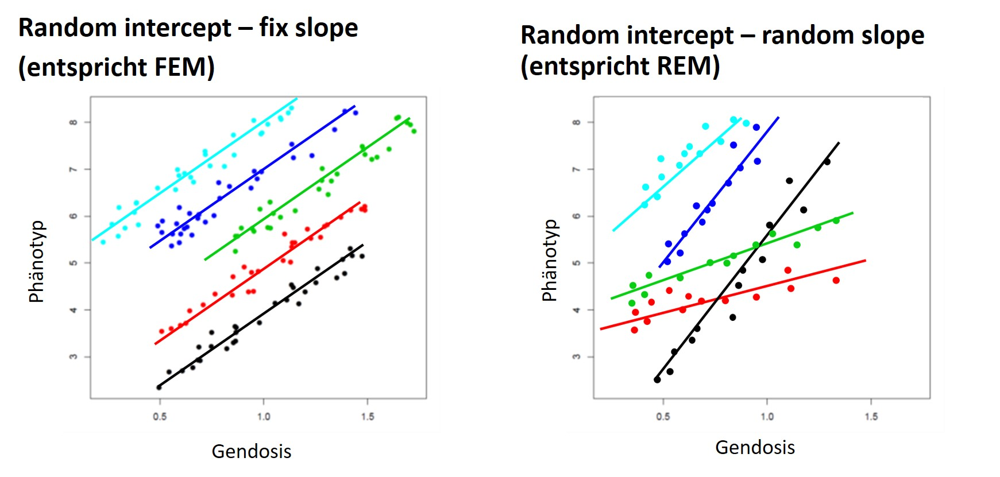

```{r setup1, echo=FALSE, warning=FALSE, message=FALSE}
setwd("D:/Lehre/WS2122_Statistik/uebung/RUebungen/")
.libPaths("C:/Program Files/R/R-4.1.1/library")

# Fuer diese Uebung notwenige Pakete
library(knitr)
library(data.table)
setDTthreads(1)
library(meta)
library(qqman)

knitr::opts_chunk$set(echo = TRUE)

```

Ziel der Übung ist eine Meta-Analyse durchzuführen und anschließend den identifizierten Lokus mit Hilfe von Online-Tools weiter zu beschreiben. 

# Meta-Analyse
## Beispiele
In einer Meta-Analyse werden die Ergebnisse einzelner Studien zusammengefasst. In genetischen Studien ist dies schon fast zwingend, da die Effekte einzelner SNPs recht klein sind, und man daher mit hoher Fallzahl kausale SNPs besser bestimmen kann. 

In den meisten Fällen wird ein *fixed effect model* (FEM) gewählt, seltener ein *random effect model* (REM). Die Annahme von FEM ist, dass der genetische Effekt fix ist, d.h. in jeder Studie gleich (homogen). Es entspricht einem gemischten Modell, wobei der Effekt des SNPs fix (*fix slople*), aber der Effekt der Studien zufällig ist (*random intercept*). Bei REM wird die Heterogenität zwischen den Studien berücksichtigt ("between study variance") und auch der genetische Effekt als random modelliert. 



In R kann man beide Modelle mit dem Paket **meta** ausrechnen. 

```{r B5A1_1}
loaded<-load("data2/MetaBsp.RData")
myDat
mymod<-metagen(TE = myDat$beta,seTE = myDat$se,studlab = myDat$study)
summary(mymod)
mymod$pval.fixed
mymod$pval.Q
forest(mymod,layout = "JAMA")

mymod2<-metagen(TE = myDat$beta[1:5],seTE = myDat$se[1:5],studlab = myDat$study[1:5])
summary(mymod2)
mymod2$pval.fixed
mymod2$pval.Q
forest(mymod2,layout = "JAMA")

```

Dieser SNP weist eine sehr hohe Heterogenität auf, die v.a. von *study6* verursacht wird. Wenn man nun zusätzliches Wissen hat, wie z.B. dass diese Studienpopulation von den anderen stark abweicht (deutlich ältere Teilnehmer, nur ein Geschlecht, o.ä.), kann man diese Studie von der Analyse ausschließen. Dies wird jedoch nur in Ausnahmefällen gemacht (sollte eigentlich durch das Analyseprotokoll schon vorher ausgeschlossen worden sein). Man würde daher diesen SNP aufgrund seiner Heterogenität filtern. 

Wichtige Plots in einer GWAS oder Meta-GWAS sind der QQ-Plot und der Manhattan-Plot. Dazu kann man das Paket **qqman** nutzen. In diesem Paket liegt der Beispieldatensatz *gwasResults*. 

Bei GWAS nimmt man an, dass die Teststatistiken näherungsweise standard-normalverteilt sind. Wenn die Nullhypothese zutrifft, haben die Teststatistiken daher eine Varianz von 1. Inflation ist eine Abweichung von der Nullhypothese, und die Varianz nimmt den Wert $\lambda$ an, wobei $\lambda>1$. Der Median von nicht zentrierten, $\chi^2$-verteilten Zufallsvariablen beträgt $0.456*\lambda$. Man vergleicht daher den Median seiner eigenen, beobachteten Teststatistiken gegenüber dem erwarteten Median. 

$$ \lambda = \frac{median(Y_1^2,...,Y_n^2)}{0.456}$$

Wenn $\lambda$ etwa 1 ist, kann man davon ausgehen, dass die Nullhypothese nicht verletzt ist. Wenn $\lambda$ von 1 stark abweicht, kann man nicht mehr von einer Nullverteilung ausgehen, und muss dann geeignet adjustieren. Weiter Infos zur Bestimmung des Medians stehen bei [**Gross et al.**](https://doi.org/10.1186/s12863-017-0571-x) (Additional File 2, Kapitel 6). Deflationen treten nicht natürlich auf, sondern entstehen z.B. bei polygenetischen Phänotypen unter Verwandtschaftskorrektur: der Phänotyp hat eine hohe Heritabilität, die Effekte werden jedoch durch die Adjustierung rauskorrigiert. In diesem Fall sollte man sein Model überdenken. Inflation tritt bei Populationsstratikikation auf. Hier muss mittels $\lambda$ korrigiert oder das Model angepasst werden (z.B. die ersten PCs mit verwenden). 

Im QQ-Plot des **qqman**-Pakets werden die erwarteten gegen die beobachteten **log10 transformierten p-Werte** aufgetragen. Keine Inflation liegt vor, wenn bis zu bei den Koordinaten (1,1) die Verteilung übereinstimmt (d.h. auf der Ursprungsgerade ist). Bei einer Inflation hingegeben wäre die beobachtete Verteilung über der Ursprungsgerade. Alternativ kann man auch die **stats** Funktion für QQ-Plots verwenden (allgemeiner). Hier wird dann ein Zufallsvektor mit gegebener Verteilung mit den **Teststatistiken** verglichen. 

Im Manhattan-Plot erhält man eine grobe Übersicht, auf welchen Chromosomen eine Assoziation detektiert wurde. 

```{r B5A1_2}
data("gwasResults")
dim(gwasResults)
colnames(gwasResults)

myPs<-gwasResults$P
myYs<-qchisq(p = myPs,df = 1)
lambda<-median(myYs)/0.456
lambda

par(mfrow=c(1,2))
qq(gwasResults$P, main="QQ-Plot mit log10(p)")
abline(h=1,col=2,lty=2)
abline(v=1,col=2,lty=2)

qqplot(x=rchisq(n = 16470,df = 1),y=myYs,main = "QQ-Plot mit Teststatistiken")
abline(0,1, col = 2)
abline(h=1,col=2,lty=2)
abline(v=1,col=2,lty=2)
par(mfrow=c(1,1))

manhattan(gwasResults,
          col = c("blue4", "orange3"),
          main = "Manhattan Plot der Test-Daten",
          ylim = c(0, 10),
          suggestiveline = -log10(1e-06))
```

## Aufgaben
Es liegen Summary Statistiken von sechs Studien zu einem Risikofaktor X vor, hier nur beispielhaft für einen Bereich von Chromosom 14 (Study1.out, ..., Study6.out). Alle Outputs wurden mittels [SNPTEST](https://mathgen.stats.ox.ac.uk/genetics_software/snptest/snptest.html#frequentist_tests) erzeugt. 

a) **Daten laden**: Öffnen Sie einen der Datensätze mit einem Text-Editor und machen Sie sich mit der Struktur vertraut. Laden Sie anschließend alle sechs Datensätze in R und schränken Sie die Datensätze auf die Schnittmenge der SNPs ein! Beantworten Sie folgende Fragen:

* Was ist der Phänotyp und auf welche Covariablen wurde adjustiert?

* Welches genetische Modell wurde verwendet und wie groß sind die Fallzahlen in den sechs Studien? 

* Wurden die Genotypen oder die Gendoses für die Analysen verwendet? 

* Ist das für alle Studien gleich? 

b) **Daten filtern**: Filtern Sie alle SNPs, für die in allen Studien ein Kommentar eingetragen ist (=Fehlermeldung). Hier konnte keine Statistik bestimmt werden (z.B. monomorphe SNPs). 

c) **Meta-Anaylse rechnen**: Berechnen Sie nun mit der Funktion *metagen* aus dem Paket **meta** die Meta-Statistiken. Dazu werden nur die beta-Schätzer und Standardfehler der einzelnen Studien gebraucht. Erstellen Sie eine geeignete Schleife und speichern Sie als Output bitte folgende Variablen:

* Beta-Schätzer, Standardfehler und p-Wert des fixed-effect Modells (FEM)

* Beta-Schätzer, Standardfehler und p-Wert des random-effect Modells (REM)

* Cochran's Q, p-Wert von Q, $I^2$, und Studienzahl als Gütemaße der Meta-Analyse

d) **QC-Check**: Erzeugen Sie je einen QQ- und Manhattan-Plot pro Modell. Nutzen Sie dazu die Funktionen *qq* und *manhattan* aus dem Paket **qqman**. Bestimmen Sie zusätzlich den Inflationsfaktor $\lambda$ pro Modell und interpretieren Sie diese. Für *manhattan* müssen Sie noch das Chromosom ergänzen (kein Standard-Output von SNPTEST). Da hier nur eine Region von Chromosom 14 betrachtet wird, ist es auch hilfreich die x-Achse auf die gegebenen Basenpositionen zu beschränken. 

e) Ihr Projektleiter hat entschieden, dass Sie Ihre Analysen wiederholen sollen. Diesmal sollen aber nur die Studien 2, 3, 5, und 6 in Ihre Meta-Analyse eingeschlossen werden, da hier auch die Covariablen übereinstimmen. Wiederholen Sie die Meta-Analyse, bestimmmen Sie wieder die $\lambda$s und erstellen Sie neue Plots. Wie ändert sich die Inflationsfaktoren? Ist eine weitere Korrektur nötig, oder kann man die Daten nun auswerten?  

f) Die Meta-Daten müssen allerdings noch gefiltert werden. Welche Thresholds fallen Ihnen zu den folgenden Maßen ein: MAF, info, Q, $I^2$, k, p-Wert und $r^2$? Filtern Sie Ihre Meta-Ergebnisse. Nutzen Sie für MAF und info bitte die minimale MAF bzw. info der vier Studien. Erzeugen Sie einen Forest Plot zu dem bestassoziierten SNP. Interpretieren Sie den Forest-Plot!

\newpage 

# Online-Annotation
In der Vorlesung haben Sie verschiedene Online-Tools kennengelernt, die man für die Annoation von genomweit signifikanten Hits nutzen kann. Auf weitere Beispiele wird daher hier verzichtet. 

In den Aufgaben können Sie ein paar Tools ausprobieren. Sie können aber gerne kostenfreie Tools wie [FUMA](https://fuma.ctglab.nl/) oder [SNiPA](https://snipa.helmholtz-muenchen.de/snipa3/) testen. 

## Aufgaben
a) Schlagen Sie den Top-SNP in [dbSNP](https://www.ncbi.nlm.nih.gov/snp/) nach! Stimmen die Allele und die MAF überein?

b) Welche Gene liegen in der Nähe? Ist davon eines plausibler als andere? Wenn ja, warum? Nutzen Sie dazu z.B. [GeneCards](https://www.genecards.org/). 

c) Was ist zu der Genexpression des Kandidatengens bzw. des Top-SNPs bekannt? Nutzen Sie dazu z.B. das [GTEx Portal](https://gtexportal.org/home/). 

d) Welche anderen Phänotypen sind mit diesem Gen bzw. Lokus assoziiert? Nutzen Sie dazu z.B. den [GWAS Catalog](https://www.ebi.ac.uk/gwas/home).

e) Wie schaut die LD-Struktur in der Region aus? Nutzen Sie dazu alle SNPs mit $p<1*10^{-5}$ und z.B. das Tool [LDmatrix](https://ldlink.nci.nih.gov/?tab=ldmatrix).

f) In welchen Pathway bzw. Netzwerk liegt das Kandidatengen und welche Krankheit ist damit assoziiert? Hat das Ergebnis Auswirkungen auf Ihre Analysen? Nutzen Sie dazu [KEGG](https://www.genome.jp/kegg/kegg2.html).

