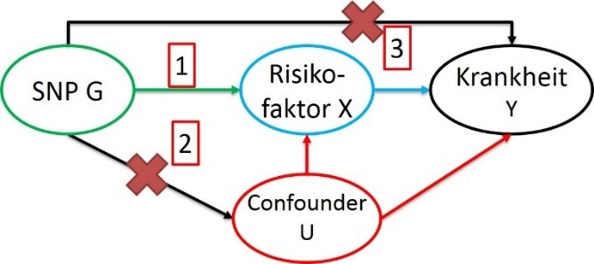

  
```{r setup1, echo=FALSE, warning=FALSE, message=FALSE}
setwd("D:/Lehre/WS2122_Statistik/uebung/RUebungen/")
.libPaths("C:/Program Files/R/R-4.1.1/library")

# Fuer diese Uebung notwenige Pakete
library(knitr)
library(data.table)
setDTthreads(1)
library(ivpack)
library(MendelianRandomization)

knitr::opts_chunk$set(echo = TRUE)

```

Ziel der Übung ist eine Mendelsche Randomisierung (MR) durchzuführen um kausale Beziehungen zu identifizieren. 

# Ratio-Methode
## Beispiele
Das Ziel einer MR ist die Beschreibung von einem kausalen Effekt von einem Risikofaktor *X* auf ein Outcome bzw. Krankheit *Y*. 

Klassischerweise würde man dazu eine randomisierte kontrollierte Studie (RCT) durchführen, in der ein Studienarm eine Intervention (Medikament, Behandlung o.ä.) erfährt, die einen Effekt auf den Risikofaktor hat. Der andere Arm wird nur mittels Placebo behandelt oder ohne Therapie weiter beobachtet. Wenn die beiden Arme balanciert waren bezüglich aller relevanten Confounder *U* ist jede Änderung in *Y* verursacht durch die Änderung in *X* und ein kausaler Effekt kann geschätzt werden. 

{width=50%}

Um Zeit und Kosten zu sparen, kann man statt Medikament vs Placebo auch Risiko-Allel vs anderes Allel vergleichen. Dazu müssen drei Bedingungen gelten:
  
  1) Die Assoziation der genetischen Variante *G* auf *X* ist **stark**, z.B. genomweit signifikant. 

2) Der SNP *G* ist unabhängig von **allen** Confoundern *U*, d.h. *G* ist nicht auch mit diesen assoziiert. 

3) Der SNP *G* ist unabhängig von *Y*, bis auf den Effekt der durch *X* vermittelt wird, d.h. es gibt keinen direkten Effekt von *G* auf *Y*. 

Während man die erste Bedingung gut nachweisen kann, kann man die anderen beiden nur plausibilisieren (man kennt nicht alle Confounder; man kann nur für die testen, zu denen man Daten hat).



Wenn die Bedingungen (plausibel) erfüllt sind, kann man mittels folgenden Model einen Ratio-Schätzer ableiten ($\beta_{IV}$, durch die Genetik erklärte Effekt von *X* auf *Y*, *IV*= instrumenal variable): 
  
\begin{align}
Y \sim \beta_{IV} \cdot X &= \beta_{IV} \cdot (\beta_X \cdot G) = \beta_Y \cdot G \notag \\
\Longrightarrow \hat{\beta}_{IV} &= \frac{\hat{\beta}_Y}{\hat{\beta}_X} \notag
\end{align}

Den Standardfehler kann mittels der Delta-Methode bestimmen. Üblicherweise schneidet man nach dem ersten oder zweiten Term ($SE_1$ bzw. $SE_2$) ab: 
  
\begin{align}
SE_1(\hat{\beta}_{IV}) &= se(\hat{\beta}_Y) / \hat{\beta}_X \notag \\
SE_2(\hat{\beta}_{IV}) &= \sqrt{\frac{se(\hat{\beta}_Y)^2}{\hat{\beta}_X^2} + \frac{\hat{\beta}_Y^2se(\hat{\beta}_X)^2}{\hat{\beta}_X^4}} \notag
\end{align}

In diesem Beispiel nutzen wir Daten von 1000 Personen und 4 SNPs *g1* - *g4*, einem Risikofaktor *x* und zwei Outcomes *y* (kontinuierlich) und *y.bin* (binär). Die beiden kontiunierlichen Größen sind annähernd normalverteilt. Die SNPs sind klassisch codiert, d.h. Genotyp AA entspricht 0, AB 1 und BB 2.

```{r B6A1_1}
load("data2/MR.RData")
dim(myDat)
colnames(myDat)

par(mfrow=c(1,3))
hist(myDat$x)
hist(myDat$y)
plot(myDat$x,myDat$y)
cor.test(myDat$y,myDat$x)
summary(lm(y~x,data=myDat))

attach(myDat)
mody<-lm(y ~ g1)
modx<-lm(x ~ g1)
by<-summary(mody)$coef[2,1]
byse<-summary(mody)$coef[2,2]
bx<-summary(modx)$coef[2,1]
bxse<-summary(modx)$coef[2,2]
beta.ratio<-by/bx
se.ratio.st<- byse/sqrt(bx^2)
p1<-2*pnorm(-abs(beta.ratio/se.ratio.st))
beta.ratio; se.ratio.st; p1
```

## Aufgaben
a) Bestimmen sie folgende Parameter für alle SNPs *g1* - *g4*:
  
  + Die Schätzer aus den jeweiligen linearen Regressionen: $\hat{\beta}_Y$, $se(\hat{\beta}_Y)$, $\hat{\beta}_X$, $se(\hat{\beta}_X)$
  
  + Der kausale Schätzer $\beta_{IV}$ und beide Standardfehler $SE_1$ und $SE_2$ sowie die dazugehörigen P-Werte

+ Die F-Statistik der Regression des Risikofaktors. 

+ Die MAF

b) Bezogen auf den Standardfehler erster Ordnung, welche genetische Variante liefert das präziseste Ergebnis? Wodurch wird die Präzision beeinflusst? Wann und wo unterscheiden sich die Fehler erster und zweiter Ordnung am meisten?
  
c) Unterscheidet sich der kausale Schätzer von der beobachteten Assoziation? Welche kausalen Schätzer sind signifikant?
  
\newpage 

# Two-Stage least squares Methode (2SLS oder TSLS)
## Beispiele
Bei dieser Methode wird der kausale Schätzer mittels zweifacher Regression bestimmt:
  
1. Stufe: Regression des Risikofaktors auf den SNP

2. Stufe: Regression des Outcome auf die gefitteten Werte des Risikofaktors aus der 1. Stufe

\begin{align}
Y &\sim \beta_{IV} \cdot X = \beta_{IV} \cdot (\beta_X \cdot G) = \beta_Y \cdot G \notag \\
X &\sim \beta_0 + \beta_X \cdot G + \epsilon \rightarrow X_{fit} = \beta_x \cdot G \notag \\
Y &\sim \beta_0 + \beta_{IV} \cdot X_{fit} + \epsilon \notag
\end{align}

Der Vorteil dieser Methode ist, dass man auch gleichzeitig mehrere SNPs verwenden kann: 
  
```{r B6A2_1}
stage1<-lm(x~g1)
fit<-stage1$fitted.values
stage2<-lm(y~fit)
summary(stage2)

mod1<-ivreg(y~x|g1,x=T)
summary(mod1)
```

Ein Vorteil dieser Methode ist, dass man auch gleichzeitig mehrere SNPs verwenden kann, indem man in der ersten Stufe ein multivariates Modell verwendet. Allerdings sollten dazu diese SNPs unkorreliert sein (z.B. LD $r^2<0.1$). 

## Aufgaben
a) Führen Sie ein TSLS per Hand für alle SNPs einzeln und gemeinsam durch und notieren Sie sich den Schätzer und dessen Standardfehler!
  
b) Nutzen Sie nun die ivreg Funktion des R-Pakets ivpack und führen Sie ebenfalls eine TSLS für alle SNPs einzeln und gemeinsam durch! 
  
c) Wie unterscheiden sich die Ergebnisse

  + von der Ratio- und der TSLS-Methode pro SNP?
  
  + von der per Hand und der *ivreg* Variante für die gemeinsame Analyse?
  
Per Hand bezieht sich hier darauf, dass man beide Stufen per Hand rechnet, und nicht alles in einem Schritt wie mit der *ivreg* Funktion von **ivpack**.

\newpage

# Inverse Varianz gewichtete Methode (inverse-variance weighted, IVW)

## Beispiele
Oft hat man nur Summarized Data, d.h. nur die $\beta$s und $SE$s der einzelnen SNPs. Damit lässt sich keine TSLS durchführen. Stattdessen kann man den kausalen Schätzer mittels IVW bestimmen: 
  
\begin{align}
\hat\beta_{IV,IVW} &= \frac{\sum{\hat{\beta}_Y}\hat{\beta}_Xse(\hat{\beta}_Y)^{-2}}{\sum{\hat{\beta}_X^2se(\hat{\beta}_Y)^{-2}}} \notag \\
SE_3(\hat\beta_{IV,IVW}) &= \sqrt{\frac{1}{\sum{\hat{\beta}_X^2se(\hat{\beta}_Y)^{-2}}}} \notag 
\end{align}

Dies entspricht einer Meta-Analyse der kausalen Schätzer (FEM). Auch hier sollte man vorher sicherstellen, dass die SNPs nicht korreliert sind. 

In dem Paket **MendelianRandomization** von Stephen Burgess sind inzwischen viele Varianten der MR mittels Summary Statistics implementiert. Die IVW-Methode ist nur eine davon. Andere berücksichtigen etwaige Pleiotropie (z.B. MR_egger). Hier im Beispiel wird der Effekt von LDL-Cholesterol auf koronare Herzkrankheit betrachtet:
  
```{r B6A3_1}
MRObject<- mr_input(bx = ldlc, bxse = ldlcse, exposure = "LDLC",
                    by = chdlodds, byse = chdloddsse, outcome="CAD")
mr_allmethods(MRObject)
mr_plot(mr_allmethods(MRObject,method = "main"))

```


## Aufgaben
Bestimmen Sie den kausalen Meta-Effekt mittels jeweils mit und ohne SNP *g4*: 
  
a) der oben aufgeführten Funktionen

b) der Funktion *metagen* aus dem Paket **meta** (s. letzte R-Übung)

c) der Funktion *mr_allmethods* aus dem Paket **MendelianRandomization**
  
d) Gibt es Unterschiede bei den Kausalschätzungen? 
  
e) Erstellen Sie einen Scatterplot der vier Instrumente inkl. der Fehlerbalken (Hinweis: *mr_plot* aus **MendelianRandomization**)!
  
\newpage

# MR mit binären Outcome
## Beispiele
Natürlich kann man das Prinzip der MR auch auf binäre Phänotypen anwenden. Hierbei ist zu beachten, dass empfohlen wird, die G-X Assoziation nur auf den Kontrollen bzgl. Y zu rechnen. 

```{r B6A4_1}
attach(myDat)
g1.con<-g1[y.bin==0]
x.con<-x[y.bin==0]
predict.con.g1<-predict(lm(x.con~g1.con),newdata=list(g1.con=g1))
tsls2.con<-glm(y.bin ~ predict.con.g1, family="binomial")
summary(tsls2.con)

```

Die berechneten Schätzer repräsentieren die log-kausalen Odds Ratios für *y.bin* pro Einheitssteigerung von *x*. Zurückrechnen zu normalen OR erfolgt über die Exponential-Funktion, die Konfidenzintervalle kann man mittels Normal-Approximation bestimmen: 
  
```{r B6A4_2}
beta.tsls.con<-summary(tsls2.con)$coef[2,1]
se.tsls.con<-summary(tsls2.con)$coef[2,2]

lower.bound<-beta.tsls.con - 1.96*se.tsls.con
upper.bound<-beta.tsls.con + 1.96*se.tsls.con

OR<-exp(beta.tsls.con)
exp(lower.bound); OR; exp(upper.bound)
```

## Aufgaben 

Führen Sie die Ratio-Methode bzw. TSLS für *g2* bzw. *g1 - g3* durch!