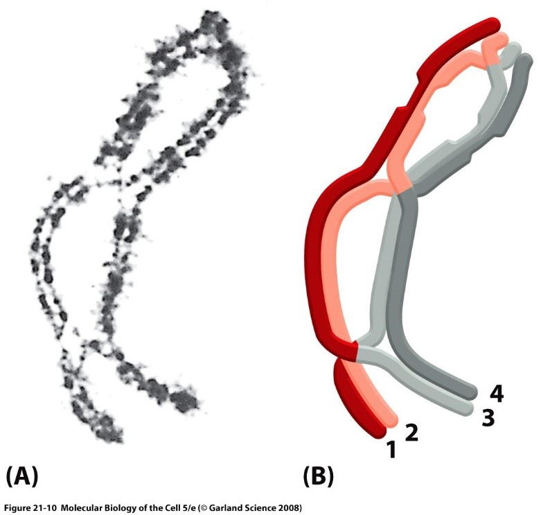
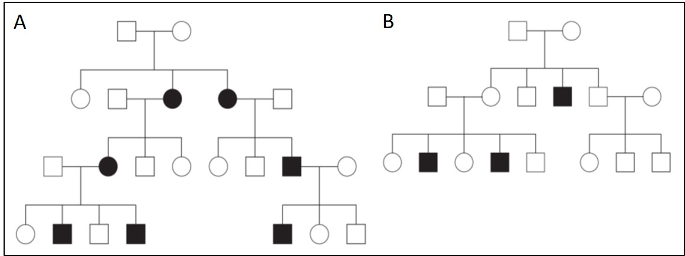

  

```{r setup1, echo=FALSE, warning=FALSE, message=FALSE}
r_on_server = FALSE
if(r_on_server==T) basicpath = "/net/ifs2/san_projekte/projekte/genstat/"  else basicpath =  "C:/Users/janne/Documents/R/Test/Teaching_WS2122/"
if(r_on_server==T) .libPaths("/net/ifs2/san_projekte/projekte/genstat/07_programme/rpackages/amanMRO/") 

#.libPaths()

if(r_on_server==T) pathwd = paste0(basicpath, "/13_lehre/WS2021_Statistik/uebung/Theorie/") else pathwd = paste0(basicpath,"Exercises_classic/")
setwd(pathwd)

# Hier sollen alle notwendigen Pakete stehen die im Laufe der Uebung genutzt werden
# library(knitr)
# library(foreach)
# library(doParallel)
library(data.table)
setDTthreads(1)
# library(readxl)
# library(lubridate)
# library(MASS)
# library(nlme)
# library(ggplot2)
# library(meta)
# library(qqman)
# library(ivpack)
# library(MendelianRandomization)

knitr::opts_chunk$set(echo = TRUE)

```

## Aufgabe 1: Definitionen

Definieren Sie **SNP**, **CNV** und **Chromosomen-Mutationen** und geben Sie je ein Beispiel dafür an.

## Aufgabe 2: Transkription & Translation

Betrachten Sie diese DNA-Sequenz: 5‘ ATGCTTAAGC AGCATGCCGA GTAA 3‘

a) Bestimmen Sie den zugehörige **Antisense-Strang**! Aus welchen der beiden Sequenzen kann man quasi die **mRNA** bzw. **tRNA** ablesen? Welche kleine **Änderung** muss man hierbei vornehmen? 
  
b) Bestimmen Sie die **Aminosäuren** und die Polarität und Basizität deren Seitenketten! Kann man dadurch eine Aussage zur **Sekundärstruktur** treffen? 
  
c) Was passiert, wenn man eine Insertion bzw. zwei Mutationen einfügt?
  
  + 5‘ ATGCT$\text{\underline{C}}$TAAG CAGCATGCCG AGTAA 3‘

+ 5‘ ATGCTTA$\text{\underline{C}}$GC AGCAT$\text{\underline{C}}$CCGA GTAA 3‘

## Aufgabe 3: SNP-Recherche

a) Recherchieren Sie zu den zwei SNPs **rs8176719** und **rs8176747** in Online-Datenbanken 
  
  * Chromosom und Basenposition der SNPs (bitte Genome Build mitangeben, z.B. hg19),
  * die beiden Allele (Major, Minor) und die MAF (Minor Allele Frequency)
  * das (nächstgelegene) Gen und mögliche Auswirkungen der SNPs 

  Online-Datenbanken: 

  * [dbSNP](https://www.ncbi.nlm.nih.gov/snp/),
  * [Ensembl](https://www.ensembl.org/index.html), 
  * [UCSC Genome Browser](https://genome.ucsc.edu/cgi-bin/hgTracks?db=hg38&lastVirtModeType=default&lastVirtModeExtraState=&virtModeType=default&virtMode=0&nonVirtPosition=&position=chrX%3A15560138%2D15602945&hgsid=919169167_bzeri4BJCEsT3CnTzuqmAhOWJZZs),
  * [SNPedia](https://www.snpedia.com/)

b)	Definieren Sie die Begriffe **dominant**, **rezessiv**, und **kodominant**! Erläutern sie diese anhand des SNPs rs8176719 aus der Hausaufgabe!  
  
c)	Erstellen Sie eine **Tabelle** mit den wichtigsten Merkmalen von autosomal dominant, autosomal rezessiv, X dominant, X rezessiv und Y bzgl. Geschlechterverteilung, Generationenhäufigkeit, Eltern-Kind und Geschwister-Beziehungen!
  
## Aufgabe 4: Crossing-over

Sie haben in der Vorlesung den Begriff Crossing-over kennengelernt. 

a) Definieren Sie anhand der Abbildung 1 den Begriff **Crossing-over**.

b) Definieren Sie geeignete **Segmente** in Abbildung 1! Zwischen welchen Segmenten beobachtet man eine **Rekombination**? Zwischen welchen nicht? 
  
c) Was ist ein **Rekombinationshotspot**?
  
d) Warum ist das Crossing-over relevant für die **genetische Statistik**?
  


\newpage

## Aufgabe 5: Stammbäume

Sie haben in der Vorlesung verschiedene Stammbäume kennengelernt. 

a) Definieren Sie den Begriff **Penetranz**.

b) Betrachten Sie die zwei Stammbäume in Abbildung 2 und geben Sie folgendes **unter Berücksichtigung möglicher eingeschränkter Penetranz** an:
  + eine Legende,
+ die Träger/in,
+ wahrscheinlichstes Segregationsmuster mit Begründung

c) Welche Entscheidung würden Sie ohne Berücksichtigung von eingeschränkter Penetranz treffen?
  


\newpage