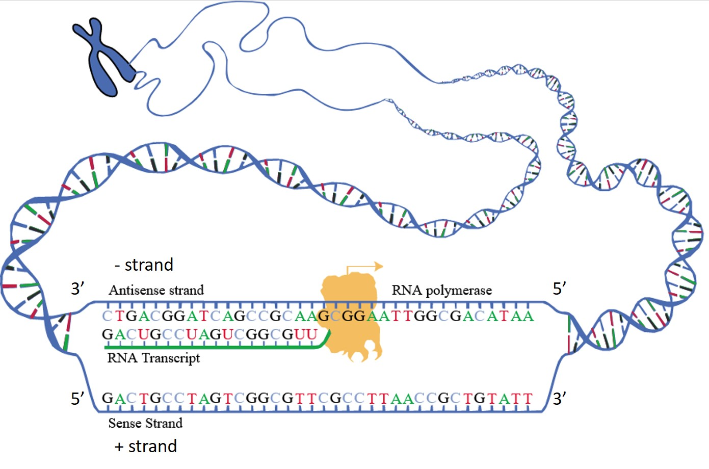
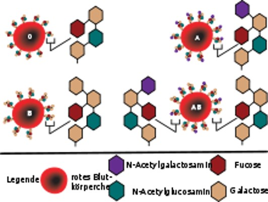
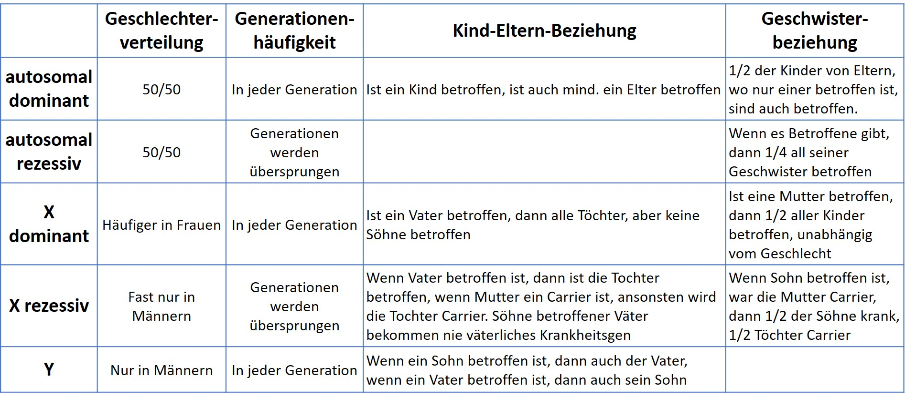
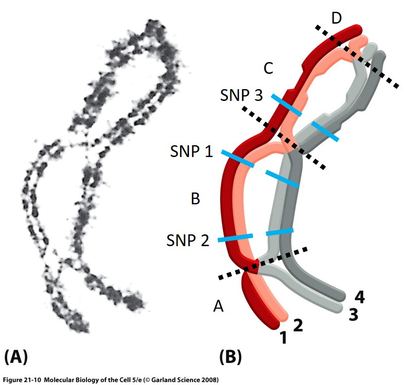
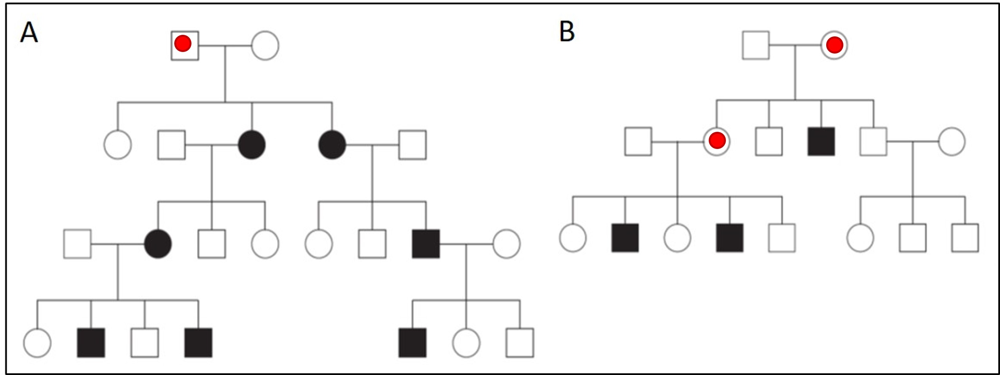
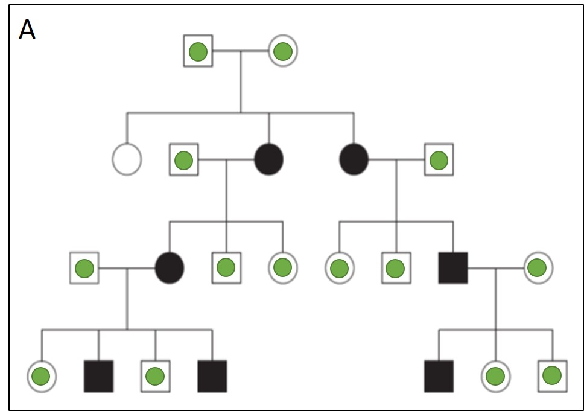

## Vorstellung 

* Name
* Fachrichtung
* Erwartung an Übung
* Arbeits-Du ok?

## Hinweise zu Moodle

zu Moddle:

- Alle relevanten Unterlagen stehen auf Moodle zur Verfügung
- MC-Tests 

zur Übung:

- Die Lösungen der Aufgaben werden in der Übung gemeinsam besprochen - kein Monolog von meiner Seite
- Am Ende des Moduls wird wahrscheinlich eine Musterlösung bereitgestellt

## Aufgabe 1: Definitionen

Definieren Sie **SNP**, **CNV** und **Chromosomen-Mutationen** und geben Sie je ein Beispiel dafür an.

## Aufgabe 1: Lösung

**SNP** = single nucleotid polymorphism = Einzelnukleotid Polymorphismus = Punktmutation

* Variation eines Basenpaares an einer Stelle im Genom
* Bsp.: SNP in *MCM6* führt zu Laktoseintoleranz

**CNV** = copy number variation = Kopienzahlvariation

* Form der strukturellen Variation (Chromosomen-Mutation)
* Deletion oder Duplikation von ganzen Genen
* Bsp.: Walters et al (2010), Deletion von ~ 600 kb auf 16p11.2 ist assoziiert mit Übergewicht
* Bsp.: Jacquemont et al. (2011), Duplikation von ~ 600 kb auf 16p11.2 ist assoziiert mit Untergewicht

**Chromosomen-Mutation** = Deletion, Duplikation, Inversion (intra), oder Insertion, Translokation (inter) von Genen aber auch ganzen Chromosomen

* Bsp.: Translokations-Trisomie 21: Chr 21 3x vorhanden, eines davon hat sich an Chr. 13, 14,15 oder 22 angelagert

## Aufgabe 2: Transkription & Translation

DNA-Sequenz: 5‘ ATGCTTAAGC AGCATGCCGA GTAA 3‘

- Antisense-Strang, mRNA, tRNA
- Aminosäuren, Polarität und Basizität, Sekundärstruktur? 
- Insertion bzw. zwei Mutationen?
  
  + 5‘ ATGCT$\text{\underline{C}}$TAAG CAGCATGCCG AGTAA 3‘
  + 5‘ ATGCTTA$\text{\underline{C}}$GC AGCAT$\text{\underline{C}}$CCGA GTAA 3‘

## Aufgabe 2: Lösung (1)

Sense 5' | ATG | CTT | AAG | CAG | CAT | GCC | GAG | TAA
-------- | --- | --- | --- | --- | --- | --- | --- | ---
Anti 3'  | TAC | GAA | TTC | GTC | GTA | CGG | CTC | ATT
mRNA     | AUG | CUU | AAG | CAG | CAU | GCC | GAG | UAA
tRNA     | UAC | GAA | UUC | GUC | GUA | CGG | CUC | AUU
-------- | --- | --- | --- | --- | --- | --- | --- | ---
AS       | Met | Leu | Lys | Gln | His | Ala | Glu | Stp
Typ      | unp | unp | bas | pol | bas | unp | sau | - 
-------- | --- | --- | --- | --- | --- | --- | --- | ---
Indel    | Met | Leu | Stp |     |     |     |     |  
SNPs     | Met | Leu | Thr | Gln | His | Pro | Glu | Stp

Table: Anti-Sense, mRNA und tRNA zu der gegebenen Sense-Sequenz.  \label{tab1_1}

## Aufgabe 2: Lösung (2)

{width=70%}

## Aufgabe 3: SNP-Recherche

- Recherche zu **rs8176719** und **rs8176747**

  + Chromosom und Basenposition 
  + Allele (Major, Minor) und MAF
  + das Gen und mögliche Auswirkungen der SNPs 

-	Def. **dominant**, **rezessiv**, und **kodominant**!
- **Tabelle** mit Merkmalen von autosomal dominant, autosomal rezessiv, X dominant, X rezessiv und Y 

## Aufgabe 3: Lösung (1)

Kriterium        rs8176719                 rs8176747
--------------   -----------------------   ----------------
Chromosom        9                         9
Basenposition    133257521 (hg19)          133255928 (hg19)
Allele           -/G (-Strang)             G/C (-Strang)
MAF              0.349                     0.123
Gen              *ABO* Gen (-Strang)       *ABO* Gen (-Strang)
Auswirkung       Deletion                  AS-Tausch
                 Frameshift                G -> Blutgruppe A möglich
                 inaktives Protein         C -> Blutgruppe B möglich
                 D-Galaktose bleibt frei
                 Blutgruppe 0 möglich
--------------   -----------------------   ----------------

Table:  Recherche zu den zwei SNPs rs8176719 und rs8176747 \label{tab1_2}

## Aufgabe 3: Lösung (2)

* Rezessiv: zeigt nur einen Effekt, wenn homozygot (Blutgruppe 0)
* Dominant: zeigt einen Effekt, wenn mindestens ein Allel vorliegt (Blutgruppe AA & AO, Blutgruppe BB & BO)
* Kodominant: Beide Alleleffekte beobachtbar (Blutgruppe AB)

{width=50%}

## Aufgabe 3: Lösung (3)

## Aufgabe 4: Crossing-over

- Definition **Crossing-over**
- Definieren Sie geeignete **Segmente** in Abbildung 1! Zwischen welchen Segmenten beobachtet man eine **Rekombination**? Zwischen welchen nicht? 
- **Rekombinationshotspot**?
- Warum ist das Crossing-over relevant für die **genetische Statistik**?

## Aufgabe 4: Lösung (1)

- **gegenseitigen Austausches von einander entsprechenden Abschnitten zweier homologer Chromosomen** 
- 4 Segmente, getrennt durch 3 Rekombinationsereignisse
  
  + von Chromatiden 1 & 3 zwischen A & B,
  + von Chromatiden 2 & 4 zwischen B & C, und
  + von Chromatiden 2 & 3 zwischen C & D statt.

- **Rekombinationshotspots**: Bereiche in der DNA, bei denen vermehrt Rekombinationen stattfinden.  
- **Bezug zur genetischen Statistik**: Austausch von genetischen Material; bestimmte Genbereiche mit hoher Wahrscheinlichkeit gemeinsam vererbt werden. Diese (Un-)Abhängigkeitsstruktur muss in statistischen Analysen berücksichtigt werden (Stichwort Linkage Disequilibrium, LD).

## Aufgabe 4: Lösung (2)

{width=50%}

## Aufgabe 5: Stammbäume

- Definition **Penetranz**
- Angabe:
  + eine Legende,
  + die Träger/in,
  + wahrscheinlichstes Segregationsmuster
- Welche Entscheidung würden Sie ohne Berücksichtigung von eingeschränkter Penetranz treffen?

{width=50%}

## Aufgabe 5: Lösung (1)

Penetranz: prozentuale Wahrscheinlichkeit, mit der ein bestimmter Genotyp den ihm zugehörigen Phänotyp ausbildet

- Kreis/Quadrat: Frau/Mann
- Keine Füllung/Füllung/Punkt: gesund/krank/Anlageträger
- Träger/in: s. Abbildung \ref{fig1_6}
- Wahrscheinlichstes Segregationsmuster: 
    + Autosomal dominant
    + x-chromosomal rezessiv
    
- autosomal-rezessiv

## Aufgabe 5: Lösung (2)

## Aufgabe 5: Lösung (3)

{width=50%}