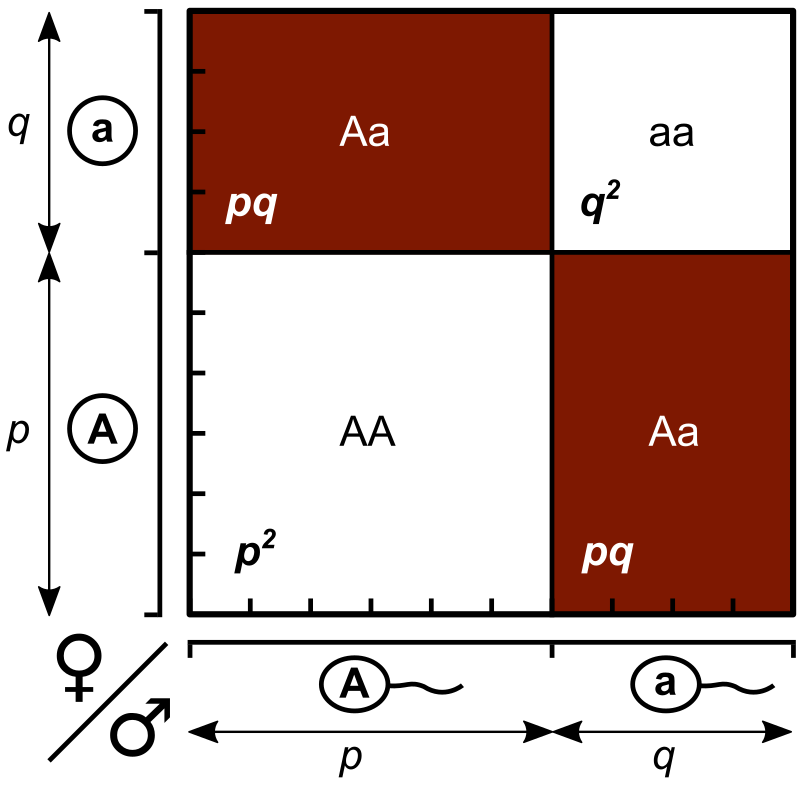
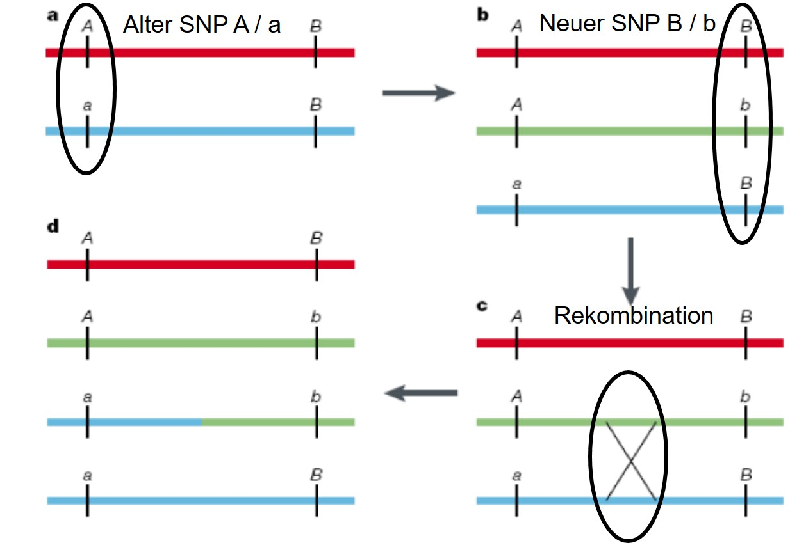

```{r B3_setup, include=FALSE}
knitr::opts_chunk$set(echo = FALSE)
library(data.table)
setDTthreads(1)
library(ggplot2)

```

## Fragen

Gibt es Fragen zu

* Vorlesung?
* Übung?
* Seminar?

## Plan heute

Besprechung von 

* Blatt 3 - A3 & A4 (HWE, LD)

Anschließend / Falls noch Zeit

* Blatt 3 - A2 (PCA)
* Zusatzaufgabe zu PCA in R

## Aufgabe 3: Hardy-Weinberg-Gleichgewicht

Genotyp | AA | AB | BB | Missings 
------- | -- | -- | -- | -------- 
Anzahl  | 824 | 1326 | 463 | 87

a) Allelfrequenzen $p$ und $q$ von A und B.
b) HWE und erwartete Genotypfrequenzen.
c) Testen Sie $H_0$: Die beobachteten Haufigkeiten der Genotypen sind im HWE (Signifikanzniveau von 5%).
d) Warum ist das HWE in der genetischen Statistik relevant?

## Aufgabe 3: Hintergrund (1)

* Welche Verteilungsannahme treffen wir hier?
* Was wissen wir damit über den Erwartungswert von Allel B?
* Welche Art Schätzung nimmt man bei den Allelfrequenzen vor?

## Aufgabe 3: Hintergrund (1)

* Welche Verteilungsannahme treffen wir hier?

  --> Binomialverteilung

* Was wissen wir damit über den Erwartungswert von Allel B?

  --> $E(B) = n \cdot q \rightarrow q = \frac{E(B)}{n}$ 
  
  --> $n$ ist die Anzahl aller Allele

* Welche Art Schätzung nimmt man bei den Allelfrequenzen vor?

  --> $\hat{q} = \frac{k}{n} = \frac{\# \text{B-Allele}}{\# \text{Allele}} = \frac{2\cdot \# BB + \# AB}{2\cdot N} = \frac{\# BB + 0.5 \cdot \# AB}{N}$

  --> $N = 0.5 \cdot n$ ist die Anzahl aller Samples 
  
  --> Maximum-Likelihoodschätzer (erwartungstreu)

## Aufgabe 3: Lösung (1)

$$ N_0=824 + 1326 + 463 + 87 = 2700 $$
$$ N_1=824 + 1326 + 463 = 2613$$

Nur die Samples mit bestimmten Genotyp werden weiter berücksichtigt!

$$ \hat{p}=\frac{(2 \cdot \#AA + \#AB)}{2 \cdot N_1}= 0.569, \hat{q}=1-\hat{p}=0.431$$

## Aufgabe 3: Hintergrund (2)

**Punnett-Quadrat** = Rekombinationsquadrat

{width=50%}


## Aufgabe 3: Lösung (2)

Im HWE gilt: 

$1=p+q=(p+q)^2 =p^2 + 2pq + q^2 = p_{exp}(AA) + p_{exp}(AB) + p_{exp}(BB)$

Genotyp | AA | AB | BB | Missings 
------- | -- | -- | -- | -------- 
Anzahl  | 824 | 1326 | 463 | 87
$p_{obs}$ | 0.315 | 0.507 | 0.177
$p_{exp}$ | 0.324 | 0.490 | 0.186

AF der Eltern muss nicht gleich sein der AF der Kinder, aber alle zukünftigen Generationen haben die AF der Kinder (Gleichgewicht) 

## Aufgabe 3: Hintergrund (3)

Alle HWE-Annahmen ("ideale Population"):

* Diploide Organismen
* Nur geschlechtliche Vermehrung
* Keine Überlappung der Generationen
* Zufällige Paarung
* Unendliche Populationsgröße
* Allelfrequenzen sind in beiden Geschlechtern gleich
* Keine Migration, Gendrift, Mutation, oder Selektion

## Aufgabe 3: Hintergrund (3)

Alle HWE-Annahmen ("ideale Population"):

* Diploide Organismen

* Nur geschlechtliche Vermehrung

* Keine Überlappung der Generationen

* Zufällige Paarung

  --> z.B. bei Zucht verletzt --> Erhöhter Anteil von Homozygoten

* Unendliche Populationsgröße

  --> zufällige Änderung in AFs durch kleine Fallzahl --> Gendrift 

* Allelfrequenzen sind in beiden Geschlechtern gleich

* Keine Migration, Gendrift, Mutation, oder Selektion

  --> Selektion: schnelle und absolute Änderung der AF (p=1)

  --> Mutation: schwache Änderung der AF 

  --> Migration: AF mehr homogen (tw. auch nicht-zufällige Paarung)

## Aufgabe 3: Lösung (3)

**Hinweis**: Weiterrechnen mit den gerundeten Werten!

Um die Hypothese zu testen, muss das $\chi^2$ bestimmt werden: 

$$ \chi^2 = N_1 \sum \frac{(p_{obs} - p_{exp})^2}{p_{exp}}= 3.33$$
Da $m=2$ Allele betrachten werden, haben wir einen Freiheitsgrad: 

$$df = \frac{m(m-1)}{2}=\frac{2 \cdot 1}{2}=1 \rightarrow \chi_1^2=3.841$$

$\chi^2 = 3.33 < 3.841 = \chi_1^2$ 

Die Nullhypothese kann nicht abgelehnt werden. 

## Aufgabe 3: Lösung (4)

```{r B3_1, eval=T,echo=FALSE, warning=FALSE, message=FALSE}
data<-c(824,1326,463,87)
N0<-sum(data)
N1<-N0-87
p<-(2*data[1]+data[2])/(2*N1)
pr<-round(p,3)
q<-(2*data[3]+data[2])/(2*N1)
qr<-round(q,3)

Exp<-c()
Exp[1]<-p^2
Exp[2]<-2*p*q
Exp[3]<-q^2
Expr<-round(Exp,3)
Obs<-c()
Obs[1]<-data[1]/N1
Obs[2]<-data[2]/N1
Obs[3]<-data[3]/N1
Obsr<-round(Obs,3)

dumTab<-data.frame(Exp,Expr,Obs,Obsr)
dumTab = t(dumTab)
dumTab = cbind(c(NA,NA,p,pr),c(NA,NA,q,qr),dumTab)
rownames(dumTab) = c("expected","expected - rd",
                           "observed","observed - rd")
knitr::kable(dumTab, position = "!b",
             caption = "Erwartete vs beobachtete Genotyphäufigkeit",
             col.names = c("AF(A)","AF(B)","AA","AB","BB"))
```

## Aufgabe 3: Lösung (5)

```{r B3_2, eval=T,echo=T, warning=FALSE, message=FALSE}
qchisq(p = 0.95,df = 1)

```


```{r B3_3, eval=T,echo=FALSE, warning=FALSE, message=FALSE}
x<-N1* (((Obs[1]-Exp[1])^2/Exp[1]) + ((Obs[2]-Exp[2])^2/Exp[2]) + ((Obs[3]-Exp[3])^2/Exp[3]))

xr<-N1* (((Obsr[1]-Expr[1])^2/Expr[1]) + ((Obsr[2]-Expr[2])^2/Expr[2]) + ((Obsr[3]-Expr[3])^2/Expr[3]))

y<-qchisq(p = 0.95,df = 1)

dumTab2 = data.table(xi = c(x,xr),
                     pval = c(1-pchisq(x,df=1),1-pchisq(xr,df=1)),
                     sig = c(x>y,xr>y))
rownames(dumTab2) = c("ungerundet","gerundet")

knitr::kable(dumTab2, position = "!b",
             caption = "Ergebnis Chi-Quadrat-Test",
             col.names = c("Chi^2","P-Wert","Signifikant?"))
```

In echten Genotypdaten kann eine Abweichung vom HWE ein Anzeichen für einen Genotypisierungsfehler sein. 

## Aufgabe 4: Linkage disequilibrium

\begin{center}
\begin{tabular}[h]{c|cc}
 & SNP 1 Allel A & SNP 1 Allel a \\
\hline
SNP 2 Allel B & u & v \\
SNP 2 Allel b & v & u \\
\end{tabular}
\end{center}

a) Randverteilung, Interpretation
b) Zeigen Sie, dass für $t$ gilt: $D'(t)=r(t)=Y(t)$
c) Ab welchem $u$ würde der LD-Threshold von 0.5 überschritten?

\begin{center}
\begin{tabular}[h]{c|cc}
EUR & rs8176747-C & rs8176747-G \\
\hline
rs8176719-T & 609 & 0 \\
rs8176719-TC & 312 & 85 \\
\end{tabular}

\begin{tabular}[h]{c|cc}
AFR & rs8176747-C & rs8176747-G \\
\hline
rs8176719-T & 891 & 42 \\
rs8176719-TC & 207 & 182 \\
\end{tabular}
\end{center}

d) Randverteilung, absoluten --> relative Häufigkeiten
e) Berechnung $D'$ und $r^2$ und Interpretation 

## Aufgabe 4: Hintergrund (1)

{width=80%}

Volle Kombinatorik führt zur schrittweise Verringerung von LD

## Aufgabe 4: Lösung (1) 

\centering
\begin{tabular}[h]{c|cc|l}
 & SNP 1 Allel A & SNP 1 Allel a & Total\\
\hline
SNP 2 Allel B & u=$p_{00}$ & v=$p_{01}$ & u+v = $p_{0\cdot}$ \\
SNP 2 Allel b & v=$p_{10}$ & u=$p_{11}$ & u+v = $p_{1\cdot}$ \\
\hline
& u+v = $p_{\cdot 0}$ & u+v = $p_{\cdot 1}$ & 1
\end{tabular}
\raggedright

**Interpretation**: 

* Der Haplotyp **AB** ist genauso häufig wie **ab**. 
* $2 \cdot (u+v) =1 \rightarrow u+v=0.5 =p(A)=p(b)=p(B)=p(b)$, d.h. alle Allelfrequenzen sind gleich. 

## Aufgabe 4: Lösung (2) 

\begin{align}
D &= p_{00} - p_{0\cdot}p_{\cdot 0} = u - (u+v)^2 = u-0.25 \notag \\
r(t) &= \frac{D}{\sqrt{p_{0\cdot}p_{1\cdot}p_{\cdot 0}p_{\cdot 1}}}= \frac{D}{\sqrt{(u+v)^4}}=\frac{D}{(u+v)^2} \notag \\
\notag \\
D_{max} &= (u+v)^2 \text{ , weil alle Produkte gleich sind} \notag \\
D'(t) &= \frac{D}{D_{max}} = \frac{D}{(u+v)^2} \notag \\
\notag \\
\lambda &= \frac{u^2}{v^2} \text{ und } u+v=0.5 \rightarrow v=0.5-u \notag \\
Y(t) &= \frac{\frac{u}{v}-1}{\frac{u}{v}+1}=\frac{u-v}{v}\cdot \frac{v}{u+v}=\frac{u-v}{u+v}=\frac{(u+v)(u-v)}{(u-v)^2} \notag \\
&\Rightarrow (u-v)(u+v)=0.5(u-0.5+u)=0.5(2u-0.5)=u-0.25=D \notag
\end{align}

## Aufgabe 4: Lösung (3) 

$$ r(t) = 0.5 = \frac{D}{(u+v)^2} = \frac{u-0.25}{0.25} \Leftrightarrow u=0.5 \cdot 0.25 +0.25 =0.375$$

Wenn $u\geq 0.375$ wird $r(t)\geq 0.5$. 

## Aufgabe 4: Hintergrund (2)

Kriterium        rs8176719                 rs8176747
--------------   -----------------------   ----------------
Chromosom        9                         9
Basenposition    133257521 (hg19)          133255928 (hg19)
Allele           -/G (-Strang)             G/C (-Strang)
MAF              0.349                     0.123
Gen              *ABO* Gen (-Strang)       *ABO* Gen (-Strang)
Auswirkung       Deletion                  AS-Tausch
                 Frameshift                G -> Blutgruppe A möglich
                 inaktives Protein         C -> Blutgruppe B möglich
                 D-Galaktose bleibt frei
                 Blutgruppe 0 möglich
--------------   -----------------------   ----------------

Table:  Recherche zu den zwei SNPs rs8176719 und rs8176747 aus dem ersten Übungsblatt.

## Aufgabe 4: Hintergrund (3)

* Vater mit Haplotypen (-;C) und (G;G) --> Blutgruppe A0
* Mutter mit Haplypen (G;G) und (G;G) --> Glutgruppe AA
* Welche Blutgruppen können die Kinder haben?

## Aufgabe 4: Lösung (4) 

\centering
\begin{tabular}[h]{c|cc|l}
EUR & rs8176747-C & rs8176747-G & Total \\
\hline
rs8176719-T & 609 (0.605) & 0 (0) & 609 (0.605) \\
rs8176719-TC & 312 (0.3105) & 85 (0.0845)  & 397 (0.395)\\
\hline
& 921 (0.9155) & 85 (0.0845) & 1006 (1) \\
\end{tabular}

\centering
\begin{tabular}[h]{c|cc|l}
AFR & rs8176747-C & rs8176747-G & Total \\
\hline
rs8176719-T & 891 (0.674) & 42 (0.032) & 933 (0.706) \\
rs8176719-TC & 207 (0.157) & 182 (0.137) & 389 (0.294) \\
\hline
& 1098 (0.831) & 224 (0.169) & 1322 (1) \\
\end{tabular}

## Aufgabe 4: Lösung (5) 

\begin{align}
D &= p_{00} - p_{0\cdot}p_{\cdot 0} \notag \\
D_{EUR} &= 0.605 - 0.605 \cdot 0.9155 = 0.051 \notag \\
D_{AFR} &= 0.674 - 0.706 \cdot 0.831 = 0.087 \notag \\
\notag \\
D_{max} &= min(p_{0\cdot}p_{\cdot 1},p_{\cdot 0}p_{1\cdot }) \notag \\
D_{max,EUR} &= min(0.605 \cdot 0.0845, 0.9155 \cdot 0.395)=0.605 \cdot 0.0845=0.051 \notag \\
D_{max,AFR} &= min(0.706 \cdot 0.169, 0.831 \cdot 0.294)=0.706 \cdot 0.169=0.119 \notag
\end{align}

## Aufgabe 4: Lösung (6) 

\begin{align}
D'_{EUR} &= \frac{D_{EUR}}{D_{max,EUR}}=1 \notag \\
D'_{AFR} &= \frac{D_{AFR}}{D_{AFR}}=0.731 \notag \\
\notag \\
r_{EUR}^2 &= \frac{0.051^2}{0.9155 \cdot 0.0845 \cdot 0.605 \cdot 0.395} = 0.141 \notag \\
r_{AFR}^2 &= \frac{0.087^2}{0.831 \cdot 0.169 \cdot 0.706 \cdot 0.294} = 0.260 \notag
\end{align}

**Interpretation**: 

* in EUR noch keine Rekombination ($D'=1$), in AFR schon.
* Assoziationsstatistiken nicht sehr ähnlich ($r^2<0.3$, nur schwach korreliert)

## Aufgabe 4: Hintergrund (4)

* Vater mit Haplotypen (-;C) und (G;G) --> Blutgruppe A0

* Mutter mit Haplypen (G;G) und (G;G) --> Glutgruppe AA

* Welche Blutgruppen können die Kinder haben?

* In EUR: mit 99,99% Wahrscheinlichkeit A (A0 oder AA)

* In AFR: A oder AB:

  --> Rekombination beim Vater möglich

  --> Rekombinierte Haplotypen (G;C) und (-;G) --> Blutgruppe B0

## Aufgabe 2: Hauptkomponentenanalyse

$$A=\left( \begin{array}{rrr}
1 & 0 & -2 \\ 
0 & 2 & 0 \\
-2 & 0 & 4 \\ 
\end{array}\right)$$

a) Charakteristische Polynom $det(A-\lambda E)$ und Eigenwerte $\lambda_i, i\in {1,2,3}$
b) Eigenvektoren $w_i$ mit $(A-\lambda_i E)*w_i=0$
c) Orthogonalität und Orthonormalität.
d) Überprüfung $Q*\Lambda* Q^{-1}$ mit Diagonalmatrix $\Lambda$ der EW und normalisierte Matrix $Q$ der EVs.

## Aufgabe 2: Hintergrund (1)

* Principal Component Analyses: Dimensionsreduktion durch Nutzung der Eigenvektoren der Kovarianzmatrix 
* $n$ Versuchspersonen mit $p$ gemessenen Merkmalen --> $n \times p$ Matrix
* Ziel: Projektion der $p$ Merkmale in eine niedrigere Dimension, wobei korrelierte Daten zusammengefasst werden, aber möglichst wenig Information verloren gehen soll. 
* Für normalverteilte Datensätze gilt: nach Transformation sind die Komponenten statistisch unabhängig
* $A$ könnte die Kovarianzmatrix von drei Parametern sein. 


## Aufgabe 2: Lösung (1) - Eigenwerte

$$A-\mu E=\begin{pmatrix}
1-\mu & 0 & -2  \\
0 & 2-\mu & 0 \\
-2 & 0 & 4-\mu
\end{pmatrix}$$
\begin{align}
det(A-\mu E) &= (1-\mu)(2-\mu)(4-\mu) - 4(2-\mu) \notag \\
&= (2-\mu)[(1-\mu)(4-\mu)-4] \notag \\
&= (2-\mu)[\mu^2-5\mu +4 -4] \notag \\
&= (2-\mu)(\mu^2-5\mu) \notag \\
&= \mu(2-\mu)(\mu-5) \notag \\
&\Longrightarrow \mu_1=5, \mu_2=2, \mu_3=0 \notag 
\end{align}
Es gibt also drei unterschiedliche Eigenwerte, die nach ihrer Größe geordnet werden. 

## Aufgabe 2: Lösung (2) - Eigenvektoren

$(A-\mu_i E)*w_i\overset{!}{=} 0$:

\begin{align}
\begin{pmatrix}
-4 & 0 & -2  \\
0 & -3 & 0 \\
-2 & 0 & -1
\end{pmatrix}*w_1\overset{!}{=} 0 &\Longleftrightarrow -4*w_{1,1}-2*w_{1,3}= 0 \wedge w_{1,2}=0 \notag  \\
w_1^T&=(-1,0,2) \notag \\
\begin{pmatrix}
-1 & 0 & -2  \\
0 & 0 & 0 \\
-2 & 0 & 2
\end{pmatrix}*w_2\overset{!}{=} 0 &\Longleftrightarrow w_{2,1},w_{2,3}= 0 \wedge w_{2,2}\neq0 \notag  \\
w_2^T&=(0,1,0) \notag \\
\begin{pmatrix}
1 & 0 & -2  \\
0 & 2 & 0 \\
-2 & 0 & 4
\end{pmatrix}*w_3\overset{!}{=} 0 &\Longleftrightarrow 1*w_{3,1}-2*w_{3,3}= 0 \wedge w_{3,2}=0 \notag  \\
w_3^T&=(2,0,1) \notag 
\end{align}

## Aufgabe 2: Lösung (3) - Orthogonalität & Normierung

Orthogonalität liegt vor, wenn das Skalarprodukt gleich 0 ist. 

$w_1$ und $w_2$: $w_1 \cdot w_2 = -1*0 + 0*1 + 2*0 = 0$

$w_1$ und $w_3$: $w_1 \cdot w_3 = -1*2 + 0*0 + 2*1 = -2 +2 = 0$

$w_2$ und $w_3$: $w_2 \cdot w_3 = 0*2 + 1*0 + 0*1 = 0$

Alle Eigenvektoren sind also senkrecht zu einander. Die Länge eines Vektors erhält man durch die Wurzel des Skalarprodukt mit dem Vektor selbst:

$$ \sqrt{w_1\cdot w_1} = \sqrt{1+4} = \sqrt{5} \Longleftrightarrow v_1^T=\frac{1}{\sqrt{5}}(-1,0,2)$$
$$ \sqrt{w_2\cdot w_2} = \sqrt{1} = 1 \Longleftrightarrow v_2^T=(0,1,0)$$
$$ \sqrt{w_3\cdot w_3} = \sqrt{4+1} = \sqrt{5} \Longleftrightarrow v_3^T=\frac{1}{\sqrt{5}}(2,0,1)$$

## Aufgabe 2: Lösung (4) - Überprüfen

Für orthogonale Matrizen $Q$ gilt: $Q^{-1} = Q^T$

Für symmetrische Matrizen $Q$ gilt: $Q^T=Q$, 

Umformulieren $Q * \Lambda * Q^{-1}=Q * \Lambda * Q^T=Q * \Lambda * Q$.

\begin{align}
Q * \Lambda * Q &=  \frac{1}{5} \begin{pmatrix}
-1 & 0 & 2  \\
0 & \sqrt{5} & 0 \\
2 & 0 & 1
\end{pmatrix} 
\begin{pmatrix}
5 & 0 & 0  \\
0 & 2 & 0 \\
0 & 0 & 0
\end{pmatrix} 
\begin{pmatrix}
-1 & 0 & 2  \\
0 & \sqrt{5} & 0 \\
2 & 0 & 1
\end{pmatrix} \notag  \\
&= \frac{1}{5} \begin{pmatrix}
-5 & 0 & 0  \\
0 & 2\sqrt{5} & 0 \\
10 & 0 & 0
\end{pmatrix} 
\begin{pmatrix}
-1 & 0 & 2  \\
0 & \sqrt{5} & 0 \\
2 & 0 & 1
\end{pmatrix} \notag  \\
&= \frac{1}{5} \begin{pmatrix}
5 & 0 & -10  \\
0 & 10 & 0 \\
-10 & 0 & 20
\end{pmatrix}  
= \begin{pmatrix}
1 & 0 & -2  \\
0 & 2 & 0 \\
-2 & 0 & 4
\end{pmatrix} = A \notag 
\end{align}

## Aufgabe 2: Lösung (5) - Nachrechnen in R

Die ganze Aufgabe kann man auch ganz schnell in R rechnen. Die Eigenvektoren werden bereits normiert ausgegeben. 

```{r B3_4, eval=T,echo=T, warning=FALSE, message=FALSE}
a<-c(1,0,-2); b<-c(0,2,0); c<-c(-2,0,4)
A<-matrix(c(a,b,c),3)
eigen(A)
```

## Aufgabe 2: Lösung (6) - Nachrechnen in R

```{r B3_5, eval=T,echo=T, warning=FALSE, message=FALSE}
Q<-eigen(A)$vectors
Q2<-solve(Q)
L<-matrix(c(c(5,0,0),c(0,2,0),c(0,0,0)),3)
B<-Q%*%L%*%Q2
B
```

## Zusatzaufgabe: PCA in R

* Lade *iris* aus dem R-Paket „data.table“ in R
* Wählen Sie die die ersten 4 Parameter aus dem Datensatz als Datenmatrix $M$.
* Erstellen Sie $X$ als die normierte Matrix von $M$ und bestimmen sie $A$ als $X \cdot X^T$. Was ist die Bedeutung von $A$? Rechnen Sie das nach!
* Bestimmen Sie die Eigenwerte und Eigenvektoren von A mittels der R-Funktion eigen().
* Berechnen Sie den Anteil der erklärten Varianz durch den ersten Eigenvektor 
* Plot der ersten beiden Eigenvektoren

## Zusatzaufgabe 4: Lösung (1) - Laden
 
```{r B3_6, eval=T,echo=T}
data("iris")
myDat<-iris[,1:4]
names(myDat) = c("Sepal.L", "Sepal.W", "Petal.L", "Petal.W")
dim(myDat)
```

## Zusatzaufgabe 4: Lösung (2) - Transformieren

Die Matrix $M$ wird transponiert, da wir eine 4x4 Matrix, und keine 200x200 Matrix wollen.

Anschließend wird $M$ normiert, das heißt wir ziehen den Mittelwert ab und teilen dann durch die Standardabweichung. 

```{r B3_7}
M<-t(as.matrix(myDat))
X<-(M-rowMeans(M))/apply(M,1,sd)
A<-X%*%t(X)
A
```

## Zusatzaufgabe 4: Lösung (3) - Bedeutung A

$A$ entspricht der (n-1)-fachen normierten Kovarianzmatrix der vier Blättermerkmale.

```{r B3_8}
cov(t(X))

```
 

## Zusatzaufgabe 4: Lösung (4) - PCA

Nun können wir die Eigenwerte und Eigenvektoren der Kovarianzmatrix bestimmen und deren Anteil an der erklärten Varianz ausrechnen

```{r B3_9}
eigA<-eigen(A)
eigA
eigA$values[1]/sum(eigA$values)
(eigA$values[1]+eigA$values[2])/sum(eigA$values)
```
Die ersten beiden Eigenvektoren erklären also 63% der Varianz von $A$. 

## Zusatzaufgabe 4: Lösung (5) - Plot

```{r B3_10, eval=F,echo=T}
w1<-eigA$vectors[,1]
w2<-eigA$vectors[,2]
x<-as.numeric(t(w1)%*%X)
y<-as.numeric(t(w2)%*%X)

myPlotData = data.table(myX = x, myY = y, myCol = iris$Species)

myPlot<-ggplot(myPlotData, aes(x=myX, y=myY, color=myCol)) +
  geom_abline(intercept = 0, slope = 1, color="grey", linetype="dashed", size=1.25)+
  geom_hline(yintercept = 0, color="grey", linetype="dashed", size=1.15)+
  geom_vline(xintercept = 0, color="grey", linetype="dashed", size=1.15)+
  geom_point(size=3.5)+ 
  theme_bw(base_size = 10)+
  labs(x="Projektion auf EV1", y = "Projektion auf EV2")
myPlot
```

## Zusatzaufgabe 4: Lösung (5) - Plot

```{r B3_11}
w1<-eigA$vectors[,1]
w2<-eigA$vectors[,2]
x<-as.numeric(t(w1)%*%X)
y<-as.numeric(t(w2)%*%X)

myPlotData = data.table(myX = x, myY = y, myCol = iris$Species)

myPlot<-ggplot(myPlotData, aes(x=myX, y=myY, color=myCol)) +
  geom_abline(intercept = 0, slope = 1, color="grey", linetype="dashed", size=1.25)+
  geom_hline(yintercept = 0, color="grey", linetype="dashed", size=1.15)+
  geom_vline(xintercept = 0, color="grey", linetype="dashed", size=1.15)+
  geom_point(size=3.5)+ 
  theme_bw(base_size = 10)+
  labs(x="Projektion auf EV1", y = "Projektion auf EV2")
myPlot
```