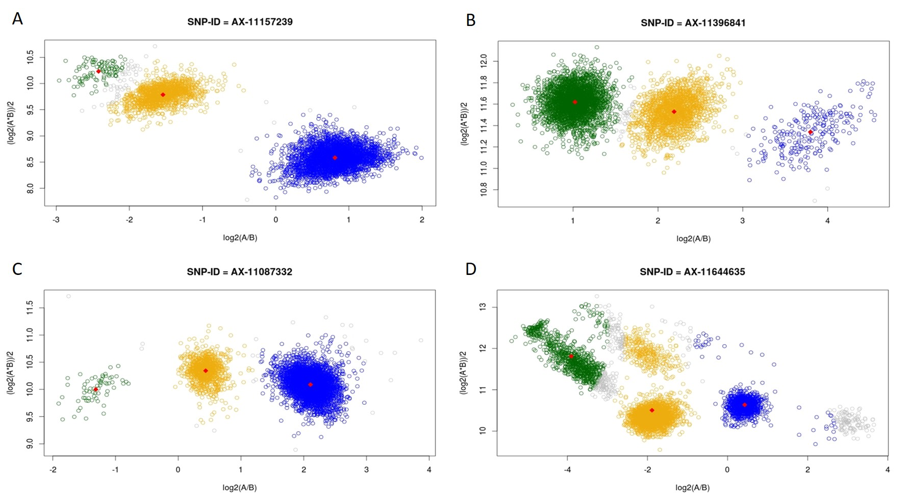

Sie können Ihre Lösungen zu Aufgabe 3 und 4 als PDF in Moodle hochladen (Frist: 13.12.2021). 

```{r setup1, echo=FALSE, warning=FALSE, message=FALSE}
r_on_server = FALSE
if(r_on_server==T) basicpath = "/net/ifs2/san_projekte/projekte/genstat/"  else basicpath =  "C:/Users/janne/Documents/R/Test/Teaching_WS2122/"
if(r_on_server==T) .libPaths("/net/ifs2/san_projekte/projekte/genstat/07_programme/rpackages/amanMRO/") 

#.libPaths()

if(r_on_server==T) pathwd = paste0(basicpath, "/13_lehre/WS2021_Statistik/uebung/Theorie/") else pathwd = paste0(basicpath,"Exercises_classic/")
setwd(pathwd)

# Hier sollen alle notwendigen Pakete stehen die im Laufe der Uebung genutzt werden
# library(knitr)
# library(foreach)
# library(doParallel)
library(data.table)
setDTthreads(1)
# library(readxl)
# library(lubridate)
# library(MASS)
# library(nlme)
# library(ggplot2)
# library(meta)
# library(qqman)
# library(ivpack)
# library(MendelianRandomization)

knitr::opts_chunk$set(echo = TRUE)

```

## Aufgabe 1: Populationsgenetik

Ein SNP wird in drei verschiedenen Populationen gemessen:

Genotyp      | AA  | AB  | BB 
------------ | --- | --- | ---
Population 1 | 125 | 250 | 125
Population 2 |  50 |  30 |  20
Population 3 | 100 | 500 | 400

a) Bestimmen Sie die Allelfrequenzen $p_i$ und $q_i$ für jede Population $i$ und die Gesamtfrequenzen $\bar{p}$ und $\bar{q}$ aller drei Populationen zusammen. 
b) Berechnen Sie den Inzuchtskoeffizient $F_i$ pro Population $i$, indem Sie die beobachtete und unter HWE erwartete Heterozygosität bestimmen. 
c) Erklären Sie, warum wir die Varianz mit der Heterozygosität gleichsetzen können. Hinweis: HWE nimmt Binomialverteilung an. 
d) Bestimmen Sie 
    + $H_I$ als Mittelwert der beobachteten Heterozygoten innerhalb der Populationen, 
    + $H_S$ als Mittelwert der erwarteten Heterozygoten innerhalb der Populationen und
    * $H_T$ als erwartete Heterozygote der Gesamtpopulation. 
e) Berechnen Sie mittels $H_S$ und $H_T$ den Fixationsindex $F_ST$. 
f) Interpretieren Sie die Ergebnisse. 

## Aufgabe 2: Heritabilität

In der Vorlesung haben Sie den Begriff **Heritabilität** kennengelernt. Definieren Sie diesen Begriff und beschreiben Sie kurz eine Methode wie diese geschätzt werden kann! 

Schätzen Sie folgende Aussagen ein (wahr/falsch): 

a) Falls eine Person die Veranlagung einer Krankheit hat, die eine Heritabilität von 1 besitzt, wird diese Person auch die Krankheit erleiden. 
b) Die Heritabilität Finger an jeder Hand zu haben ist 1 (oder fast 1). 
c) Die Begriffe „Heritabilität“ und „ererbt“ bedeuten fast das Gegenteil.
d) In Amerika der 1950er Jahre war die Heritabilität für das Tragen von Ohrringen sehr hoch.
e) Die Heritabilität von eineiigen Zwillingen ist 1.
f) Je mehr sich die Umwelt für verschieden Populationen mit unterschiedlicher Heritabilität angleicht, desto höher wird die (Gesamt-)Heritabilität. 

## Aufgabe 3: Genotypisierung

Sie haben in der Vorlesung den Begriff **Coverage** kennengelernt.

a) Von was hängt die Coverage einer Microarrays ab? 
b) Was sind die üblichen Referenz-Panels und wie unterscheiden diese sich? 
c) Beschreiben Sie stichpunktartig den Workflow der Affymetrix Axiom Plattform!

## Aufgabe 4: SNP-Clusterplots

Beim Calling gibt es verschiedene Kriterien der SNP-Qualität: 

Kriterium    | Bedeutung                                                              
------------ | -----------------------------------------------------------------------
Call Rate    | Anteil an Samples, die pro SNP gecalled wurde = 1 – Anteil missings 
p(HWE)       | Exakter Fisher Test $\rightarrow$ Ist die Differenz der beobachteten und der erwarteten Allelfrequenz (im HWE) signifikant? 
p(PA)        | Chi-Quadrat Test $\rightarrow$ Ist die Allelfrequenz abhängig von der Array-Platte (Batch-Effekt)? 
nMA bzw. MAF | Anzahl des Minor Allels in alles Samples $\rightarrow$ Ist der SNP monomorph, d.h. ist es eigentlich kein richtiger SNP in der verwendeten Kohorte? 
FLD          | Minimaler Abstand zwischen den Cluster (bzgl. X-Achse) $\rightarrow$ Sind die Cluster gut trennbar? 
HetSO        | Abstand des AB-Clusters zu AA bzw. BB (bzgl. Y-Achse) $\rightarrow$ Hat AB höhere Intensität als AA und BB? 
HomRO        | Verteilung der Cluster (bzgl. 0 der X-Achse) $\rightarrow$ Ist AB in etwa bei 0? 

a) Recherchieren Sie anhand Ihrer Vorlesungsunterlagen die Thresholds für jedes Kriterium. 
b) Betrachten Sie die vier unten angezeigten Clusterplots und geben Sie mit Begründung an, ob der SNP gefiltert werden muss. 

SNP | CR | p(HWE) | p(PA) | nMA | FLD | HetSO | HomRO
--- | -- | ------ | ----- | --- | --- | ----- | -----
AX-11157239 | 98.97 | 0.0026 | 0.86 | 1598 | 2.84 | 0.13 |  0.81
AX-11396841 | 99.37 | 0.25 | 0.15 | 2242 | 5.39 | 0.03 | -1.02
AX-11087332 | 99.49 | 0.89 | 0.67 | 1141 | 7.58 | 0.27 |  1.30
AX-11644635 | 93.92 | $5.24x10^{-29}$ | 0 | 4449 | 3.62 | -0.70 | 0.67



Hinweis: X-Achse: $log_2(Int(A)/Int(B))$, Y-Achse: $0.5 \cdot log_2(Int(A) \cdot Int(B))$

