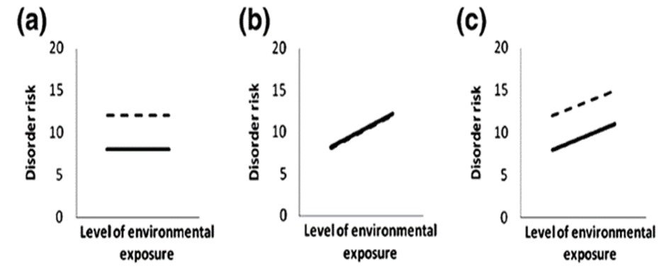
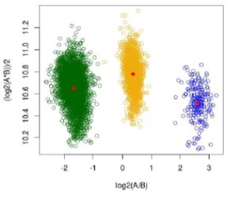
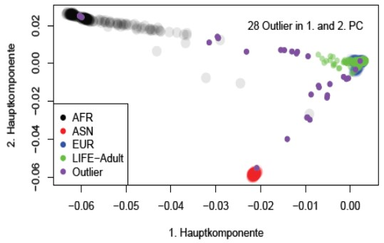
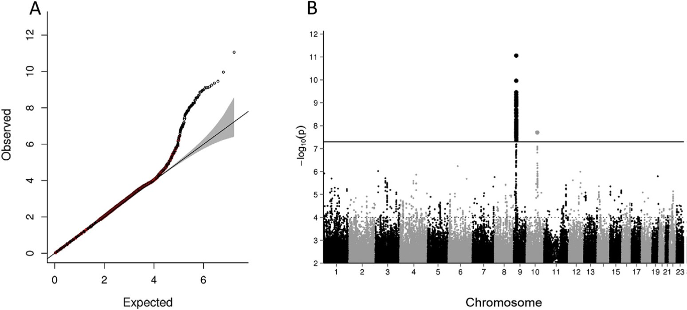
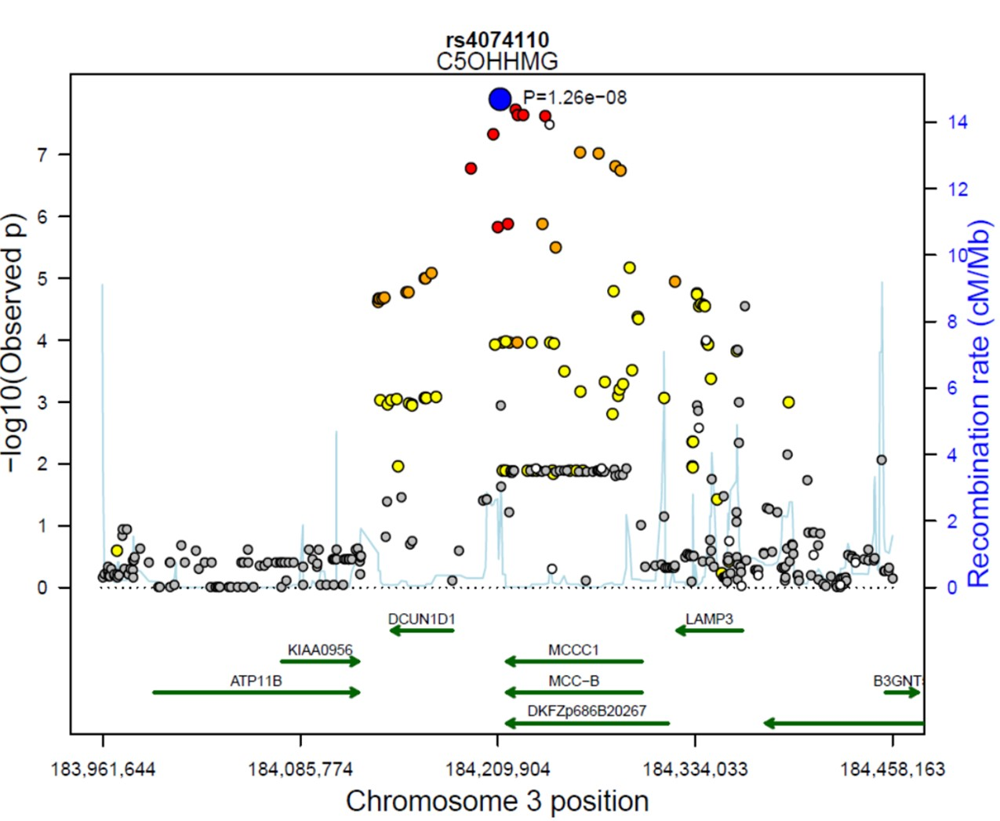
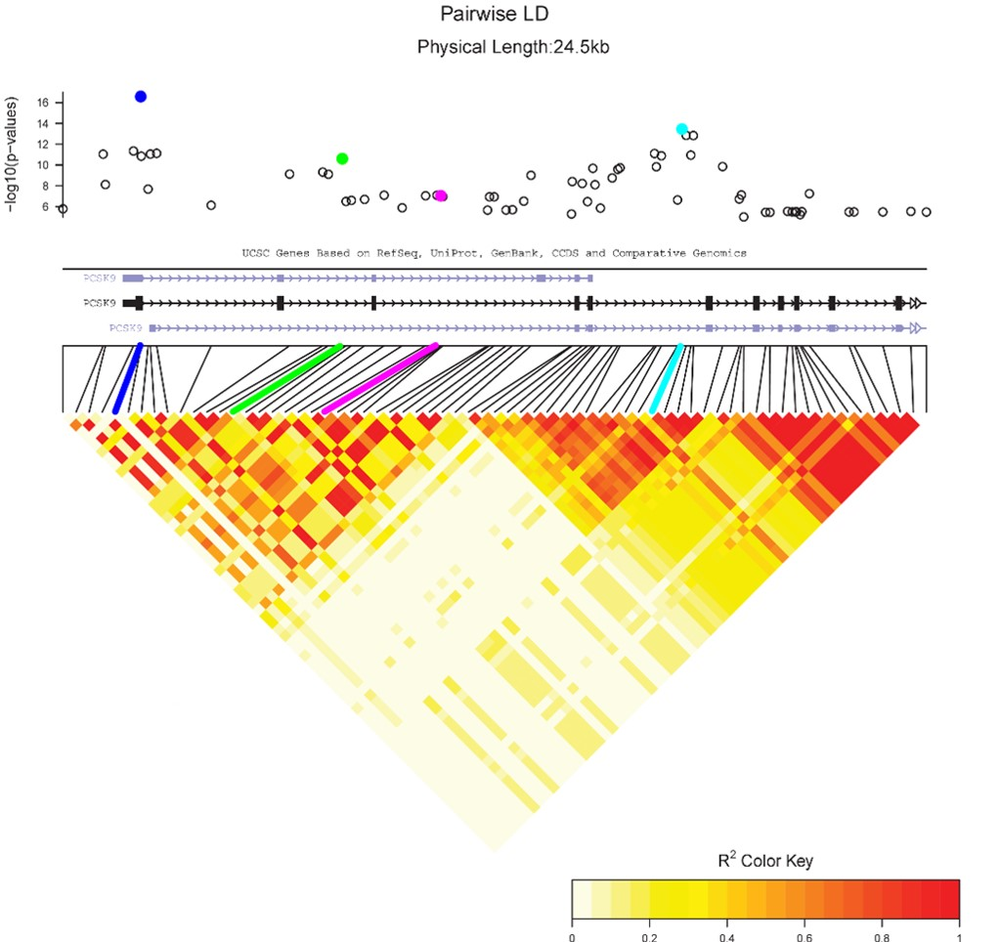
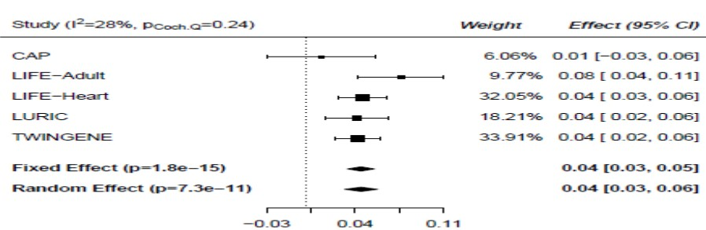
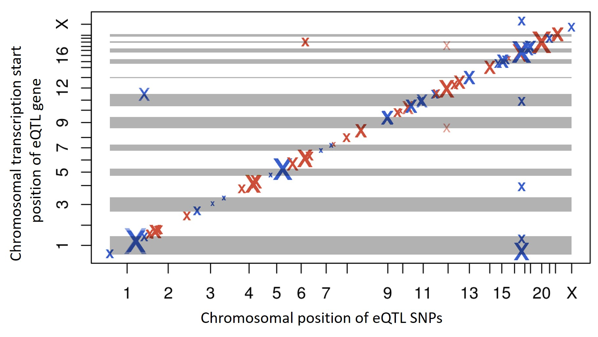
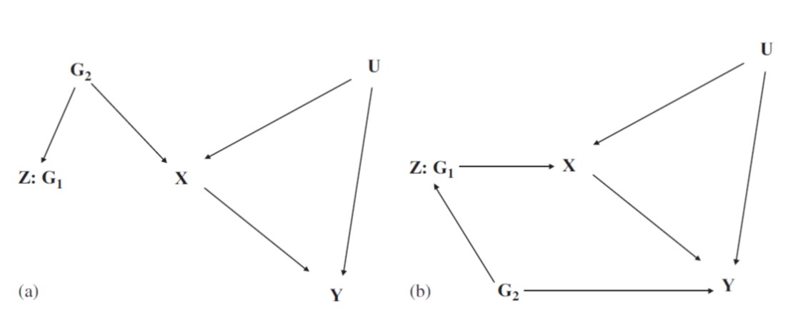

Sie können Ihre Lösungen zu Aufgabe 1 & 2 als PDF in Moodle hochladen (Frist: 24.01.2022). 

```{r setup1, echo=FALSE, warning=FALSE, message=FALSE}
r_on_server = FALSE
if(r_on_server==T) basicpath = "/net/ifs2/san_projekte/projekte/genstat/"  else basicpath =  "C:/Users/janne/Documents/R/Test/Teaching_WS2122/"
if(r_on_server==T) .libPaths("/net/ifs2/san_projekte/projekte/genstat/07_programme/rpackages/amanMRO/") 

#.libPaths()

if(r_on_server==T) pathwd = paste0(basicpath, "/13_lehre/WS2021_Statistik/uebung/Theorie/") else pathwd = paste0(basicpath,"Exercises_classic/")
setwd(pathwd)

# Hier sollen alle notwendigen Pakete stehen die im Laufe der Uebung genutzt werden
# library(knitr)
# library(foreach)
# library(doParallel)
library(data.table)
setDTthreads(1)
# library(readxl)
# library(lubridate)
# library(MASS)
# library(nlme)
# library(ggplot2)
# library(meta)
# library(qqman)
# library(ivpack)
# library(MendelianRandomization)

knitr::opts_chunk$set(echo = TRUE)

```

## Aufgabe 1: Genexpressionsanalysen

Ein paar Fragen zur Genexpression (GX):

a) Erläutern Sie die Begriff **eQTL** und **TWAS**. Was ist das Ziel einer genomweiten eQTL Studie? Was ist der Unterschied zwischen eQTL und TWAS?
b) Was ist der Unterschied zwischen cis und trans eQTLs? Wie sind hier die Grenzen definiert?
c) Warum adjustiert man bei GX-Analysen häufig auf Lymphozyten und Monozyten?
d) Wie kann man bei GX-Analysen auf technische bzw. biologische Confounder adjustieren?
e) Skizzieren Sie den Ablauf einer eQTL-Analyse!


## Aufgabe 2: Multiples Testen in GE-Analysen

Bitte führen Sie eine hierarchische Korrektur mittels Bonferroni auf beiden Stufen durch!

Gen  | SNP    | p-Wert
---- | ------ | --------
Gen1 | rs1001 | 0.05
Gen1 | rs1002 | 0.04
Gen1 | rs1003 | 0.005
Gen1 | rs1004 | 0.4
Gen1 | rs1005 | 0.3
Gen1 | rs1006 | 0.8
---- | ------ | --------
Gen2 | rs2001 | 0.1
Gen2 | rs2002 | 0.2
Gen2 | rs2003 | 0.04
Gen2 | rs2004 | 0.0001
Gen2 | rs2005 | 0.004
Gen2 | rs2006 | 0.02
Gen2 | rs2007 | 0.00005

## Aufgabe 3: Pathway-Analysen

Die Wirkung eines Medikaments X auf die Genexpression soll untersucht werden. Dazu wird ein Genexpressionsarray mit 15397 Genen verwendet und die Expression mit bzw. ohne Medikament verglichen. Dabei wurden 1042 Gene detektiert, die unterschiedliche Expression aufweisen. Das Medikament soll den Lipidstoffwechsel beeinflussen. Aus einer Datenbank sind dazu 2793 Gene bekannt, von denen 2587 auf dem Array enthalten sind. 

Wie viele signifikante Gene müssten im Lipidstoffwechsel liegen, um von einer signifikanten Anreicherung ausgehen zu können? Gehen Sie dazu von einer hypergeometrischen Verteilung aus. 


## Aufgabe 4: Interpretation von Plots

Bitte betrachten Sie die Plots und beantworten Sie folgende Fragen:

a) Wie heißt der Plot?
b) Aus welchen Daten wird er erzeugt?
c) Wie ist dieser Plot zu interpretieren?

{width=75%}

{width=50%}






{width=75%}

{width=65%}








