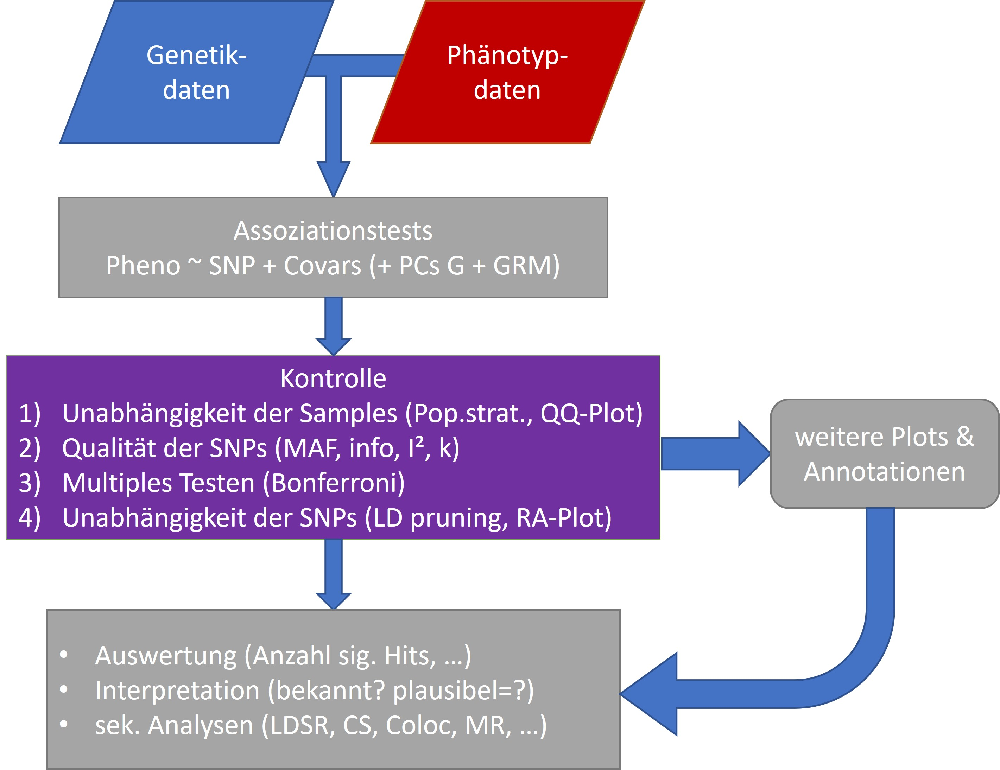
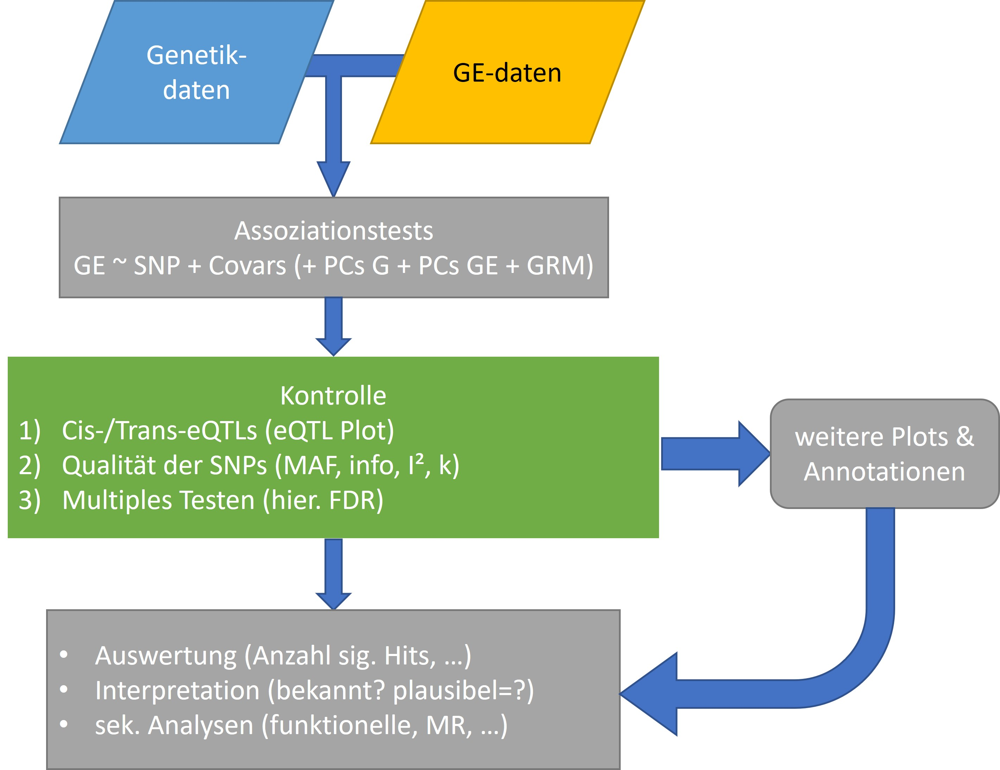
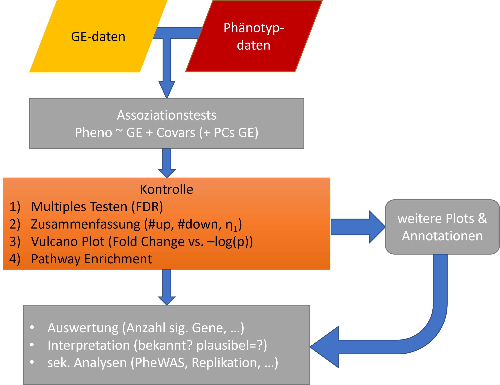

```{r setup, include=FALSE}
knitr::opts_chunk$set(echo = FALSE)
library(data.table)
setDTthreads(1)
library(ggplot2)
```

## Fragen

Gibt es Fragen zu

* Vorlesung?
* Übung?
* Seminar?

## Plan heute

* Blatt 6 - A1: Genexpressionsanalysen
* Blatt 6 - A2: Pathway-Analysen
* Blatt 6 - A3: Hierarchische Testkorrektur
* Blatt 6 - A4: Interpretation von Plots

# Genexpressionsanalysen

## Wiederholung GWAS-Workflow

{width=80%}

## Aufgabe 1

a) **eQTL** vs. **TWAS**
b) **cis** vs. **trans** eQTLs
c) Warum adjustiert man auf Lymphozyten und Monozyten?
d) Wie adjustiert man auf technische bzw. biologische Confounder?
e) Skizzieren Sie den Ablauf einer eQTL-Analyse!

## Aufgabe 1 - Lösung a) & b)

* **GE**: Genexpression, mRNA Levels 
* **eQTL**: Expression Quantitative Trait Locus $\Rightarrow GE \sim G$
* **TWAS**: Transkriptionsweite Assoziationsstudie $\Rightarrow Phänotyp \sim GE$
* Ziel eQTL: 
    * Funktionelle Relevanz, Validierung
    * Identifizierung neuer genetischer Risikofaktoren
    * Aufklärung grundlegender biologischer Zusammenhänge
* Ziel TWAS: 
    * Identifizierung von Gen - Phänotyp - Beziehungen
    * Pathwayanalysen
* **Cis**: SNP „in Nähe“ der Expressionssonde (1 MB Fenster)
* **Trans**: SNP „weit weg“ von Expressionssonde (mehr als 1 MB, auch andere Chromosomen)

## Aufgabe 1 - Lösung c) & d)

* **Technische Confounder**: z.B. Batcheffekte, Hintergrundrauschen, sollte in der Präprozessierung der GE-Arrays bereits korrigiert werden. 
* **Biologische Confounder**: können meist als Modellparameter berücksichtigt werden: 
    + **Blutwerte**: nötig bei Blutgewebe da verschiedene Blutkörperfraktionen mit unterschiedliche GE 
    + Alter, Geschlecht, Medikamente: bekannter Einfluss (bsp. Sexualhormone sind Transkriptionsfaktoren)
    + Weitere, unbekannte Confounder: PCA der GE

## Aufgabe 1 - Lösung e) 

{width=80%}

## Aufgabe 1 - Zusatz

{width=80%}

# Pathwayanalysen

## Aufgabe 2

Frage: $GE \sim Medikament$?, $N=15,397$ GEs ($k=1,042$ sig. assoziiert, $m=2,587$ im Lipidpathway)

Wie viele signifikante Gene müssten im Lipidstoffwechsel liegen, um von einer signifikanten Anreicherung ausgehen zu können? Gehen Sie dazu von einer hypergeometrischen Verteilung aus. 

## Hintergrund (1)

\begin{figure}[here]
\begin{center}
\includegraphics[width=0.8\textwidth]{../Exercises_classic/figures/Blatt6_PathwayAnalyse.jpg}
\caption{Schema einer Überrepräsentationsanalyse.}
\label{fig:Pathway}
\end{center}
\end{figure}

## Hintergrund (2)

**Idee**: Urne mit $N-m$ schwarzen und $m$ weißen Kugeln, aus der $k$ mal ohne zurücklegen gezogen wird. Wie hoch ist die Wahrscheinlichkeit, dass $q$ Kugeln weiß sind?

* $N = 15,397$ = Größe der Grundmenge (alle Gene),
* $k$ = Größe der Stichprobe, $k \leq N$ (differenziell exprimierte Gene), und
* $m$ = Größe einer spezifischen Teilmenge von $N$, $m \leq N$ (Gene eines Pathway),

so gilt für die Wahrscheinlichkeit, dass die Stichprobe $k$ Elemente von der spezifischen Teilmenge enthält

$$P(q) = \frac{\binom{m}{q}\binom{N-m}{k-q}}{\binom{N}{k}}$$

## Aufgabe 2 - Lösung

* $N=15,397, m=2,587, k=1,042$, $m/N=16.8\% \rightarrow 16.8\% \cdot k =175$, 
* Bei $q=175$ Treffern ist die Ratio gleich (= Erwartung, keine Anreicherung). 
* Suche nach $q>175$, sodass $P(q>x)>0.95$ (Anreicherung, mehr Treffer als zufällig erwartet). 

```{r, echo=T}
qhyper(0.95,2587,15397-2587,1042)
```

* $P(x \leq 194)=0.95 \rightarrow$ ab $q \geq 195$ signifikanten Anreicherung

# Hierarchische Testkorrektur

## Aufgabe 3

Hierarchische Korrektur mittels Bonferroni für folgende Daten:


Gen 1  | -        | Gen 2  | -        | Gen 3  | - 
------ | -------- | ------ | -------- | ------ | --------
SNP    | p-Wert   | SNP    | p-Wert   | SNP    | p-Wert 
------ | -------- | ------ | -------- | ------ | --------
rs1001 | 0.05     | rs2001 | 0.1      | rs1004 | 0.0124
rs1002 | 0.04     | rs2002 | 0.2      | rs1005 | 0.2
rs1003 | 0.005    | rs2003 | 0.04     | rs1006 | 0.0025
rs1004 | 0.4      | rs2004 | 0.0001   | rs2001 | 0.5
rs1005 | 0.3      | rs2005 | 0.004    | rs2002 | 0.00001
rs1006 | 0.8      | rs2006 | 0.02     | rs2003 | 0.054
-      | -        | rs2007 | 0.00005  | -      | -

## Hintergrund

* **Multiples Testproblem**: Alphafehler-Kumulierung (globale Erhöhung des Fehler 1. Art, mehr falsch positive). 
* Hierarchisches FDR:
    1) Adjustierung Genebene: $n_i$ Tests pro Transkript
    2) min. adj. p-Wert pro Transkript bestimmen
    3) Adjustierung global: $n$ Gene
    4) Bestimmung der Anzahl $k$ der sig. assoziierten Transkripte mittels Step 3
    5) Bestimmung des globalen Sig.niveaus $\alpha_1 = 0.05 \cdot k/n$ 
    6) Anwendung von $\alpha_1$ auf die adjustierten p-Werte von Step 1

```{r B6A3_0, echo=F}
myTab = data.table::data.table(gene = c(rep("Gen1",6), rep("Gen2",7), rep("Gen3",6)),
                               SNP = c("rs1001", "rs1002", "rs1003", "rs1004", "rs1005","rs1006",
                                       "rs2001","rs2002","rs2003","rs2004","rs2005","rs2006","rs2006",
                                       "rs1004","rs1005","rs1006","rs2001","rs2002","rs2003"),
                               pVal = c(0.05,0.04,0.005,0.4,0.3,0.8,
                                        0.1,0.2,0.04,0.0001,0.004,0.02,0.00005,
                                        0.0124,0.2,0.0025,0.5,0.00001,0.054))
```

## Aufgabe 3 - Lösung (1)

```{r B6A3_1, echo=T}
head(myTab)
myTab[,.N,by=gene]
```


## Aufgabe 3 - Lösung (2)

```{r B6A3_2, echo=T}
# step 1: Bonferroni innerhalb der Gene
myTab[,p_adj1 := pVal*6]
myTab[gene == "Gen2",p_adj1 := pVal*7]

# step 2: check min p_adj
myTab2 = myTab[,.SD[p_adj1==min(p_adj1)],by=.(gene)]
myTab2

```

## Aufgabe 3 - Lösung (3)

```{r B6A3_3, echo=T}
# step 3: Bonferroni über die Gen
n = dim(myTab2)[1]
myTab2[,p_adj2 := p_adj1*n]
myTab2[p_adj2<=0.05]

# step 4 & 5: k und alpha1 bestimmen
(k = dim(myTab2[p_adj2<=0.05])[1])
(a1 = 0.05 * (k/n))

```

## Aufgabe 3 - Lösung (4)

```{r B6A3_4, echo=T}
# step 6: a1 auf level 1 anwenden (nur bei genen, die in level 2 assoziiert waren!)
matched = match(myTab$gene,myTab2$gene)
myTab[,p_adj2 :=myTab2[matched,p_adj2]]
myTab[p_adj1 <= a1 & p_adj2<=0.05,]

```

Es sind insgesamt 5 SNPs mit den zwei Genen assoziiert!

# Plots der Vorlesung

## Aufgabe 4

Bitte betrachten Sie die Plots und beantworten Sie folgende Fragen:

a) Wie heißt der Plot?
b) Aus welchen Daten wird er erzeugt?
c) Wie ist dieser Plot zu interpretieren?

## Plot 1


## Plot 1: Genetik-Umwelt-Interaktionsplot

* Darstellung des Haupt- bzw. Interaktionseffekts der Genetik und Umwelt auf das Risiko einer Erkrankung. Durchgezogenen Linie: Allel A; gestrichelte Linie: Allel B
* Panel a: Haupteffekt durch die Genetik, Allel B erhöht das Risiko, kein Umwelteinfluss
* Panel b: Haupteffekt durch die Umwelt, Genetik spielt keine Rolle
* Panel c: Additiver Effekt von Umwelt und Genetik, keine Interaktion
* Für Interaktion müssten sich die Linien überkreuzen bzw. nicht mehr parallel verlaufen.

## Plot 2

{width=80%}

## Plot 2: SNP-Clusterplot

* Clusterplot eines SNPs, Aufgetragen sind die transformierten Intensitäten der zwei Allele. Grün: Cluster von Genotyp BB; Gelb: Cluster AB; Blau: Cluster AA; rot: Mittelpunkte der Cluster
* keine / kaum graue Punkte zu sehen $\rightarrow$ wenige Missings, gute Callrate
* kein sehr kleines Cluster $\rightarrow$ MAF nicht zu klein
* AB Cluster etwa bei 0 bzgl. der X-Achse und über den BB bzw. AA Cluster bzgl. der Y-Achse; alle drei Cluster deutlich von einander getrennt $\rightarrow$ Clusterkriterien erfüllt. 
* SNP muss wahrscheinlich nicht gefiltert werden, aber HWE ist hier nicht ablesbar.

## Plot 3


## Plot 3: X-Y-Intensity Plot

* Intensitätsplot aller gonosomalen SNPs (Mittelwert pro X bzw. Y pro Sample). Farbcodierung vergleicht Geschlecht aus der Datenbank mit dem in dem Calling berechneten Geschlecht.
* Zwei Mismatches (cyan und rot): hier stimmt das Datenbankgeschlecht nicht zu dem Berechneten $\rightarrow$ beide für alle Analysen filtern.
* Zwei Frauen mit relativ niedriger X-Intensität, eine Frau mit höherer X-Intensität, und zwei Männer mit höheren Y-Intensitäten $\rightarrow$ für gonosomale Analysen filtern.
* Ein Mann, dessen Geschlecht nicht berechnet werden konnte, der aber auch hohe X-Intensitäten hat (XXY-Mann) $\rightarrow$ für gonosomale Analysen filtern.
* Die übrigen *unkown* Samples können bleiben, da diese vermutlich nur etwas schlechtere SNP-Quali haben. 
* Aussagen sollten noch mit X-Intensity-X-Heterozygosity Plot gecheckt werden.

## Plot 4


## Plot 4: PC-Plot

* Hauptkomponentenanalyse der Genetikdaten, aufgetragen sind die ersten zwei Eigenvektoren. Diese trennen die ethnische Herkunft der Samples auf. Schwarz: afrikanisches Cluster; rot: asiatisches Cluster; blau: euopäisches Cluster; grün: unbekannte Ethnie (vermutlich Europäer); lila: unbekannte Ethnie entlang des Dreiecks
* Hauptkomponenten werden verwendet um auf Stratifikationsbias in genomweiten Studien zu adjustieren. Stratifikationsbias: falsche Schätzer genetischer Effekte aufgrund einer gemeinsamen Analyse von Personen unterschiedlicher genetischer Herkunft bei gleichzeitigem Vorliegen nichtgenetisch bedingter Unterschiede zwischen den Personengruppen. 


## Plot 5


## Plot 5: QQ- und Manhattan-Plot

* QQ-Plot: Vergleich der erwarteten Verteilung der Teststatistiken mit der Beobachteten.
* Keine Inflation der Teststatistiken zu sehen (d.h. Beobachtungen liegen auf der Ursprungsgeraden für nicht signifikante Beobachtungen)
* Manhattan-Plot: Auftragung aller SNPs und ihrer -$log_{10}$-transformierten p-Werte. Durchgezogene Linie entspricht der genomweiten Signifikanz ($p=5 \cdot 10^{-8}$)
* Es gibt zwei genomweit signifikante Hits (Chr. 9 & 10)

## Plot 6

{width=75%}

## Plot 6: Regional-Association-Plot

* Entspricht einem Zoom in einen Manhattanplot
* Zusätzliche Informationen: Rekombinationsrate (hellblaue Peaks entsprechen Rekombinationshotspots); Gene (inkl. Ableserichtung); LD bezüglich des Top-Hits (Färbung der Punkte)
* Es fehlt eine LD-Legende! Vermutlich rot: hohes LD ($r^2>0.8$), orange: mittleres LD ($0.5<r^2<0.8$), gelb: niedriges LD ($0.2<r^2<0.5$), grau: kein LD ($r^2<0.2$). 
* Vermutlich nur ein genomweit signifikantes Signal, die anderen stark assoziierten Varianten sind über LD gekoppelt (nicht unabhängig).
* Man kann nicht das kausale Gen ablesen, da man nicht weiß, ob es sich um eine Missense-Mutation in einem Gen oder Mutation im Enhancer Bereich vor einem Gen handelt. 

## Plot 7

{width=65%}

## Plot 7: LD-Heatmap

* Alle paarweisen LD $r^2$ einer Region sind im Dreieck aufgetragen. Die Striche zeigen die Position in einem Gen an (dunkle Kästen: Exons), darüber ist ein Manhattanplot aufgetragen. 
* Man erkennt drei Haploblöcke. Im ersten sind drei signifikante SNPs (blau, grün, magenta), die die restlichen SNPs im Block taggen. Im zweiten Block gibt es nur einen signifikanten Hit (cyan), im letzten Block keinen. 
* Der erste Block ist etwas uneinheitlich. Dies kann daran liegen, dass es sich hier um mehrere Varianten mit niedriger MAF handelt. 

## Plot 8


## Plot 8: Forest-Plot

* Meta-Analyse eines SNPs in 5 Studien. 
* Größe der Schätz-Quadrate spiegelt Fallzahl der Studien wider, Fehlerbalken das 95%-Konfidenzinterval. 
* Es wurden sowohl fixed als auch random effects model gerechnet, wobei sich die Schätzer nicht, nur der Standardfehler etwas unterscheidet (niedrige Heterogenität, alle Effekte gehen in die gleiche Richtung). 
* Sowohl der FEM- als auch der REM-Schätzer sind genomweit signifkant. 

## Plot 9


## Plot 9: eQTL-Plot

* Position der SNPs gegen die Position der Sonden aufgetragen, wobei nur signifikante eQTLs mit einem Kreuz gekennzeichnet wurden (Farbe alternierend bzgl. SNP Position, graue Streifen bzgl. Sonden Position). Je größer das Kreuz, desto stärker die Assoziation.  
* Entlang der Ursprungsgeraden liegen cis-eQTLs. 
* Auf Chromosom 1, 6, 12, und 16 gibt es trans-eQTLs, die mit Sonden auf Chr. 11, 19, 8 und 18, und 1, 4, 11, und X assoziieren. 

## Plot 10


## Plot 10: MR-DAGs

* Gerichtete Azyklische Graphen für eine Mendelische Randomisierung. 
* Panel a: $G_1$ ist ein valides Instrument, da es keinen anderen Weg zu Y gibt als über X. 
* Panel b: $G_1$ ist ein invalides Instrument, da es in hohen LD zu $G_2$ steht und $G_2$ direkt Y beeinflusst. 

# Zusammenfassung

## Zusammenfassung

* **eQTLs**: Expression Quantitative Trait Locus $\Rightarrow GE_i \sim G_j$, für alle $i = 1, ... m$ Genexpressionssonden und alle $j = 1,  ... n$ SNPs
* **TWAS**: Transkriptionsweite Assoziationsstudie $\Rightarrow Phänotyp \sim GE_i$, für alle $i = 1, ... m$ Genexpressionssonden
* **Pathwayanalyse**: Sind mehr Gene eines Pathways mit einem Phänotypen assoziiert, als man zufällig erwarten würde?
* **Hierarchische Korrektur** auf multiples Testen: Bsp. eQTL-Studie, alle SNPs mit allen GE-Sonden getesten, also sowohl multiple Test auf SNP als auch auf GE-Ebene. Daher korrigiert man hier in Stufen, erst innerhalb einer Sonde, anschließend über alle Sonden hinweg. 
