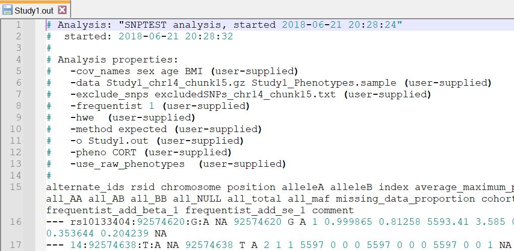

```{r setup, include=FALSE}
knitr::opts_chunk$set(echo = FALSE)
library(data.table)
setDTthreads(1)
library(ggplot2)
library(meta)
library(qqman)
library(foreach)
```

## Fragen

Gibt es Fragen zu

* Vorlesung?
* Übung?
* Seminar?

## Plan heute

Genomweite Meta-Analyse (R-Blatt 5)

## Ausgangslage

Daten von 6 Studien

Schritt 1: Daten anschauen 

## Screenshot



## Screenshot - Auswertung

* pheno CORT --> Phänotyp Cortisol (Steroidhormon)
* cov_names sex age BMI in Study 1 & 4, cov_names age BMI in Study 2, 3, 5 & 6 --> Unterschiedliche Adjustierung, mögliche Fehlerquelle
* frequentist 1 --> additives Modell
* method expected --> Gendoses

|Studie|1|2|3|4|5|6|
|------|-|-|-|-|-|-|
|Fallzahl|5597|2943|2654|2070|1358|712|

## Ausgangslage

Daten von 6 Studien

Schritt 1: Daten anschauen 

Schritt 2: Daten filtern  

## Filter (vor GWAMA)

Auf was kann muss man filtern?

## Filter (vor GWAMA)

Auf was kann muss man filtern?

* Vollständigkeit der Daten (beta, se, maf, Allele, ...)
* Gleiche IDs (sonst keine Meta-Analyse)
* **KEINE** Filterung von MAF, p-Wert oder LD, das kommt erst **NACH** der GWAMA

## Filter (vor GWAMA) in R

```{r, eval=T, echo=T, warning=F}
pathToData = "../Exercises_R/data2/"

# laden
tab1<-fread(paste0(pathToData,"Study1.out"),skip = 14)
tab2<-fread(paste0(pathToData,"Study2.out"),skip = 14)
tab3<-fread(paste0(pathToData,"Study3.out"),skip = 14)
tab4<-fread(paste0(pathToData,"Study4.out"),skip = 14)
tab5<-fread(paste0(pathToData,"Study5.out"),skip = 14)
tab6<-fread(paste0(pathToData,"Study6.out"),skip = 14)
```

## Filter (vor GWAMA) in R

```{r, eval=T, echo=T}
# filtern auf Schnittmenge
sharedIDs = tab1[is.element(rsid,tab4$rsid),rsid] 
tab1<-tab1[is.element(rsid,sharedIDs),]
tab2<-tab2[is.element(rsid,sharedIDs),]
tab3<-tab3[is.element(rsid,sharedIDs),]
tab4<-tab4[is.element(rsid,sharedIDs),]
tab5<-tab5[is.element(rsid,sharedIDs),]
tab6<-tab6[is.element(rsid,sharedIDs),]
```

Insgesamt sind imm 156420 SNPs in den Studien, aber nur 156415 in der Schnittmenge. 

## Filter (vor GWAMA) in R

```{r, eval=T, echo=T}
# prüfe Reihenfolge (hier nur am Beispiel von tab1, tab2, und tab4) 
stopifnot(tab1$rsid==tab2$rsid)
stopifnot(tab1$rsid==tab4$rsid)

```

## Filter (vor GWAMA) in R

```{r, eval=T, echo=T}
# prüfe Allele (hier nur am Beispiel von tab1, tab2, und tab4) 
stopifnot(tab1$alleleA==tab2$alleleA)
stopifnot(tab1$alleleA==tab4$alleleA)

```

## Filter (vor GWAMA) in R

```{r, eval=T, echo=T}
# filtern auf NA
filt3<-!is.na(tab1$comment) &
  !is.na(tab2$comment) &
  !is.na(tab3$comment) & 
  !is.na(tab4$comment) &
  !is.na(tab5$comment) &
  !is.na(tab6$comment) 
table(filt3)
table(filt3,!is.na(tab1$comment))
```

## Filter (vor GWAMA) in R

```{r, eval=T, echo=T}
tab1<-tab1[!filt3,]
tab2<-tab2[!filt3,]
tab3<-tab3[!filt3,]
tab4<-tab4[!filt3,]
tab5<-tab5[!filt3,]
tab6<-tab6[!filt3,]
```

Insgesamt sind 96543 SNPs immer NA. Diese werden gefiltert. Für die Meta-Analyse stehen daher 59872 SNPs zur Verfügung. 

## Ausgangslage

Daten von 6 Studien

Schritt 1: Daten anschauen 

Schritt 2: Daten filtern 

Schritt 3: Meta-Analyse durchführen

## GWAMA

Was ist mein Input?

Was ist mein Output?

## GWAMA

Was ist mein Input?

* Beta & SE pro Studie
* Für Post-GWAMA-QC: EAF, info

Was ist mein Output?

* Statisiken von FEM & REM (beta, SE, p, $I^2$)
* Minimale Info
* Gewichtete EAF

## GWAMA in R

```{r, eval=F, echo=T}
j<-seq(1,60000,10000)
#dumTab = foreach(i = 1:dim(tab1)[1])%do%{
  dumTab = foreach(i = 1:50)%do%{
  #i=1
  if(is.element(i,j)==T)message(paste0("working on SNP ", i))
  myBetas<-c(tab1$frequentist_add_beta_1[i],tab2$frequentist_add_beta_1[i],tab3$frequentist_add_beta_1[i],tab4$frequentist_add_beta_1[i],tab5$frequentist_add_beta_1[i],tab6$frequentist_add_beta_1[i])
  mySEs<-c(tab1$frequentist_add_se_1[i],tab2$frequentist_add_se_1[i],tab3$frequentist_add_se_1[i],tab4$frequentist_add_se_1[i],tab5$frequentist_add_se_1[i],tab6$frequentist_add_se_1[i])
  mod<-metagen(myBetas,mySEs,studlab = c("Study 1","Study 2","Study 3","Study 4","Study 5","Study 6"))
  
  n = c(tab1$all_total[i], tab2$all_total[i], tab3$all_total[i],tab4$all_total[i], tab5$all_total[i], tab6$all_total[i])
  totalN = sum(n)
  nWeight = n/totalN
  maf = c(tab1$all_maf[i] , tab2$all_maf[i], tab3$all_maf[i],tab4$all_maf[i], tab5$all_maf[i], tab6$all_maf[i])
  nWeightedMAF = sum(nWeight * maf)
  
  minInfo = min(c(tab1$info[i], tab2$info[i], tab3$info[i],tab4$info[i], tab5$info[i], tab6$info[i]))
  
  myRes = data.table(beta_FEM = mod$TE.fixed,
                     se_FEM = mod$seTE.fixed,
                     pval_FEM = mod$pval.fixed,
                     beta_REM = mod$TE.random,
                     se_REM = mod$seTE.random,
                     pval_REM = mod$pval.random,
                     k = mod$k,
                     I2 = mod$I2,
                     MAF_weighted = nWeightedMAF,
                     info_min = minInfo)
  myRes
  
}

myTab = rbindlist(dumTab)
colnames(myTab)
```

## GWAMA in R

```{r, eval=T, echo=F}
j<-seq(1,60000,10000)
dumTab = foreach(i = 1:dim(tab1)[1])%do%{
#dumTab = foreach(i = 1:500)%do%{
  #i=1
  if(is.element(i,j)==T)message(paste0("working on SNP ", i))
  myBetas<-c(tab1$frequentist_add_beta_1[i],
             tab2$frequentist_add_beta_1[i],
             tab3$frequentist_add_beta_1[i],
             tab4$frequentist_add_beta_1[i],
             tab5$frequentist_add_beta_1[i],
             tab6$frequentist_add_beta_1[i])
  mySEs<-c(tab1$frequentist_add_se_1[i],
           tab2$frequentist_add_se_1[i],
           tab3$frequentist_add_se_1[i],
           tab4$frequentist_add_se_1[i],
           tab5$frequentist_add_se_1[i],
           tab6$frequentist_add_se_1[i])
  mod<-metagen(myBetas,mySEs,
               studlab = c("Study 1","Study 2","Study 3",
                           "Study 4","Study 5","Study 6"))
  #print(summary(mod))
  #forest(mod)
  
  n = c(tab1$all_total[i], tab2$all_total[i], tab3$all_total[i],
        tab4$all_total[i], tab5$all_total[i], tab6$all_total[i])
  totalN = sum(n)
  nWeight = n/totalN
  maf = c(tab1$all_maf[i] , tab2$all_maf[i], tab3$all_maf[i],
        tab4$all_maf[i], tab5$all_maf[i], tab6$all_maf[i])
  nWeightedMAF = sum(nWeight * maf)
  
  minInfo = min(c(tab1$info[i], tab2$info[i], tab3$info[i],
        tab4$info[i], tab5$info[i], tab6$info[i]))
  
  myRes = data.table(beta_FEM = mod$TE.fixed,
                     se_FEM = mod$seTE.fixed,
                     pval_FEM = mod$pval.fixed,
                     beta_REM = mod$TE.random,
                     se_REM = mod$seTE.random,
                     pval_REM = mod$pval.random,
                     k = mod$k,
                     I2 = mod$I2,
                     MAF_weighted = nWeightedMAF,
                     info_min = minInfo,
                     chr = 14,
                     pos = tab1$position[i],
                     SNP = tab1$rsid[i])
  myRes
  
}

myTab = rbindlist(dumTab)
colnames(myTab)
```

## GWAMA in R

```{r, echo=TRUE}
# QQ und Manhattan Plot vorbereiten
table(myTab$chromosome)

Y1<-qchisq(1-myTab$pval_FEM,df = 1)
lambda1<-median(Y1)/0.456
Y2<-qchisq(1-myTab$pval_REM,df = 1)
lambda2<-median(Y2)/0.456
lambda1;lambda2
```

## GWAMA in R: QQ - FEM

```{r}
# Plots FEM
qq(myTab$pval_FEM, main=paste("QQ-Plot FEM, vor QC, Inflation",round(lambda1,3),sep=": "))
```

## GWAMA in R: Manhattan - FEM

```{r}
# Plots FEM
manhattan(myTab, chr="chr", bp="pos", p="pval_FEM",
          main = "Manhattan-Plot FEM, vor QC",
          suggestiveline = -log10(1e-06), genomewideline =-log10(5e-08),
          xlim=c(min(myTab$pos),max(myTab$pos)))
```

## GWAMA in R: QQ - REM

```{r}
# Plots REM
qq(myTab$pval_REM, main=paste("QQ-Plot REM, vor QC, Inflation",round(lambda2,3),sep=": "))

```

## GWAMA in R: Manhattan - REM

```{r}
# Plots REM
manhattan(myTab, chr="chr", bp="pos", p="pval_REM",
          main = "Manhattan-Plot REM, vor QC",
          suggestiveline = -log10(1e-06), genomewideline =-log10(5e-08),
          xlim=c(min(myTab$pos),max(myTab$pos)))
```

## GWAMA 

Problem: hohe Inflation

Ursache?

## GWAMA 

Problem: hohe Inflation

Ursache: 

* unterschiedliche Modelle
* Populationsstruktur in den Studien! Study 1 = Study 2 (Männer) + Study 3 (Frauen)

Lösung: 

* Nur mit Study 2, 3, 5, und 6 arbeiten!
* Anschließend $\lambda$ neu ausrechnen und bewerten
* Falls ok, dann SNPs filtern 

## Filter (nach GWAMA)

* MAF<0.01: minor allele frequency, man filtert meistens die ganz seltenen Varianten raus
* info<0.5: Imputationsqualität, abhängig von Analyseplan, wird oft auch höher angesetzt, z.B. 0.8
* p(Q)<0.05: Cochrans Q Statistik, Heterogenitätsmaß, Summe der gewichteten Differenzen, p-Wert mit k-1 Freiheitsgraden; bei wenigen Studien wird die Grenze noch oben korrigiert, z.B 0.1
* $I^2$>75%: $I^2$ Statistik, Heterogenitätsmaß, Prozentsatz der Variation zwischen Studien
* k<2: Anzahl der Studien
* $p<5x10^-8$: p-Wert der Meta-Analyse (Standard = FEM)
* $r^2$>0.5: LD-Maß, statistische Abhängigkeit der Marker, der bestassoziierte SNP bleibt, SNPs in LD zu diesem werden gefiltert

## Online Annotation

Lead SNP: rs9989237

* dbSNP
* GeneCards
* GTEx
* GWAS Catalog
* LD-Tool
* KEGG Pathway
