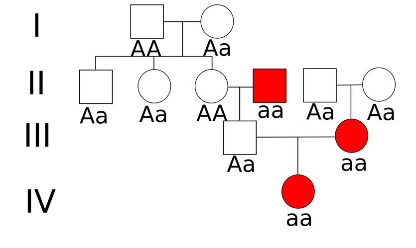
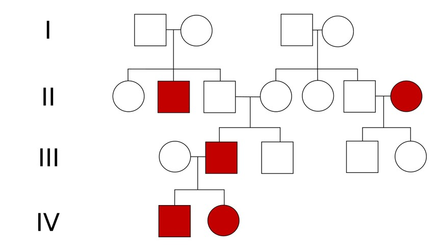
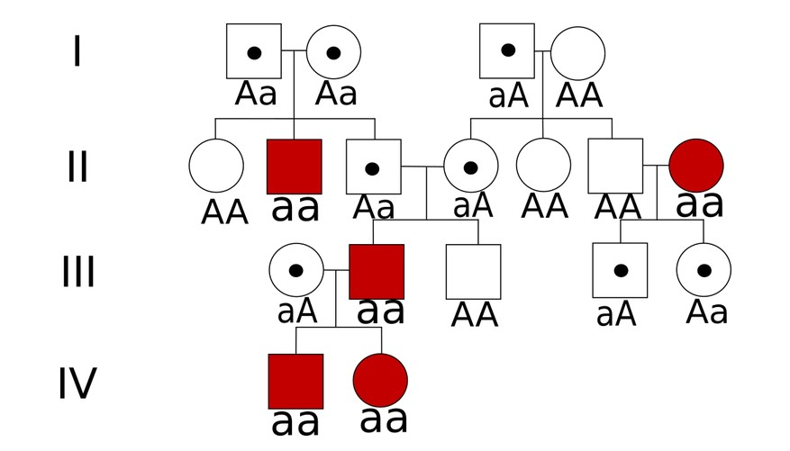
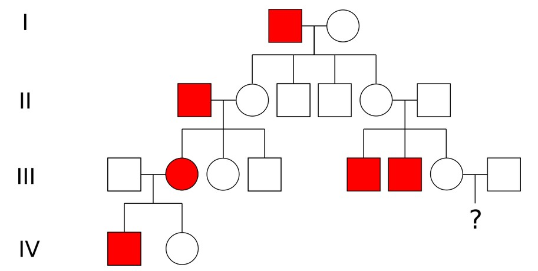
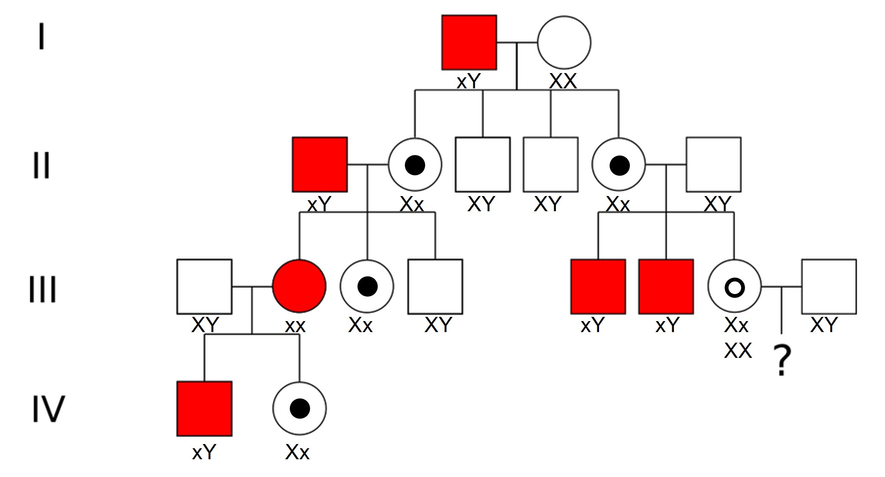
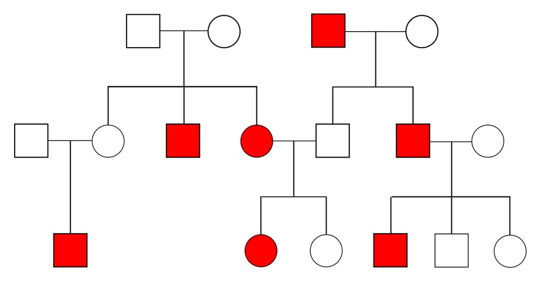
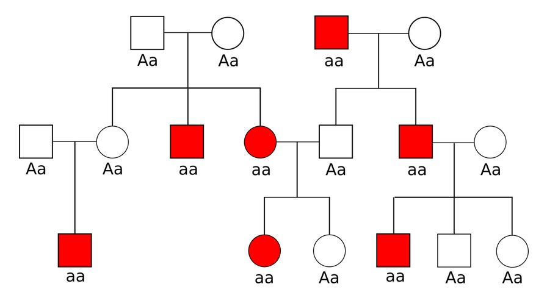
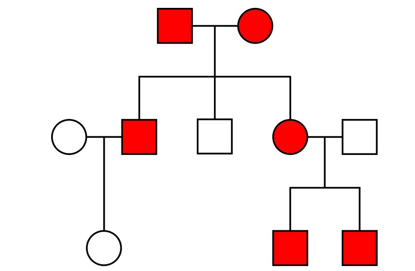
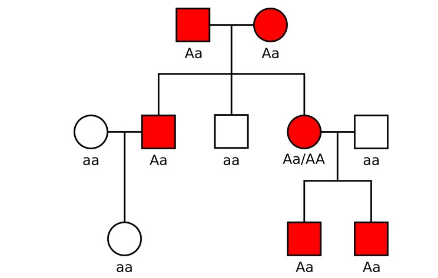

```{r, echo=FALSE, warning=FALSE, message=FALSE}
library(knitr)
library(foreach)
library(doParallel)
library(data.table)
library(readxl)
library(ggplot2)
```

## Fragen 

Gibt es bereits Fragen zu

* Vorlesung,
* Übung, 
* Seminar?

## Plan heute

Besprechung der ersten beiden Übungsblätter

* Biologische Grundlagen
* Einführung in R

Ein paar weitere Aufgaben zu 

* Stammbäumen
* SNPs - Crossing-Over - Blutgruppen

# Biologische Grundlagen

## Aufgabe 1: Definitionen

Definieren Sie **SNP**, **CNV** und **Chromosomen-Mutationen** und geben Sie je ein Beispiel dafür an.

## Aufgabe 1: Lösung

**SNP** = single nucleotid polymorphism = Einzelnukleotid Polymorphismus = Punktmutation

* Variation eines Basenpaares an einer Stelle im Genom
* Bsp.: SNP in *MCM6* führt zu Laktoseintoleranz

**CNV** = copy number variation = Kopienzahlvariation

* Form der strukturellen Variation (Chromosomen-Mutation)
* Deletion oder Duplikation von ganzen Genen
* Bsp.: Walters et al (2010), Deletion von ~ 600 kb auf 16p11.2 ist assoziiert mit Übergewicht
* Bsp.: Jacquemont et al. (2011), Duplikation von ~ 600 kb auf 16p11.2 ist assoziiert mit Untergewicht

**Chromosomen-Mutation** = Deletion, Duplikation, Inversion (intra), oder Insertion, Translokation (inter) von Genen aber auch ganzen Chromosomen

* Bsp.: Translokations-Trisomie 21: Chr 21 3x vorhanden, eines davon hat sich an Chr. 13, 14,15 oder 22 angelagert

## Aufgabe 2: Transkription & Translation

DNA-Sequenz: 5‘ ATGCTTAAGC AGCATGCCGA GTAA 3‘

- Antisense-Strang, mRNA, tRNA
- Aminosäuren, Polarität und Basizität, Sekundärstruktur? 
- Insertion bzw. zwei Mutationen?
  
  + 5‘ ATGCT$\text{\underline{C}}$TAAG CAGCATGCCG AGTAA 3‘
  + 5‘ ATGCTTA$\text{\underline{C}}$GC AGCAT$\text{\underline{C}}$CCGA GTAA 3‘

## Aufgabe 2: Lösung (1)

Sense 5' | ATG | CTT | AAG | CAG | CAT | GCC | GAG | TAA
-------- | --- | --- | --- | --- | --- | --- | --- | ---
Anti 3'  | TAC | GAA | TTC | GTC | GTA | CGG | CTC | ATT
mRNA     | AUG | CUU | AAG | CAG | CAU | GCC | GAG | UAA
tRNA     | UAC | GAA | UUC | GUC | GUA | CGG | CUC | AUU
-------- | --- | --- | --- | --- | --- | --- | --- | ---
AS       | Met | Leu | Lys | Gln | His | Ala | Glu | Stp
Typ      | unp | unp | bas | pol | bas | unp | sau | - 
-------- | --- | --- | --- | --- | --- | --- | --- | ---
Indel    | Met | Leu | Stp |     |     |     |     |  
SNPs     | Met | Leu | Thr | Gln | His | Pro | Glu | Stp

Table: Anti-Sense, mRNA und tRNA zu der gegebenen Sense-Sequenz.  

## Aufgabe 2: Lösung (2)

{width=70%}

## Aufgabe 3: SNP-Recherche

- Recherche zu **rs8176719** und **rs8176747**

  + Chromosom und Basenposition 
  + Allele (Major, Minor) und MAF
  + das Gen und mögliche Auswirkungen der SNPs 

-	Def. **dominant**, **rezessiv**, und **kodominant**!
- **Tabelle** mit Merkmalen von autosomal dominant, autosomal rezessiv, X dominant, X rezessiv und Y 

## Aufgabe 3: Lösung (1)

Kriterium        rs8176719                 rs8176747
--------------   -----------------------   ----------------
Chromosom        9                         9
Basenposition    133257521 (hg19)          133255928 (hg19)
Allele           -/G (-Strang)             G/C (-Strang)
MAF              0.349                     0.123
Gen              *ABO* Gen (-Strang)       *ABO* Gen (-Strang)
Auswirkung       Deletion                  AS-Tausch
                 Frameshift                G -> Blutgruppe A möglich
                 inaktives Protein         C -> Blutgruppe B möglich
                 D-Galaktose bleibt frei
                 Blutgruppe 0 möglich
--------------   -----------------------   ----------------

Table:  Recherche zu den zwei SNPs rs8176719 und rs8176747 

## Aufgabe 3: Lösung (2)

* Rezessiv: zeigt nur einen Effekt, wenn homozygot (Blutgruppe 0)
* Dominant: zeigt einen Effekt, wenn mindestens ein Allel vorliegt (Blutgruppe AA & AO, Blutgruppe BB & BO)
* Kodominant: Beide Alleleffekte beobachtbar (Blutgruppe AB)

{width=50%}

## Aufgabe 3: Lösung (3)


## Aufgabe 4: Crossing-over

- Definition **Crossing-over**
- Definieren Sie geeignete **Segmente** in Abbildung 1! Zwischen welchen Segmenten beobachtet man eine **Rekombination**? Zwischen welchen nicht? 
- **Rekombinationshotspot**?
- Warum ist das Crossing-over relevant für die **genetische Statistik**?

## Aufgabe 4: Lösung (1)

- **gegenseitigen Austausches von einander entsprechenden Abschnitten zweier homologer Chromosomen** 
- 4 Segmente, getrennt durch 3 Rekombinationsereignisse
  
  + von Chromatiden 1 & 3 zwischen A & B,
  + von Chromatiden 2 & 4 zwischen B & C, und
  + von Chromatiden 2 & 3 zwischen C & D statt.

- **Rekombinationshotspots**: Bereiche in der DNA, bei denen vermehrt Rekombinationen stattfinden.  
- **Bezug zur genetischen Statistik**: Austausch von genetischen Material; bestimmte Genbereiche mit hoher Wahrscheinlichkeit gemeinsam vererbt werden. Diese (Un-)Abhängigkeitsstruktur muss in statistischen Analysen berücksichtigt werden (Stichwort Linkage Disequilibrium, LD).

## Aufgabe 4: Lösung (2)

{width=50%}

## Aufgabe 5: Stammbäume

- Definition **Penetranz**
- Angabe:
  + eine Legende,
  + die Träger/in,
  + wahrscheinlichstes Segregationsmuster
- Welche Entscheidung würden Sie ohne Berücksichtigung von eingeschränkter Penetranz treffen?

{width=50%}

## Aufgabe 5: Lösung (1)

Penetranz: prozentuale Wahrscheinlichkeit, mit der ein bestimmter Genotyp den ihm zugehörigen Phänotyp ausbildet

- Kreis/Quadrat: Frau/Mann
- Keine Füllung/Füllung/Punkt: gesund/krank/Anlageträger
- Träger/in: s. Abbildung \ref{fig1_6}
- Wahrscheinlichstes Segregationsmuster: 
    + Autosomal dominant
    + x-chromosomal rezessiv
    
- autosomal-rezessiv

## Aufgabe 5: Lösung (2)


## Aufgabe 5: Lösung (3)

{width=50%}

# Einführung in R

## Aufgabe 1: R als Taschenrechner

Berechnen Sie folgende Terme: 

- $|3^5 - 2^{10}|$
- $sin(\frac34 \pi)$
- $\frac{16!}{5!11!}$
- $\sqrt{37-8} + \sqrt{11}$
- $e^{-2.7}/0.1$
- $2.3^8 + \ln(7.4) - \tan(0.3\pi)$
- $\log_{10}(27)$
- $\ln(\pi)$
- $\ln(-1)$

## Aufgabe 1: Lösung

```{r B1A1_L, eval=F,echo=T}
abs(3^5 - 2^10)
sin((3/4)*pi)
factorial(16)/(factorial(5)*factorial(11))
sqrt(37-8) + sqrt(11)
exp(-2.7)/0.1
2.3^8 + log(7.4) - tan(0.3*pi)
log10(27)
log(pi)
log(-1)
```

## Aufgabe 2: Variablen und Folgen

Erzeugen Sie für $n= 1, ..., 10$:

- $a_n = 3^n$
- $b_n = e^{-n}$
- $c_n = (1 + \frac1n)^n$
- $d_n = \sin(n \frac{\pi}{10})$

## Aufgabe 2: Lösung

```{r B1A2_L, eval=F,echo=T}
n<-seq(1:10)
a<-3^n
a
b<-exp(-n)
b
c<-(1 + 1/n)^n
c
d<-sin(n*pi/10)
d
```

## Aufgabe 3: Funktionen

- $h(x)=\sin(\sqrt{x})$ an 0, 0.1, 0.2, ..., 0.9, und 1. 
- $g_1(a,b,c) = \frac{a*b}{a*b+(1-c)*(1-a)}$ und $g_2(a,b,c) = \frac{c*(1-a)}{c*(1-a)+(1-b)*a}$ für $a \in [0,1]$, $b=0.7$ und $c=0.95$ 
- Plot von $g_1$ und $g_2$ für $a \in [0,1]$, $b=0.7$ und $c=0.95$. 

## Aufgabe 3: Lösung (1)

```{r B1A3_L1, eval=T,echo=T,tidy=T}
h<-function(x){sin(sqrt(x))}
x<-seq(0,1,0.1)
options(width = 60)
h(x)

```

## Aufgabe 3: Lösung (2)

```{r B1A3_L2, eval=T,echo=T,tidy=T}
g1<-function(a,b,c){return(b*a/(b*a+(1-c)*(1-a)))}
g2<-function(a,b,c) {return(c*(1-a)/(c*(1-a)+(1-b)*a))}
g1(x,0.7,0.95)
g2(x,0.7,0.95)
```

## Aufgabe 3: Lösung (3)

```{r, eval=F,echo=T}
curve(g1(x,0.7,0.95),0,1,
      main = "Plot for g_1 and g_2",
      xlab = "a",
      ylab = "g_i(a,0.7,0.95)")
curve(g2(x,0.7,0.95),add=TRUE,col="red",lty="dashed")
legend(0.88, 0.65, legend=c("g_1", "g_2"),
       col=c("black", "red"), lty=1:2, cex=0.8)
```

## Aufgabe 3: Lösung (3)

```{r, eval=T,echo=F}
curve(g1(x,0.7,0.95),0,1,
      main = "Plot for g_1 and g_2",
      xlab = "a",
      ylab = "g_i(a,0.7,0.95)")
curve(g2(x,0.7,0.95),add=TRUE,col="red",lty="dashed")
legend(0.88, 0.65, legend=c("g_1", "g_2"),
       col=c("black", "red"), lty=1:2, cex=0.8)
```

## Aufgabe 4: Vektoren & Matrizen

- Vektor *A* mit den Quadratzahlen 1, 4, 9, ..., 400 
- Vektoren *B* und *C* aus den ersten bzw. letzten zehn Einträgen von *A*. 
- Vektor *D* mit 50 Einträgen mit Muster ACCB
- Erzeugen Sie aus *D* die 10x5 Matrix *M*. 

## Aufgabe 4: Lösung

```{r B1A4_L, eval=T,echo=T}
options(width = 50)
n<-c(1:20)
n
A<-n^2
A
B<-A[1:10]
C<-A[11:20]
D<-c(A,C,C,B)

M<-matrix(D,nrow = 10)
```


## Aufgabe 5: Schleifen

- Erstellen Sie einen Vektor **iters** für Anzahl der Iterationen, beginnend bei 10, endend bei 100, und in 10er Schritten. 

- Erstellen Sie einen Outputvektor **times**, in dem die Zeit eingetragen werden soll. 

- Definieren Sie die erste *for*-Schleife von 1 bis zur Länge von **iters**, die
    + sich die Anzahl der gewünschten Iterationen aus **iters** zieht
    + die Zeitmessung startet (x=Sys.time())
    + pro Iteration eine normalverteilte Zufallsvariable mit n=10000 Ziehungen erstellt (dummy=rnorm(1e5), zweite Schleife) und die Summary davon bestimmt (dummy2<-summary(dummy), entspricht Min., Max., Quantile)
    + die Zeit in der Variablen **times** abspeichert 
    
- Plotten Sie **iters** gegen **times**!
    
## Aufgabe 5: Lösung (1)
    
```{r B1A5_L, eval=T,echo=T}
#iterations to time
iters<-seq(10,100,by=10)
 
#output time vector for  iteration sets
times<-numeric(length(iters))
 
```

## Aufgabe 5: Lösung (2)
    
```{r B1A5_L2, eval=T,echo=T}
#loop over iteration sets
for(val in 1:length(iters)){
  cat(val,' of ', length(iters),'\n')
  to.iter<-iters[val]
     
  #start time
  strt<-Sys.time()
   
  #same for loop as before
  for(i in 1:to.iter){
    to.ls<-rnorm(1e5)
    to.ls<-summary(to.ls)
  }
   
  #end time
  times[val]<-Sys.time()-strt
}
```

## Aufgabe 5: Lösung (3)

```{r, eval=F}
#plot the times
to.plot<-data.frame(iters,times)
ggplot2::ggplot(to.plot,aes(x=iters,y=times)) + 
    geom_point() +
    geom_smooth() + 
    theme_bw() + 
    scale_x_continuous('No. of loop iterations') + 
    scale_y_continuous ('Time in seconds')

```

## Aufgabe 5: Lösung (4)

```{r, eval=T,echo=F,fig.width=4,fig.height=3}
#plot the times
to.plot<-data.frame(iters,times)
ggplot(to.plot,aes(x=iters,y=times)) + 
    geom_point() +
    geom_smooth() + 
    theme_bw() + 
    scale_x_continuous('No. of loop iterations') + 
    scale_y_continuous ('Time in seconds')

```

## Aufgabe 6: Dateneingabe

- Laden Sie den Datensatz *iris*. 
- Ändern Sie die Klasse von *data.frame* zu *data.table*.
- Wie viele Einträge sind pro Spezies vorhanden? 
- Wie lang und breit sind im Mittel die Blätter pro Spezie? Nutzen Sie dazu die Funktion *lapply()*.
- Definieren Sie eine neue Spalte als Produkt der Kelchblattlänge und -breite. 
- Wie groß ist die mittlere Differenz der Blattlänge (Kelch - Blüte) in der Spezies *setosa*?

## Aufgabe 6: Lösung (1)

```{r B1A6_l, eval=T,echo=T}
data(iris)
head(iris)

```

## Aufgabe 6: Lösung (2)

```{r}
getDTthreads()
setDTthreads(1)

setDT(iris)

iris[,.N,Species]
```


## Aufgabe 6: Lösung (3)

```{r}
iris[,lapply(.SD,mean),Species]


```

## Aufgabe 6: Lösung (4)

```{r,fig.width=4,fig.height=3}
iris[,test := Sepal.Length*Sepal.Width]
iris[,hist(test)]
```

## Aufgabe 6: Lösung (5)

```{r}
iris[Species=="setosa",mean(Sepal.Length - Petal.Length)]
iris[,mean(Sepal.Length - Petal.Length),Species]
```

# Präsenzübungen zu Stammbäume

## Aufgabe P1: Stammbäume - WDH

* Kreis/Quadrat = Frau/Mann
* Keine Füllung/Füllung/Punkt = gesund/erkrankt/Anlageträger

{width=70%}

## Stammbäume - BSP 1

Bestimmen Sie den Erbgang des vorliegenden Stammbaumes und den Genotyp aller Mitglieder!

{width=70%}

## Stammbäume - BSP 1 - LSG

Bestimmen Sie den Erbgang des vorliegenden Stammbaumes und den Genotyp aller Mitglieder!

Lösung: Autosomal rezessiv (zwei Gesunde habe eine erkrankte Tochter)

{width=70%}

## Stammbäume - BSP 2

Bestimmen Sie den Erbgang des vorliegenden Stammbaumes und den Genotyp aller Mitglieder!

{width=70%}

## Stammbäume - BSP 2 - LSG

Bestimmen Sie den Erbgang des vorliegenden Stammbaumes und den Genotyp aller Mitglieder!

Lösung: Autosomal rezessiv (zwei Gesunde habe eine erkrankten Sohn; erkrankte Mutter hat gesunde Kinder) – z.B. Morbus Wilson

{width=70%}

## Stammbäume - BSP 3

Kinderwunsch in der dritten Generation. Bestimmen Sie den Erbgang und den Genotypen der Mutter. Mit welcher Wahrscheinlichkeit werden die Kinder dieses Paares erkranken?

{width=70%}

## Stammbäume - BSP 3 - LSG

Lösung: X-chromosomal rezessiv (fast nur Männer, kann Generationen überspringen) – z.B. Fischschuppenkrankheit Ichthyosis vulgaris

Mutter hat 50% Chance Trägerin zu sein 

* Keine Tochter wird erkranken (höchsten Trägerin)
* Söhne werden zu 25% erkranken (WSK(Mutter Trägerin) * WSK(rezessives Allel wird vererbt) = 0.5 * 0.5 = 0.25)

{width=70%}


## Stammbäume - BSP 4

Bestimmen Sie den Erbgang des vorliegenden Stammbaumes und den Genotyp aller Mitglieder 

{width=70%}

## Stammbäume - BSP 4 - LSG

Bestimmen Sie den Erbgang des vorliegenden Stammbaumes und den Genotyp aller Mitglieder 

Lösung: autosomal-rezessiv (beide Geschlechter betroffen) – z.B. Galaktosämie

{width=70%}

## Stammbäume - BSP 5

Bestimmen Sie den Erbgang des vorliegenden Stammbaumes und den Genotyp aller Mitglieder 

{width=70%}

## Stammbäume - BSP 5 - LSG

Bestimmen Sie den Erbgang des vorliegenden Stammbaumes und den Genotyp aller Mitglieder 

Lösung: autosomal-dominant (beide Geschlechter betroffen) – z.B. Brachydaktylie (Penetranz etwa 62%) 

{width=70%}

# Präsenzübungen zu SNPs, Crossing-Over und Blutgruppen

## Blutgruppen - WDH

* *ABO* liegt auf 9q34 (langer Arm von Chr 9); ist eine Glycosyltransferase; 
* „O“-Allel: Vorläuferprotein wird nicht modifiziert
* „A“-Allel: Anbau von N-Acetylgalactosamin
* „B“-Allel: Anbau von Galactose

{width=50%}

## Blutgruppen - SNPs (1)

SNP | MAF | Art        | Konsequenz 
--- | --- | ---------- | ----------
rs8176719 | 0.375 | Deletion, Frameshift | Protein ohne Enzymaktivität
rs8176747 | 0.132 | Basenaustausch, AS-Austausch | Unterschiedliche Glycosyle werden gebunden
rs8176750 | 0.098 | Deletion, Frameshift | keine funktionelle Änderung

Table:  Recherche zu den drei Blutgruppen-SNPs. MAF aus UCSC (gemischte Population).

**Frage**: Wie häufig müssten die Blutgruppen laut dieser MAFs sein?

## Blutgruppen - SNPs (2)

Wie häufig müssten die Blutgruppen laut dieser MAFs sein?

* Allel "O": $0.625$
* Allel "A": $0.375 \cdot (1-0.132) = 0.3255$
* Allel "B": $0.375 \cdot 0.132 = 0.0495$

* Blutgruppe A = AA, AO, OA = $A^2 + 2 \cdot O \cdot A = 0.513$, in BRD: 43%
* Blutgruppe B = BB, BO, OB = $B^2 + 2 \cdot O \cdot B = 0.064$, in BRD: 11%
* Blutgruppe AB = AB, BA = $2 \cdot A \cdot B = 0.032$, in BRD: 5%
* Blutgruppe O = OO = $O^2 = 0.391$, in BRD: 41%

## Blutgruppen - SNPs - Crossing-over (1)

SNP  | MAF | Art        | Konsequenz 
---- | --- | ---------- | ----------
rs8176719 (exon 6) | 0.375 | Deletion, Frameshift | Protein ohne Enzymaktivität
rs8176747 (exon 7) | 0.132 | Basenaustausch, AS-Austausch | Unterschiedliche Glycosyle werden gebunden
rs8176750 (exon 7) | 0.098 | Deletion, Frameshift | keine funktionelle Änderung

Table:  Recherche zu den drei Blutgruppen-SNPs. MAF aus UCSC (gemischte Population).

**Frage**: Es gibt viele SNPs in *ABO* Gen – warum reichen die ersten zwei zur Blutgruppenbestimmung aus?

## Blutgruppen - SNPs - Crossing-over (2)

* Allel „O“: Frameshift ist die relevante Mutation
* Allel „A“ & „B“: nur eine von vielen Mutationen, die zur Substratspezifität führt
* Diese SNPs werden aber „im Block“ vererbt --> keine Rekombination, es reicht tatsächlich ein SNP aus dem Block aus
* Deswegen auch „fixe“ Blutgruppen der Kinder

{width=30%}

# Zusammenfassung

## Zusammenfassung

* Warum sind Segregationsmuster wichtig in der funktionellen Genomanalyse?
* Warum ist LD wichtig in der funktionellen Genomanalyse?
