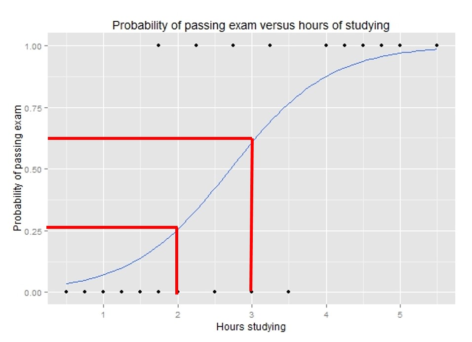
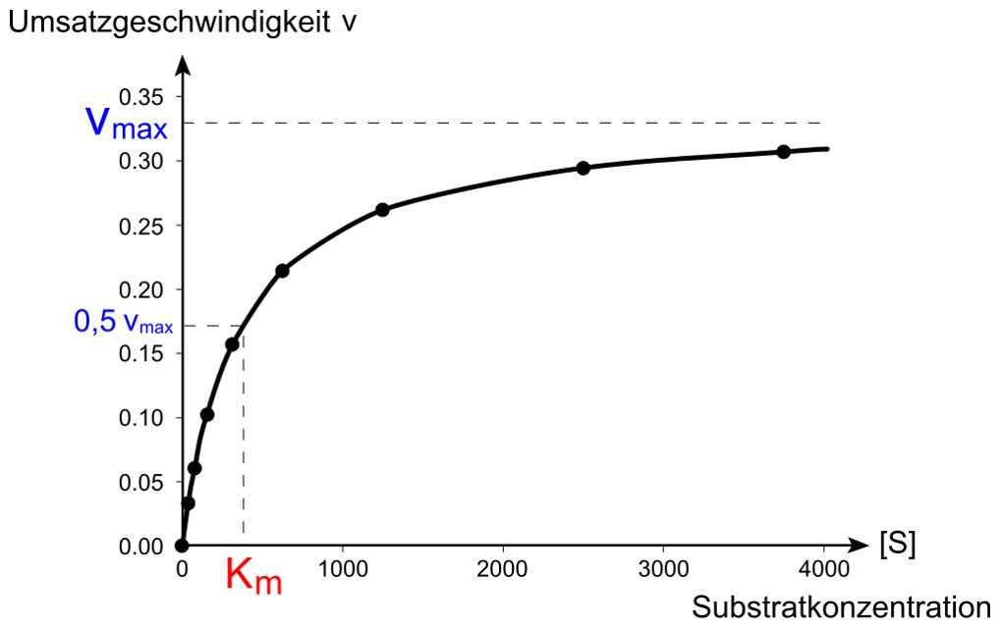

```{r setup, echo=FALSE, warning=FALSE, message=FALSE}
library(knitr)
library(data.table)
setDTthreads(1)
library(MASS)
library(Hmisc)
library(nlme)
```

## Fragen

Gibt es Fragen zu

* Vorlesung?
* Übung?
* Seminar?

## Plan heute

Besprechung von 

* Blatt 3 - A1 (lineare Regression)
* RBlatt 3 (Regressionsmodelle)

Anschließend

* kurze Vorstellung der Seminarpaper (separat)

# Lineare Regression

## Aufgabe 1: Lineare Regression - Hintergrund (1)

* Regresswerte = Vorhergesagte Werte: $\hat{y}_i = \hat{\beta}_0 + \hat{\beta}_1 x_i$ 
* Residuen = Abweichung Vorhersage - Beobachtung: $\hat{y}_i - y_i$
* Residual Sum of Square (RSS) = Summe der quadratischen Fehler: $\sum_{i=1}^n (\hat{y}_i - y_i)^2$
* Mean Square Error = Residuale Varianz: $\frac{1}{n} \sum_{i=1}^n (\hat{y}_i - y_i)^2$

## Aufgabe 1: Lineare Regression - Hintergrund (2)

{width=70%}

## Aufgabe 1: Lineare Regression (Einschub - 1)

Größe (cm) | 180 | 175 | 160 | 170 | 190
---------- | --- | --- | --- | --- | --- 
Gewicht (kg) | 80 | 80 | 58 | 60 | 85

$$RSS(\beta_0,\beta_1)=\sum_{i=1}^{n} [(\beta_0 + \beta_1 x_i)-y_i]^2$$

* $\hat{\beta_0}$ und $\hat{\beta_1}$?
* $\beta_0$ und $\beta_1$ für den obigen Datensatz!
* Welches Gewicht können Sie für eine 176 cm große Person vorhersagen?

## Aufgabe 1: Lineare Regression (Einschub - 2)

$$RSS(\beta_0,\beta_1)=\sum_{i=1}^{n} [(\beta_0 + \beta_1 x_i)-y_i]^2;  \bar{x} =\frac{1}{n} \sum x_i \text{ und } \bar{y} =\frac{1}{n} \sum y_i$$

\begin{align}
\frac{\partial RSS(\beta_0,\beta_1)}{\partial \beta_0} &= 2 \sum (\beta_0 + \beta_1x_i - y_i) \notag \\
&= 2n\beta_0 + 2\beta_1 \sum x_i - 2 \sum y_i  \stackrel{!}{=} 0 \notag \\
\Rightarrow \beta_0 &=\frac{1}{n}(\sum y_i - \beta_1 \sum x_i) = \bar{y} - \beta_1 \bar{x} \notag \\
\notag \\
\end{align}

## Aufgabe 1: Lineare Regression (Einschub - 3)
\begin{align}
\frac{\partial RSS(\beta_0,\beta_1)}{\partial \beta_1} &= 2 \sum [\beta_0 + \beta_1x_i - y_i]x_i \notag \\
&= 2 \beta_0 \sum x_i + 2\beta_1 \sum x_i^2 - 2 \sum x_iy_i \stackrel{!}{=} 0 \notag \\
\Rightarrow \beta_1 &= \frac{\sum x_iy_i - \beta_0 \sum x_i}{\sum x_i^2} = \frac{\sum x_iy_i - (\bar{y} - \beta_1 \bar{x}) \sum x_i}{\sum x_i^2} \notag \\
&\Leftrightarrow \beta_1 (\sum x_i^2 - \bar{x}\sum x_i) = \sum x_iy_i - \bar{y}\sum x_i \notag \\
&\Leftrightarrow \beta_1 (\sum x_i^2 - n\bar{x}^2) = \sum x_iy_i - n\bar{x}\bar{y} \notag \\
\end{align}

## Aufgabe 1: Lineare Regression (Einschub - 4)

\begin{align}
\Rightarrow \beta_1 &= \frac{\sum x_iy_i - n\bar{x}\bar{y}}{\sum x_i^2 - n\bar{x}^2} \notag \\
&= \frac{\sum x_iy_i - n\bar{x}\bar{y} - n\bar{x}\bar{y} + n\bar{x}\bar{y}}{\sum x_i^2 - n\bar{x}^2 - n\bar{x}^2 + n\bar{x}^2} \notag \\
&= \frac{\sum x_iy_i - \bar{y} \sum x_i - \bar{x} \sum y_i + n \bar{x} \bar{y}}{\sum x_i^2 - 2\bar{x}^2 \sum x_i + n \bar{x}^2} \notag \\
&= \frac{\sum (x_iy_i - x_i\bar{y} - \bar{x}y_i + \bar{x}\bar{y})}{\sum (x_i^2 - 2x_i\bar{x} + \bar{x}^2)} \notag \\
&= \frac{\sum (x_i - \bar{x})(y_i - \bar{y})}{\sum (x_i - \bar{x})^2} \notag \\
&= \frac{\text{empirischen Kovarianz von x und y}}{\text{empirischen Varianz von x}} \notag
\end{align}

## Aufgabe 1: Lineare Regression (Einschub - 5)

```{r}
groesse<-c(180,175,160,170,190)
gewicht<-c(80,80,58,60,85)

x_m<-mean(groesse)
y_m<-mean(gewicht)
var1<-sum((groesse-x_m)*(gewicht-y_m))
var2<-sum((groesse-x_m)^2)
b1<-var1/var2
b0<-y_m - b1*x_m

b1; b0; b0+b1*176
```


## Aufgabe 1: Lineare Regression 

```{r A1, echo=FALSE, warning=FALSE, message=FALSE}
loaded1<-load("../Exercises_R/data2/SNP.RData")
setDT(myDat)
wskAA<-c()
wskAA[myDat$SNP==0]<-1
wskAA[myDat$SNP!=0]<-0
wskAB<-c()
wskAB[myDat$SNP==1]<-1
wskAB[myDat$SNP!=1]<-0
wskBB<-c()
wskBB[myDat$SNP==2]<-1
wskBB[myDat$SNP!=2]<-0

```

* Univariate lineare Regression für *sex* und *SNP* auf *trait*!
* Multivariate lineare Regression & Interaktionsanalyse!
* Bestes Modell?
* Welches genetische Modell wird hier verwendet?
* Test der anderen genetischen Modelle
* Autosomal oder X-chromosomal?

## Aufgabe 1: Lösung (1)

```{r A1_0, echo=FALSE, warning=FALSE, message=FALSE}
mod1<-lm(trait~sex,data=myDat)
mod2<-lm(trait~SNP,data=myDat)
mod3<-lm(trait~sex+SNP,data=myDat)
```

```{r A1_1, echo=T,eval=T}
mod4<-lm(trait~sex*SNP,data=myDat)
summary(mod4)
```

## Aufgabe 1: Lösung (2)

```{r A1_2, echo=F,eval=T}
dummy0<-c(summary(mod1)$adj.r.squared,summary(mod2)$adj.r.squared,
          summary(mod3)$adj.r.squared,summary(mod4)$adj.r.squared)
dummy1<-c(logLik(mod1),logLik(mod2),logLik(mod3),logLik(mod4))
dummy2<-AIC(mod1,mod2,mod3,mod4)
dumTab<-data.frame(dummy0,dummy1,dummy2)
rownames(dumTab)<-c("sex","SNP","sex+SNP","sex*SNP")
knitr::kable(dumTab, position = "!b",
             caption = "Modellvergleich 1 (Modellgüte Adjustierung)",
             col.names = c("adj. r^2","logLik","df","AIC"))
```

## Aufgabe 1: Lösung (3)

```{r A1_3, echo=F,eval=T}
interaction.plot(myDat$sex,myDat$SNP,myDat$trait, fixed = T, 
                 col=c("red","green","blue"),lty=1,lwd=2,
                 xlab = "Geschlecht (1=Männer, 2=Frauen)",
                 trace.label = "SNP",ylab="Mittelwert Trait",
                 main="Interaktionsplot")
```

## Aufgabe 1: Lösung (4)

```{r A1_4}
add<-wskAB + 2*wskBB
dom<-wskAB + wskBB
rez<-wskBB

mod_add<-lm(myDat$trait ~ add*myDat$sex)
mod_dom<-lm(myDat$trait ~ dom*myDat$sex)
mod_rez<-lm(myDat$trait ~ rez*myDat$sex)
```

## Aufgabe 1: Lösung (5)

```{r A1_5, echo=F,eval=T}
dummy0<-c(summary(mod_add)$adj.r.squared,summary(mod_dom)$adj.r.squared,
          summary(mod_rez)$adj.r.squared)
dummy1<-c(logLik(mod_add),logLik(mod_dom),logLik(mod_rez))
dummy2<-AIC(mod_add,mod_dom,mod_rez)
dumTab<-data.frame(dummy0,dummy1,dummy2)
rownames(dumTab)<-c("additiv","dominant","rezessiv")
knitr::kable(dumTab, position = "!b",
             caption = "Modellvergleich 2 (Modellgüte genetisches Modell)",
             col.names = c("adj. r^2","logLik","df","AIC"))
```

## Aufgabe 1: Lösung (6)

```{r A1_6}
mod<-lm(myDat$trait ~ (wskAB + wskBB) * myDat$sex)
summary(mod)
```

## Aufgabe 1: Lösung (7)

```{r A1_7, echo=F,eval=T}
betas<-c(summary(mod_add)$coefficients[2,1],
         summary(mod_dom)$coefficients[2,1],
         summary(mod_rez)$coefficients[2,1],
         summary(mod)$coefficients[2,1],
         summary(mod)$coefficients[3,1])
dummy0<-c(summary(mod_add)$adj.r.squared,
          summary(mod_dom)$adj.r.squared,
          summary(mod_rez)$adj.r.squared,
          summary(mod)$adj.r.squared,
          summary(mod)$adj.r.squared)
dummy1<-c(logLik(mod_add),logLik(mod_dom),
          logLik(mod_rez),logLik(mod),logLik(mod))
dummy2<-AIC(mod_add,mod_dom,mod_rez,mod)
dummy2[5,]<-dummy2[4,]
dumTab<-data.frame(betas,dummy0,dummy1,dummy2)
rownames(dumTab)<-c("additiv","dominant","rezessiv","Effekt AB","Effekt BB")
knitr::kable(dumTab, position = "!b",
             caption = "Modellvergleich 3 (Effektschätzer genetisches Modell)",
             col.names = c("beta","adj. r^2","logLik","df","AIC"))
```

## Aufgabe 1: Lösung (8) - Zusammenfassung

* Interaktion am besten, wenn auch nur kleiner Zuwachs für $r^2$.
* Additives Modell am besten, bestätigt im multivariaten Modell:
  * beide genetischen Effektschätzer sind signifikant von 0 unterschiedlich
  * $\beta_1 \approx 0.5*\beta_2$
* X-chromosom: Männer nur A oder B (keine Heterozygoten möglich)
  * Option 1: 3770 Männer als Genotypisierungsfehler unwahrscheinlich
  * Option 2: keine X-Inaktivierung, die 618 mit *2* sind Genotypisierungsfehler
  * Option 3: X-Chromosom, aber PAR (pseudo-autosomal-region), heterozygote Männer möglich
  * Fazit: Man sollte besser vorher wissen, was das für ein SNP ist, und dann ggf die Modelle wählen (Inaktivierung, Interaktion).

# Andere Regressionsmodelle

## Aufgabe 2: Logistische Regression - Hintergrund (1)

* Bsp. Fragestellung: Eine Gruppe von 20 Studierenden lernt zwischen 0 und 6 Stunden für eine Prüfung. Wie beeinflusst der Lernaufwand die Wahrscheinlichkeit die Prüfung zu bestehen?
* $\beta_1=1.5, \beta_0=-4.1$
* Log-odds Bestehen = $1.5*x -4.1 = 1.5*(x-2.7)$
* 1 Stunde mehr lernen erhöht die log-odds um 1.5; 50% Chance bei 2.7 h. 
* $P(bestehen | lernen = 2h) = 0.25$
* $P(bestehen | lernen = 3h) = 0.61$
* $P(bestehen) = \frac{e^{\beta_0 + \beta_1*x}}{1+e^{\beta_0 + \beta_1*x}}$

## Aufgabe 2: Logistische Regression - Hintergrund (2)

{width=70%}

## Aufgabe 2: Proportional Odds - Hintergrund (1)

* Bsp. Fragestellung: Eine Gruppe von 20 Studierenden lernt zwischen 0 und 6 Stunden für eine Prüfung. Wie beeinflusst der Lernaufwand die Wahrscheinlichkeit die Prüfung mit Note 1, 2, 3, 4 oder nicht zu bestehen?
* Annahme: "equal slope", die logistische Funktion für die Wahrscheinlichkeit, mindestens Note j zu erreichen, verläuft für jede Note parallel verschoben, aber mit der gleichen Steigung. 
* $\beta_1=1.5$ wie vorher, aber pro Stufe anderer Intercept

## Aufgabe 2: Logistische Regression - Hintergrund (2)

{width=70%}

## Aufgabe 2: Logistische / Proportional Odds Regression

```{r A2, echo=FALSE, warning=FALSE, message=FALSE}
myDat[trait<mean(trait),trait_bin:=0]
myDat[trait>mean(trait),trait_bin:=1]

dum<-quantile(myDat$trait,probs = c(1/3,2/3))
myDat[,trait_cat:=0]
myDat[trait>dum[1],trait_cat:=trait_cat+1]
myDat[trait>dum[2],trait_cat:=trait_cat+1]

myDat[trait<median(trait),trait2:=0]
myDat[trait>median(trait),trait2:=1]

dum2<-quantile(myDat$trait)
myDat[,trait3:=0]
myDat[trait>dum2[2],trait3:=trait3+1]
myDat[trait>dum2[3],trait3:=trait3+1]
myDat[trait>dum2[4],trait3:=trait3+1]
```

* **Median** und **Quartile** von *trait* & Definition je eines binären und kategorialen Phänotypen.
* Univariaten, multivariaten Effekte von *sex* und *SNP* auf *trait2* mittels logistischer Regression! 
* Univariaten, multivariaten Effekte von *sex* und *SNP* auf *trait3* mittels proportional odds regression! 
* Vergleichen mit linearer Regression


## Aufgabe 2: Lösung (1) 

```{r A2_1, echo=T,eval=T}
modB1<-glm(trait2~sex,family = "binomial",data = myDat)
modB2<-glm(trait2~SNP,family = "binomial",data = myDat)
modB3<-glm(trait2~SNP+sex,family = "binomial",data = myDat)
modB4<-glm(trait2~SNP*sex,family = "binomial",data = myDat)

modD1<-polr(as.factor(trait3)~sex,data = myDat,Hess = T)
modD2<-polr(as.factor(trait3)~SNP,data = myDat,Hess = T)
modD3<-polr(as.factor(trait3)~SNP+sex,data = myDat,Hess = T)
modD4<-polr(as.factor(trait3)~SNP*sex,data = myDat,Hess = T)

```

## Aufgabe 2: Lösung (2)

```{r A2_2}
summary(modB4)
```

## Aufgabe 2: Lösung (3)

```{r A2_3}
summary(modD4)
```

## Aufgabe 2: Lösung (4)

```{r A2_4, echo=F,eval=T}
dummy1<-c(logLik(modB1),logLik(modB2),logLik(modB3),logLik(modB4))
dummy2<-AIC(modB1,modB2,modB3,modB4)
dummy3<-c(logLik(modD1),logLik(modD2),logLik(modD3),logLik(modD4))
dummy4<-AIC(modD1,modD2,modD3,modD4)

dumTab<-data.frame(dummy1,dummy2$AIC,dummy3,dummy4$AIC)
rownames(dumTab)<-c("sex","SNP","sex+SNP","sex*SNP")
knitr::kable(dumTab, position = "!b",
             caption = "Modellvergleich 4 (Modellgüte log & prop Odds)",
             col.names = c("logLik - log","AIC - log","logLik - prop Odds","AIC - prop Odds"))
```

## Aufgabe 2: Lösung (5)

```{r A2_5, echo=F,eval=T}
dumFunc = function(matrix){
  p <- pnorm(abs(matrix[, "t value"]), lower.tail = FALSE) * 2
  matrix <- cbind(matrix, "p value" = p)
  return(matrix)
}
ctable1 <- dumFunc(matrix=coef(summary(modD1)))
ctable2 <- dumFunc(matrix=coef(summary(modD2)))
ctable3 <- dumFunc(matrix=coef(summary(modD3)))
ctable4 <- dumFunc(matrix=coef(summary(modD4)))

y1 = as.numeric(ctable1[2:4,1])
e1 = as.numeric(ctable1[2:4,2])*1.96
y2 = as.numeric(ctable2[2:4,1])
e2 = as.numeric(ctable2[2:4,2])*1.96
y3 = as.numeric(ctable3[3:5,1])
e3 = as.numeric(ctable3[3:5,2])*1.96
y4 = as.numeric(ctable4[4:6,1])
e4 = as.numeric(ctable4[4:6,2])*1.96
x = c(1:3)

errbar(x,y1,y1+e1,y1-e1,type='b',
       col="black", ylim = c(-1,9),
       main="Vergleich der Intercepts",
       xlab="Kategorien",
       ylab="Intercepts")
errbar(x,y2,y2+e2,y2-e2,type='b',col="green",add=T)
errbar(x,y3,y3+e3,y3-e3,type='b',col="red",add=T)
errbar(x,y4,y4+e4,y4-e4,type='b',col="blue",add=T)
legend("topleft",legend=c("sex","SNP","sex+SNP","sex*SNP"),col=c("black","green","red","blue"),pch=19)
```

## Aufgabe 2: Lösung (6) - Zusammenfassung

* Das Interaktionsmodell bleibt das beste
* Die Intercepts bei der Prop. Odds Regression steigen quasi-linear an (=proportional)

## Aufgabe 3: Nichtlineare Regression - Hintergrund (1)

* Sättigungsfunktion: Umsatzgeschwindigkeit einer enzymatischen Reaktion in Abhängigkeit der Substratkonzentration
* Annahme: Enzymkonzentration ist fix.
* $V_{max}$: maximale Reaktionsgeschwindigkeit
* $K_m = \frac{k_1' + k_2}{k_1}$: Michaelis-Menten-Konstante = Substratkonzentration bei halb-maximaler Geschwindigkeit, Abhängig von Reaktion und Milieu (z.B. pH-Wert)
* $K_d = \frac{k_1'}{k_1}$ = Dissoziationskonstante

\begin{align}
  E + S &\xrightarrow{k_1} ESC \notag \\
  ESC &\xrightarrow{k_1'} E + S \notag \\
  ESC &\xrightarrow{k_2} E + P \notag \\
\end{align}

## Aufgabe 3: Nichtlineare Regression - Hintergrund (2)

{width=70%}

## Aufgabe 3: Nichtlineare Regression

```{r A3, echo=FALSE, warning=FALSE, message=FALSE}
loaded2<-load("../Exercises_R/data2/MichMenten.RData")
vmaxA<-max(myDat$vA)
kmA<-vmaxA/2
modA<-nls(vA ~ vmax*cS/(cS+km), data=myDat,start = list(km=kmA,vmax=vmaxA))
```

* $V_{max}$ und $K_m$ für Erwachsene und Embryonen getrennt!
  * Startwerte: $V_{max}=max(v)$ und $K_m=\frac12 max(v)$
* Was passiert wenn man die Startwerte weglässt?
* Plot und Interpretation!

## Aufgabe 3: Lösung (1)

```{r A3_1, echo=T,eval=T,warning=F}
vmaxA<-max(myDat$vA)
vmaxE<-max(myDat$vE)
kmA<-vmaxA/2
kmE<-vmaxE/2

modA<-nls(vA ~ vmax*cS/(cS+km), data=myDat,
          start = list(km=kmA,vmax=vmaxA))
modA2<-nls(vA ~ vmax*cS/(cS+km), data=myDat)

modE<-nls(vE ~ vmax*cS/(cS+km), data=myDat, 
          start = list(km=kmE,vmax=vmaxE))
modE2<-nls(vE ~ vmax*cS/(cS+km), data=myDat)
```

## Aufgabe 3: Lösung (2)

```{r A3_2, echo=T,eval=T}
summary(modA)$coef
summary(modA2)$coef

```

## Aufgabe 3: Lösung (3)

```{r A3_3, echo=F,eval=T}
FuncA<-function(z) {summary(modA)$parameters[2,1]*z/(z+summary(modA)$parameters[1,1])}
FuncE<-function(z) {summary(modE)$parameters[2,1]*z/(z+summary(modE)$parameters[1,1])}

z<-seq(0:300)
par(mar=c(5,6,5,5))
plot(myDat$cS,myDat$vA,
     main = "Michaelis-Menten Kinetik",cex.main=1.5,
     xlim=c(1,300),
     xlab="Konzentration [10^-5 mol]",cex.lab=1.5,
     ylim=c(1,20),cex.axis=1.5,
     ylab=expression(paste("Umsatzgeschwindigkeit ","[", mu, "mol/(mg*min)]")),
     col="black",pch=16,cex=1.5)
lines(FuncA(z),lwd=3,lty=3)
points(myDat$cS,myDat$vE,col="red",pch=16,cex=1.5)
lines(FuncE(z),col="red",lwd=3,lty=3)

abline(h=summary(modA)$parameters[2,1],lwd=2,lty=2,col="black")
abline(v=summary(modA)$parameters[1,1],lwd=2,lty=2,col="black")
abline(h=0.5*summary(modA)$parameters[2,1],lwd=2,lty=2,col="black")

abline(h=summary(modE)$parameters[2,1],lwd=2,lty=2,col="red")
abline(v=summary(modE)$parameters[1,1],lwd=2,lty=2,col="red")
abline(h=0.5*summary(modE)$parameters[2,1],lwd=2,lty=2,col="red")

legend("bottomright",legend=c("Adult","Embryo"),col=c("black","red"),pch=19)
```

## Aufgabe 3: Lösung (4) - Zusammenfassung

* Maximale Umsatzgeschwindigkeit ist in Embryonen und Erwachsenen fast gleich 
* Die Affinität ($K_m$) unterscheidet sich stark

# Zusammenfassung

## Zusammenfassung

* Wie kann man genetische Modelle gegeneinander testen?
* Gibt es ein "Standard"-Regressionsmodell in der Genetik?