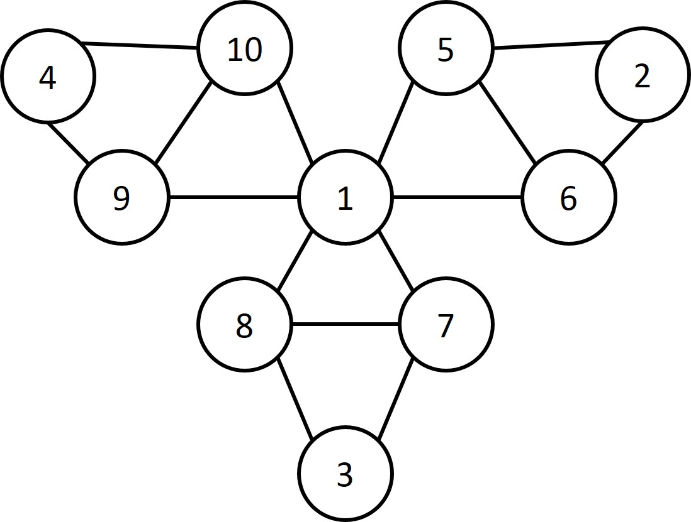

```{r setup, include=FALSE}
knitr::opts_chunk$set(echo = FALSE)
library(data.table)
setDTthreads(1)
library(ggplot2)

```

## Fragen

Gibt es Fragen zu

* Vorlesung?
* Übung?
* Seminar?

## Plan heute

Besprechung von RBlatt 4

* Verwandtschaft
* XY-Plots
* PCA 


# Verwandtschaft

```{r B4A1_1, eval=T, echo=F}
loaded<-load("../Exercises_R/data2/verwandtschaft.RData")
p2<-2*allelfreq
p4<-4*allelfreq*(1-allelfreq)

K<-matrix(NA,10,10)
for(i in 1:10){
  # i=1
  for(j in i:10){
    # j=2
    g_i<-genotypes[,i]-p2
    g_j<-genotypes[,j]-p2
    x<-sum(g_i*g_j/p4)
    k_ij<-x/30000
    K[i,j]<-k_ij
    K[j,i]<-k_ij
  }
    
}
```

## Aufgabe 1: Verwandtschaft - Hintergrund (1)

Paarweise Schätzung von Verwandtschaft: 

$$ \hat k_{i,j} = \frac{1}{M} \sum_{m=1}^{M} \frac{(g_{m,i}-2*p_{m,B})(g_{m,j}-2*p_{m,B})}{4*p_{m,B}*p_{m,A}} $$

mit 

* $M$ als Anzahl der betrachteten biallelischen SNPs (Allel A und B)

* $p_{m,B}$ als Allelfrequenz des SNPs m bezüglich Allel B

* $g_{m,i}$ als Genotyp des SNPs m von Person i bezüglich Allel B

## Aufgabe 1: Verwandtschaft - Hintergrund (2)

```{r}
knitr::kable(K,digits = 2, caption = "Verwandschaftsmatrix mittels Schleife")
```


## Aufgabe 1: Verwandtschaft 

a) Verwandtschaftsmatrix mittels Matrix-Operation bestimmen. Stimmt dieses Produkt mit *K* überein?

b) Warum gilt: $$ \hat k_{i,i} \approx 0.5$$

c) Wie viele paarweise Verwandtschaften (von Grad 1,2, … , unverwandt) beobachten Sie?

d) Welche Familienstruktur könnte die beobachteten Verwandtschaftsbeziehungen erklären?

## Aufgabe 1: Verwandtschaft - Lösung a

```{r B4A1_L1, eval=T, echo=T}
n=ncol(genotypes) 
m=nrow(genotypes) 
h=(genotypes-matrix(2*allelfreq,m,n))/
  sqrt(m*matrix(4*allelfreq*(1-allelfreq),m,n))
H=t(h)%*%(h)

table(round(H,4)==round(K,4))
```

## Aufgabe 1: Verwandtschaft - Lösung a & b

* *H* und *K* sind identisch. 
* Für die paarweise Verwandtschaft braucht man nur die obere Dreiecksmatrix. 
* Auf der Diagonalen selbst sollte immer 0.5 stehen, das ist für den Kinship-Schätzer Identität oder eineigige Zwillinge. 

$k_{i,j}$ | Interpretation
----------|-------------------------------------------------------
0.5 | Eineigige Zwillinge / Identität
0.25 | erstgradige Verwandtschaft (z.B. Eltern-Kind, Geschwister)
0.125| zweitgradige Verwandtschaft (z.B. Halbgeschwister, Großeltern-Enkel, Onkel/Tante-Nichte/Neffe)

## Aufgabe 1: Verwandtschaft - Lösung c

Anzahl Verwandtschaften: 

* n-gradig: 18 unverwandte Paare
* 2-gradig: 12 mal Großeltern-Enkel, Onkel/Tante-Nichte/Neffe oder Halbgeschwister
* 1-gradig: 15 mal Eltern-Kinder oder Geschwister

## Aufgabe 1: Verwandtschaft - Lösung c

```{r B4A1_L2}
V=round(H,3)
V[col(H)<row(H)]=NA
rownames(V)<- c("S1","S2","S3","S4","S5","S6","S7","S8","S9","S10")
colnames(V)<- c("S1","S2","S3","S4","S5","S6","S7","S8","S9","S10")
knitr::kable(V, caption = "Kinship Schätzer")
```

## Aufgabe 1: Verwandtschaft - Lösung c

```{r B4A1_L3}
V=H
V[H<.3]=1 
V[H<.2]=2  
V[H<.1]=0                                                            
V[col(H)<=row(H)]=NA                                                          
colnames(V)<- c("S1","S2","S3","S4","S5","S6","S7","S8","S9","S10")
knitr::kable(V, caption = "Verwandschaftsgrade")
```

## Aufgabe 1: Verwandtschaft - Lösung d

Interpretation 1: Ein Vater (1) hat mit drei verschiednen Müttern (2, 3, 4) je zwei Kindern (5 - 10).

Interpretation 2: Eine Mutter (1) hat mit drei verschiednen Vätern (2, 3, 4) je zwei Kindern (5 - 10).

{width=50%}

## Aufgabe 1: Verwandtschaft - Zusammenfassung

* Welche Grundannahme ist durch Verwandtschaft verletzt?
* Wie kann das gelöst werden?

# XY-Plot

```{r B4A2_1}
loaded<-load("../Exercises_R/data2/XYPlots.RData")
filt<-grepl("genotype",rownames(daten))
geno<-daten[filt,]
intent<-daten[!filt,]

snpDataX<-geno[,1:200]
snpDataX<-t(snpDataX)
countGenos<-function(x) {return(as.numeric(table(factor(x,levels=-1:2))))}
nrGenos<-apply(snpDataX,2,countGenos)
nrGenos<-t(nrGenos)
colnames(nrGenos)<-c("miss","AA","AB","BB")
heteroRate<-apply(nrGenos,1,function(x) x[3]/sum(x[2:4]))
```

## Aufgabe 2: XY-Plot - Hintergrund (1)

In genetischen Studien gibt es zwei Quellen für das Geschlecht:

* Datenbankgeschlecht: wie im Fragebogen angegeben, insbesondere auch divers
* Genetisches Geschlecht: im Genotyp-Calling bestimmt (Intensität der SNPs auf Chr. X & Y)

Mit dem XY-Plots kann man Probenvertauschungen und genetische Ausreißer entdecken. Grundannahmen: 

* Intensität von X-SNPs in Frauen doppelt so stark wie in Männern
* Intensität von Y-SNPs in Frauen nur Hintergrundrauschen
* Heterozygotenrate in Frauen etwa 25%, in Männern 0%

## Aufgabe 2: XY-Plot

a) Gesamtintensitäten pro Sample für X und Y bestimmen

b) Plots:
  
    i.	X-Intensität – Y-Intensität
  
    ii.	X-Intensität – X-Heterozygosität
  
    iii.	Y-Intensität – X-Heterozygosität

## Aufgabe 2: XY-Plot - Lösung a)

```{r, eval=T,echo=T}
# Mittelwert pro SNP und Sample
all<-seq(from=1,to=dim(intent)[1],by=2)
data.a<-intent[all,]             
data.b<-intent[all+1,]
dataInt<-(data.a+data.b)/2   

# mittlere Intensitäten pro Chromosom
dataIntX<-dataInt[,1:200]
dataIntY<-dataInt[,201:300]
IntX<-rowMeans(dataIntX)          
IntY<-rowMeans(dataIntY)          

# Normierung der Intensitäten nach dem 75%-Quantil
IntX2<-IntX/boxplot(IntX,plot=F)$stats[4]
IntY2<-IntY/boxplot(IntY,plot=F)$stats[4]

myDat<-data.frame(samples,IntX,IntY,IntX2,IntY2,heteroRate)

```

## Aufgabe 2: XY-Plot - Lösung a)

```{r,echo=F,eval=T}
knitr::kable(myDat[1:3,1:4], position = "!b")
knitr::kable(myDat[1:3,5:8], position = "!b")
```

```{r, eval=T,echo=F}
# table(myDat$sex_datenbank,myDat$sex_computed)

myDat$sexLabel[myDat$sex_datenbank=="male"&myDat$sex_computed=="male"]<-"1/male"
myDat$sexLabel[myDat$sex_datenbank=="male"&myDat$sex_computed=="unknown"]<-"1/unknown"
myDat$sexLabel[myDat$sex_datenbank=="male"&myDat$sex_computed=="female"]<-"1/female"
myDat$sexLabel[myDat$sex_datenbank=="female"&myDat$sex_computed=="male"]<-"2/male"
myDat$sexLabel[myDat$sex_datenbank=="female"&myDat$sex_computed=="unknown"]<-"2/unknown"
myDat$sexLabel[myDat$sex_datenbank=="female"&myDat$sex_computed=="female"]<-"2/female"

#table(myDat$sexLabel)

myDat$category[myDat$sexLabel == "1/male"] <- 1
myDat$category[myDat$sexLabel == "2/female"] <- 2
myDat$category[myDat$sexLabel == "1/unknown"] <- 3
myDat$category[myDat$sexLabel == "2/unknown"] <- 4
myDat$category[myDat$sexLabel == "1/female"] <- 5
myDat$category[myDat$sexLabel == "2/male"] <- 6

ordering<-order(myDat$category)
myDat<-myDat[ordering,]
```

## Aufgabe 2: XY-Plot - Lösung c)

```{r, eval =T,echo=T}
myPlot1 <- ggplot() +
  geom_point(data=myDat,aes(x=IntX2,y=IntY2,color=sexLabel,
                            shape=sexLabel),size=4) +
  xlab("X Intensität") + ylab("Y Intensität") + 
  ggtitle("XY Plot mit 300 Samples") +
  scale_colour_manual(name="submitted/computed",
                values=c("red","blue","orange",
                         "darkseagreen","cyan","magenta")) +
  scale_shape_manual(name="submitted/computed",
                     values=c(17,17,17,19,19,19)) +
  theme(legend.justification=c(1,1),
        legend.text=element_text(size=10),
        legend.title=element_text(size=10)) +
  theme(axis.text=element_text(size=10),
        axis.title=element_text(size=10),
        plot.title=element_text(size=15))

```

## Aufgabe 2: XY-Intensity Plot
```{r, eval =T,echo=F}
myPlot1
```


## Aufgabe 2: X-Intensity-Heterozygosity Plot 

```{r, eval =T,echo=F}
myPlot2 <- ggplot() +
  geom_point(data=myDat,aes(x=IntX2,y=heteroRate,color=sexLabel,shape=sexLabel),size=4) +
  xlab("X Intensität") + ylab("X Heterozygosität") + ggtitle("XX Plot mit 300 Samples") +
  scale_colour_manual(name="submitted/computed",
                      values=c("red","blue","orange","darkseagreen","cyan","magenta")) +
  scale_shape_manual(name="submitted/computed",values=c(17,17,17,19,19,19)) +
  theme(legend.justification=c(1,1),legend.text=element_text(size=10),
        legend.title=element_text(size=10)) +
  theme(axis.text=element_text(size=10), axis.title=element_text(size=10),
        plot.title=element_text(size=15))
myPlot2

```

## Aufgabe 2: Y-Intensity-Heterozygosity Plot 

```{r, eval =T,echo=F}
myPlot3 <- ggplot() +
  geom_point(data=myDat,aes(x=IntY2,y=heteroRate,color=sexLabel,shape=sexLabel),size=4) +
  xlab("Y Intensität") + ylab("X Heterozygosität") + ggtitle("YX Plot mit 300 Samples") +
  scale_colour_manual(name="submitted/computed",
                      values=c("red","blue","orange","darkseagreen","cyan","magenta")) +
  scale_shape_manual(name="submitted/computed",values=c(17,17,17,19,19,19)) +
  theme(legend.justification=c(1,1),legend.text=element_text(size=10),
        legend.title=element_text(size=10)) +
  theme(axis.text=element_text(size=10), axis.title=element_text(size=10),
        plot.title=element_text(size=15))
myPlot2

```

## Aufgabe 2: XY-Plots - Lösung b)

Man kann folgende Ausreißer erkennen: 

1) Frauen mit zu hoher oder zu niedriger X-Intensität (Mono-X oder Triple-X Frauen)
2) Männer mit zu hoher Y-Intensität (Doppel-Y Männer)
3) Männer mit zu hoher X-Intensität (Doppel-X Männer)
4) Frauen mit zu hoher oder zu niedriger X-Heterozygosität 
5) Samples mit Sex-Mismatches zwischen Datenbank und Berechnung

1)-4) Samples sollten für gonosomale Analysen gefiltert werden (autosomal ok).
5) Sex-Mismatches müssen immer gefiltert werden, auch für autosomale Analysen!

## Aufgabe 2: XY-Intensity Plot 

```{r}
# Auffaelligkeiten: 10 Samples
filter_1<-myDat$sexLabel=="2/female"&((myDat$IntX2>1.1)|(myDat$IntX2<0.9))
filter_2<-myDat$sexLabel=="1/male"&myDat$IntY2>1.1
filter_3<-myDat$sexLabel=="1/unknown"&myDat$IntX2>0.9
filter_4<-myDat$sex_datenbank=="female"&((myDat$heteroRate>0.35)|(myDat$heteroRate<0.15))
filter_5<-myDat$sexLabel=="2/male"|myDat$sexLabel=="1/female"

circleObject<- myDat[filter_1 | filter_2 | filter_3 | filter_4 | filter_5,]

# jetzt plotten
myPlot1 <- ggplot() +
  geom_point(data=myDat,aes(x=IntX2,y=IntY2,color=sexLabel,shape=sexLabel),size=4) +
  xlab("X Intensität") + ylab("Y Intensität") + ggtitle("XY Plot mit 300 Samples") +
  scale_colour_manual(name="submitted/computed",
                      values=c("red","blue","orange","darkseagreen","cyan","magenta")) +
  scale_shape_manual(name="submitted/computed",values=c(17,17,17,19,19,19)) +
  theme(legend.justification=c(1,1),legend.text=element_text(size=10),
        legend.title=element_text(size=10)) +
  theme(axis.text=element_text(size=10), axis.title=element_text(size=10),
        plot.title=element_text(size=15)) +  
  geom_point(data=circleObject,aes(x=IntX2,y=IntY2),color="black",size=10,shape=21)
myPlot1
```

## Aufgabe 2: X-Intensity-Heterozygosity Plot 

```{r}
myPlot2 <- ggplot() +
  geom_point(data=myDat,aes(x=IntX2,y=heteroRate,color=sexLabel,shape=sexLabel),size=4) +
  xlab("X Intensität") + ylab("X Heterozygosität") + ggtitle("XX Plot mit 300 Samples") +
  scale_colour_manual(name="submitted/computed",
                      values=c("red","blue","orange","darkseagreen","cyan","magenta")) +
  scale_shape_manual(name="submitted/computed",values=c(17,17,17,19,19,19)) +
  theme(legend.justification=c(1,1),legend.text=element_text(size=10),
        legend.title=element_text(size=10)) +
  theme(axis.text=element_text(size=10), axis.title=element_text(size=10),
        plot.title=element_text(size=15)) +  
  geom_point(data=circleObject,aes(x=IntX2,y=heteroRate),color="black",size=10,shape=21)
myPlot2

```

## Aufgabe 2: Y-Intensity-Heterozygosity Plot 

```{r}
myPlot3 <- ggplot() +
  geom_point(data=myDat,aes(x=IntY2,y=heteroRate,color=sexLabel,shape=sexLabel),size=4) +
  xlab("Y Intensität") + ylab("X Heterozygosität") + ggtitle("YX Plot mit 300 Samples") +
  scale_colour_manual(name="submitted/computed",
                      values=c("red","blue","orange","darkseagreen","cyan","magenta")) +
  scale_shape_manual(name="submitted/computed",values=c(17,17,17,19,19,19)) +
  theme(legend.justification=c(1,1),legend.text=element_text(size=10),
        legend.title=element_text(size=10)) +
  theme(axis.text=element_text(size=10), axis.title=element_text(size=10),
        plot.title=element_text(size=15)) +  
  geom_point(data=circleObject,aes(x=IntY2,y=heteroRate),color="black",size=10,shape=21)
myPlot3

```

## Aufgabe 2: XY-Plot - Zusammenfassung

* Welches Grundproblem wird bei einem XY-Plot betrachtet, und warum kann das nur unzureichend gelöst werden?
* Warum werden drei Parameter hier betrachten / warum reichen zwei nicht aus?

# PCA

```{r B4A3_0, echo=FALSE, warning=FALSE, message=FALSE}
plink_call<-"C:/Programme/plink2/plink2"

```

## PCA 1 - Datenvorbereitung - SNPs filtern

**Hinweis**: Es sollten am Ende 206,233 SNPs sein!

```{r B4A3_2, eval=T,echo=T}
myTab<-read.table("../Exercises_R/data2/mySnps.txt")
rslist<-fread("../Exercises_R/data2/1KG_PCA.bim",
              sep="\t",stringsAsFactors=F)
table(is.element(myTab$V1,rslist$V2))
filt<-is.element(myTab$V1,rslist$V2)
dummy<-as.character(myTab$V1[filt])
write.table(dummy,file="PCA/mySnps_filtered.txt",
            quote=F,row.names=F,col.names=F)
```

## PCA 2 - Datenvorbereitung - Samples filtern

```{r B4A3_3, eval=T,echo=T}
fam.data<-read.table("../Exercises_R/data2/1KG_PCA.fam",
                     stringsAsFactors=F,sep=" ")
ethno<-substr(fam.data$V2,1,3)
v.ethno<-c("AFR","ASN","EUR")
n.ethno<-min(table(ethno)[v.ethno])
samp.auswahl<-rep(F,length(ethno))
set.seed(2)
for(i in v.ethno){
  samp.auswahl[ethno==i] <-  1:sum(ethno==i) %in% 
    sample(sum(ethno==i),n.ethno)
}
table(ethno[samp.auswahl])
```

## PCA 2 - Datenvorbereitung - Samples filtern

**Hinweis**: Es sollten am Ende 3*246 Individuen sein!

```{r, eval=T,echo=T}
fam.data.restr<-fam.data[samp.auswahl,]

write.table(fam.data.restr,file="PCA/mySamples.txt",
            quote=F,row.names=F,col.names=F)
```

## PCA 3 - Datenvorbereitung - SNPs prunen

**Hinweis**: Es sollten am Ende 117,351 SNPs sein. 

```{r, eval=F,echo=T}
call1<-paste(plink_call,
             "--bfile ../Exercises_R/data2/1KG_PCA",
             "--extract PCA/mySnps_filtered.txt",
             "--keep PCA/mySamples.txt",
             "--indep-pairwise 50 5 0.2",
             "--out PCA/pruning_filter", 
             sep=" ")
system(call1)
```

## PCA 4 - Datenvorbereitung - Datensatz erstellen

```{r B4A3_5, eval=F,echo=T}
call2<-paste(plink_call,
             "--bfile ../Exercises_R/data2/1KG_PCA",
             "--extract PCA/pruning_filter.prune.in",
             "--keep PCA/mySamples.txt",
             "--make-bed",
             "--out PCA/pruned_data", 
             sep=" ")
system(call2)
```

## PCA 5 - Eigentliche PCA berechnen

```{r B4A3_6, eval=F,echo=T}
call3<-paste(plink_call,
             "--bfile PCA/pruned_data",
             "--pca",
             "--out PCA/pca_out",
             sep=" ")
system(call3)
```

## PCA 6 - PCA auswerten

```{r B4A3_7, eval=T,echo=T,tidy=TRUE}
pca2values<-read.table("PCA/pca_out.eigenval")$V1
pca2vector<-read.table("PCA/pca_out.eigenvec",
                       stringsAsFactors=F,sep="\t")

(pca2values[1])/sum(pca2values)
(pca2values[1]+pca2values[2])/sum(pca2values)

xmin<-min(pca2vector[,3]);xmax<-max(pca2vector[,3])
ymin<-min(pca2vector[,4]);ymax<-max(pca2vector[,4])
```

## PCA 6 - PCA Plot der ersten 2 EVs

```{r, eval=F,echo=T}
myMain1="PCA 1000Genomes (3*246 Samples, 121970 geprunte SNPs)"
plot(0,0,col="white",xlim=c(xmin,xmax),ylim=c(ymin,ymax),
     main=myMain1,
     xlab="1. Hauptkomponente",ylab="2. Hauptkomponente")
lines(pca2vector[substr(fam.data.restr$V2,1,3)=="AFR",c(3,4)],
      col=alpha("black",0.1),type="p",pch=19,cex=1.9)
lines(pca2vector[substr(fam.data.restr$V2,1,3)=="ASN",c(3,4)],
      col=alpha("red",0.1),type="p",pch=19,cex=1.9)
lines(pca2vector[substr(fam.data.restr$V2,1,3)=="EUR",c(3,4)],
      col=alpha("blue",0.1),type="p",pch=19,cex=1.9)
legend("bottomleft",legend=v.ethno,col=c("black","red","blue"),pch=19)

```

## PCA 6 - PCA Plot der ersten 2 EVs

```{r, eval=T,echo=F}
myMain1="PCA 1000Genomes (3*246 Samples, 121970 geprunte SNPs)"
plot(0,0,col="white",xlim=c(xmin,xmax),ylim=c(ymin,ymax),
     main=myMain1,
     xlab="1. Hauptkomponente",ylab="2. Hauptkomponente")
lines(pca2vector[substr(fam.data.restr$V2,1,3)=="AFR",c(3,4)],
      col=alpha("black",0.1),type="p",pch=19,cex=1.9)
lines(pca2vector[substr(fam.data.restr$V2,1,3)=="ASN",c(3,4)],
      col=alpha("red",0.1),type="p",pch=19,cex=1.9)
lines(pca2vector[substr(fam.data.restr$V2,1,3)=="EUR",c(3,4)],
      col=alpha("blue",0.1),type="p",pch=19,cex=1.9)
legend("bottomleft",legend=v.ethno,col=c("black","red","blue"),pch=19)

```

## PCA - Interpretation

* Die ersten zwei Haupkomponenten trennen die Ethnien auf.
* Beide Vektoren erklären etwa 78% der Varianz in den Genetik-Daten.
* Wenn man das ganz für alle Samples wiederholt erklären die ersten beiden Eigenwerte 84% der genetischen Varianz. 

## PCA - Alle Samples

```{r B4A3_8, eval=T,echo=F}
call4<-paste(plink_call,
             "--bfile ../Exercises_R/data2/1KG_PCA",
             "--extract PCA/mySnps_filtered.txt",
             "--indep-pairwise 50 5 0.2",
             "--out PCA/pruning_filter2", 
             sep=" ")
#system(call4)

call5<-paste(plink_call,
             "--bfile ../Exercises_R/data2/1KG_PCA",
             "--extract PCA/pruning_filter2.prune.in",
             "--make-bed",
             "--out PCA/pruned_data2", 
             sep=" ")
#system(call5)

call6<-paste(plink_call,
             "--bfile PCA/pruned_data2",
             "--pca",
             "--out PCA/pca_out2", 
             sep=" ")
#system(call6)

pca2values<-read.table("PCA/pca_out2.eigenval")$V1
pca2vector<-read.table("PCA/pca_out2.eigenvec",
                       stringsAsFactors=F,sep="\t")

# (pca2values[1])/sum(pca2values)
# (pca2values[1]+pca2values[2])/sum(pca2values)

xmin<-min(pca2vector[,3]);xmax<-max(pca2vector[,3])
ymin<-min(pca2vector[,4]);ymax<-max(pca2vector[,4])

myMain2<-"PCA 1000Genomes (1092 Samples, 115204 geprunte SNPs)"
plot(0,0,col="white",xlim=c(xmin,xmax),ylim=c(ymin,ymax),
     main=myMain2,
     xlab="1. Hauptkomponente",ylab="2. Hauptkomponente")
lines(pca2vector[substr(fam.data$V2,1,3)=="AFR",c(3,4)],
      col=alpha("black",0.1),type="p",pch=19,cex=1.9)
lines(pca2vector[substr(fam.data$V2,1,3)=="ASN",c(3,4)],
      col=alpha("red",0.1),type="p",pch=19,cex=1.9)
lines(pca2vector[substr(fam.data$V2,1,3)=="EUR",c(3,4)],
      col=alpha("blue",0.1),type="p",pch=19,cex=1.9)
lines(pca2vector[substr(fam.data$V2,1,3)=="AMR",c(3,4)],
      col=alpha("green",0.1),type="p",pch=19,cex=1.9)
legend("bottomleft",legend=c(v.ethno,"AMR"),col=c("black","red","blue","green"),pch=19)
```

## Aufgabe 3: PCA - Zusammenfassung

* Welche Grundannahme ist durch gemischte Populationen verletzt?
* Wie kann das gelöst werden?


# Zusammenfassung

## Zusammenfassung

* Welche Grundannahme ist durch Verwandtschaft verletzt? Wie kann das gelöst werden?
* Welches Grundproblem wird bei einem XY-Plot betrachtet, und warum kann das nur unzureichend gelöst werden? Warum werden drei Parameter hier betrachten / warum reichen zwei nicht aus?
* Welche Grundannahme ist durch gemischte Populationen verletzt? Wie kann das gelöst werden?

