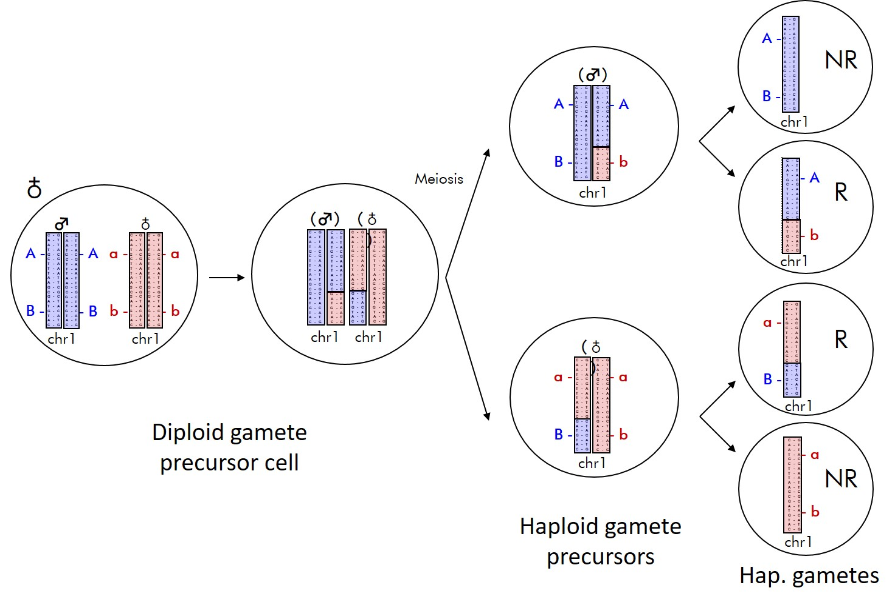
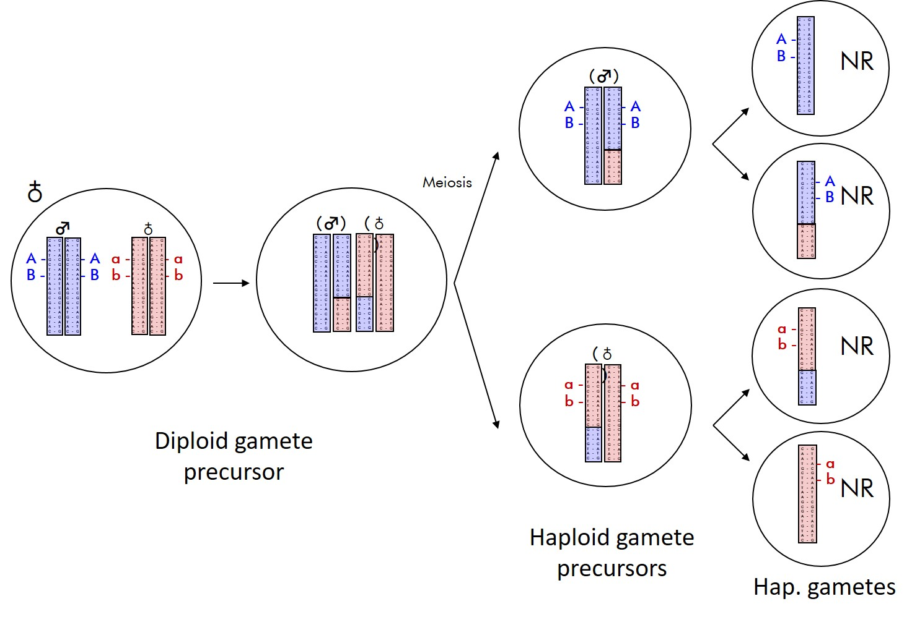
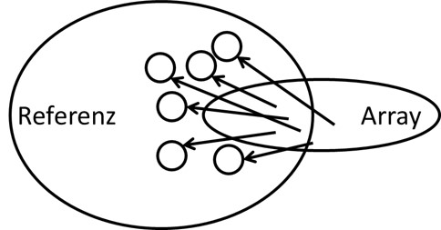
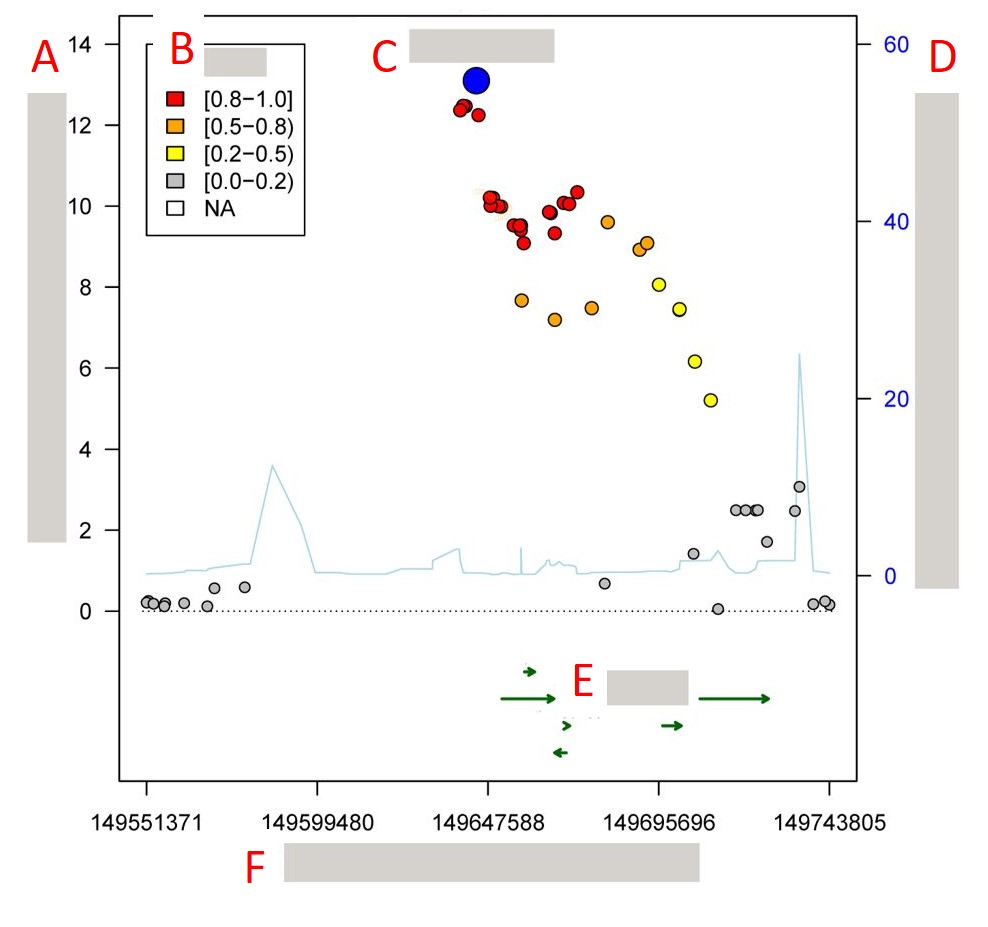

```{r setup, include=FALSE}
knitr::opts_chunk$set(echo = FALSE)
library(data.table)
setDTthreads(1)
library(ggplot2)
```

## Fragen

Gibt es Fragen zu

* Vorlesung?
* Übung?
* Seminar?

## Plan heute

Besprechung der Probeklausur

* HWE
* LD
* Coverage
* GWAS
* Stratifikationsbias
* RA-Plot 

# HWE

## Aufgabe

Mat.NR    | AA | AB | BB | Missing
--------- | -- | -- | -- | -------
Regel     | Ziffern 1-3 | Ziffern 4-6 | fix | Quersumme
321 456 7 | 321 | 456 | 56 | (1+2+3+4+5+6+7=) 28

* SNP-Messmethode und Missings (1 BE)
* Angabe verwendeten Genotyphäufigkeiten und Fallzahl; Bestimmung Callrate und Allelfrequenz für A (1 BE)
* Erwartete Genotypverteilung unter HWE (2 BE)
* HWE-Test (Nullhypothese, Teststatistik, Interpretation) (3 BE).

## Lösung (1)

**SNP-Array Workflow**:

1) Vorbereitung: DNA-Amplifizierung und Fragmentierung
2) Hybridisierung: DNA bindet an Platte, Labels werden hinzugefügt (A, T rot, C, G blau)
3) Ligation: Labels binden an die hybridisierten Fragmente, je nach Allel andere Farbe
4) Signal-Amplifizierung: Verstärkung des Signals + Messung, ob rot, blau, oder beides 

## Lösung (2)

**Calling**:

1) Calling 1: Genotypisierung von ~20.000 SNPs für alle Samples 
2) Sample Filter 1: Dish-QC, Sample Call Rate
3) Calling 2: Genotypisierung von ~550.000 SNPs 
4) SNP Filter 1: SNP Call Rate, HWE, MAF, Plattenassoziation, Clusterkriterien (FLD, HetSO, HomRO)
5) Sample Filter 2: Geschlechtsfehler, PCA, Verwandtschaft
6) SNP Filter 2: s.o. 

=> Missings entstehen durch Genotypisierungsfehler! 

=> Call Rate = Anteil an Samples, die pro SNP gecalled wurde = 1 – Anteil missings

## Lösung (3)

$$ N_0=321 + 456 + 56 + 28 = 861 $$
$$ N_1=321 + 456 + 56 = 833$$
$$CR = N_1 / N_0 = 0.967$$ 

Nur die Samples mit bestimmten Genotyp werden weiter berücksichtigt!

$$ \hat{p}=\frac{(2 \cdot \#AA + \#AB)}{2 \cdot N_1}=0.659, \hat{q}=1-\hat{p}=0.341$$

## Lösung (4)

Im HWE gilt: 

$1=p+q=(p+q)^2 =p^2 + 2pq + q^2 = p_{exp}(AA) + p_{exp}(AB) + p_{exp}(BB)$

$$p_{exp}(AA) = \hat{p}^2 = 0.659^2 = 0.434$$
$$p_{exp}(AB) = 2 \cdot \hat{p} \cdot \hat{q} = 2 \cdot 0.659 \cdot 0.341 = 0.449$$
$$p_{exp}(BB) = \hat{q}^2 = 0.341^2 = 0.116$$

## Lösung (5)

$H_0$: : Die beobachtete Genotypverteilung liegt im Hardy-Weinberg-Gleichgewicht.

$\chi^2 = N_1 \sum_{i \in {AA,AB,BB}} \frac{(p_o - p_e)^2}{p_e} = 833 (0.005 + 0.022 + 0.021) = 39.984$

$$df = \frac{m(m-1)}{2}=\frac{2 \cdot 1}{2}=1 \rightarrow \chi_1^2=3.841$$

$\chi^2 = 39.984 > 3.841 = \chi_1^2$ 

* Die Nullhypothese muss abgelehnt werden. 
* Hinweis auf Genotypisierungsfehler (passt zur niedrigen Callrate - unter dem Threshold von 97%)

# LD

## Aufgabe

* Def. & Entstehung Kopplungsungleichgewicht (LD) (1 BE)
* Zusammenhang stochastischer Unabhängigkeit und LD-Maßen (2 BE) 
* Zwei LD-Maße und Anwendungsbeispiele! (je 0.5 BE)

## Lösung (1)

* LD = linkage disequilibrium
* Allele werden überzufällig gemeinsam vererbt (keine Rekombination
zwischen zwei Markern; sie liegen im gleichen Haploblock) und sind daher
nicht mehr (stochastisch) unabhängig voneinander.
* Beeinflusst durch Selektion, Rekombinationsrate, Mutationsrate, gen. Drift, Populationsstruktur, ...


## Lösung (2)

{width=80%}

## Lösung (3)

{width=80%}

## Lösung (4)

Stochastische Unabhängigkeit: 

$P(A \cap B) = P(A) \cdot P(B) \Leftrightarrow p_{00} = p_{0\cdot}p_{\cdot 0}$

\begin{center}
\begin{tabular}[h]{c|cc|c}
 & SNP 1 Allel A & SNP 1 Allel a & Gesamt \\
\hline
SNP 2 Allel B & $p_{00}$ & $p_{01}$ & $p_{0.}$ \\
SNP 2 Allel b & $p_{10}$ & $p_{11}$ & $p_{1.}$ \\
\hline
Gesamt & $p_{.0}$ & $p_{.1}$ & $1$
\end{tabular}
\end{center}

$$\Rightarrow D = p_{00} - p_{0\cdot}p_{\cdot 0} = 0, \text{falls SNP 1 \& 2 unabhängig voneinander}$$


## Lösung (5)

* Lewontin's D': $D' = \frac{D}{D_{max}}$
* $D\geq 0: D_{max} = min(p_{0.}p_{.1},p_{.0}p_{1.})$
* $D < 0: D_{max} = min(p_{0.}p_{.0},p_{.1}p_{1.})$
* Standardisierung auf $[-1, 1]$
* Abhängig von Allelfrequenzen
* Maß für stattgefundene Rekombinationen zwischen zwei Markern

## Lösung (6)

* Korrelationskoeffizient r: $r=\frac{D}{\sqrt{p_{0.}p_{.0}p_{.1}p_{1.}}}$
* Erklärte Varianz $r^2$: $r=\frac{D^2}{p_{0.}p_{.0}p_{.1}p_{1.}}$
* Standardisierung auf $[-1, 1]$ bzw. $[0,1]$
* Abhängig von Allelfrequenzen
* Maß der Übereinstimmung von markerbasierten Teststatistiken

# Coverage

## Aufgabe

Angabe: „80% Coverage in HapMap CEU mit r2=0.9“ 

* Um welchen Arraytyp handelt es sich? Erklären Sie die Angabe! (1 BE)
* Zwei Faktoren, die die Coverage beeinflussen. (2 BE)

## Lösung (1)

* Genomweiter SNP Array
* Coverage := „Qualität des Arrays“, wie viel Prozent der Referenz-SNPs sind in hinreichend hohem LD mit den Array-SNPs.
* 80% der HapMap SNPs sind in hinreichend hohen LD (r²=0.9) mit den Array-SNPs
* HapMap : alte Referenz (2002 2009) mit Fokus auf Haplotypen (hohe Qualität für Europäer)
* LD $r^2=0.9$: ein SNP muss mind. mit 0.9 getaggt sein um abgedeckt zu werden
* Faktoren, die die Coverage beeinflussen:
    * Referenz / Ethnizität
    * SNP Dichte bzw. Cut off für seltene Varianten
    * $r^2$ Threshold

## Lösung (2)



# GWAS

## Aufgabe

* Wesentlichen Merkmale und Ziele GWAS. (2 BE) 
* Kombinationsmöglichkeiten (1 BE)

## Lösung (1)

* Ziel: Identifizierung von genetischen Varianten (SNPs, CNVs) die systematisch zwischen Individuen mit unterschiedlichen Merkmalswerten variieren
* Alternativ: Suche nach Unterschieden in Allelfrequenzen zwischen Fällen & Kontrollen
* Merkmale: 
  * Im Vgl. zu Linkage Analyse von **unverwandten** Individuen (eigentlich unbekannt und vermutlich entfernt verwandt, falls Verwandtschaft bekannt Adjustierung nötig)
  * **Hypothesenfrei**: keine Vorselektion von möglichen krankheits-/phänotypverursachenden Genen sondern Analyse des gesamten Genoms (kein a-priori Wissen); geeignet für häufige komplexe Erkrankungen, bei denen die physiologischen Mechanismen und zugrunde liegenden genetischen Faktoren oft nicht gut abgegrenzt sind. 

## Lösung (2)
  
Ablauf: 

* Jeder "gute" SNP wird getestet (typischerweise MAF und Imputationsquali-Filter, $\text{MAF}>1\%, \text{info}>0.8 \rightarrow$ ~ 10 Mio. Tests [HWE & CR wurden bereits VOR Imputation angewandt])
* Betrachtung der genomweiten Verteilung der Teststatistik (Stratifikationsbias führt zu höheren Teststatistiken --> evtl. Korrektur)
* Wir interessieren uns für die beiden Enden dieser Verteilung
* False-positives sind darunter, daher muss der p-Wert adjustiert werden (typischerweise Bonferroni, $\alpha = 5 \cdot 10^{-8}$)
* Es werden nicht notwendigerweise die kausalen / funktionellen Varianten entdeckt sondern SNPs in LD mit diesen (typischerweise $r^2<0.1$ als Schranke für Unabhängigkeit von SNPs)
* Annotation mittels Online-Datenbanken (Gene, Pathways, eQTLs, GWAS traits, ...)

## Lösung (3)

Nachteile von GWAS:

* Große Datenmenge zu verwalten / analysieren
* Auswirkungen seltener Varianten kaum nachweisbar
* Erfordern sehr große Stichprobengrößen
* Sehr empfindlich für falsch positive Ergebnisse 

## Lösung (4)

Kombinationsmöglichkeiten:

* Mehrstufendesign: 
    * Stufe 1: Alle SNPs, kleine Stichprobengröße, liberaler p-Wert ($p<1 \cdot 10^{-6}$)
    * Stufe 2: sig. SNPs aus Stufe 1, größere Stichprobengröße, stringentere p-Wert ($p<5 \cdot 10^{-8}$)
    * Vorteil: Trennung der wenigen true-positives von den vielen false-positives der ersten Stufe
    * Nachteil: Auswahl der SNPs abhängig von Modell, LD, wenig Power in der ersten Stufe
* Metaanalyse:
    * Gemeinsame Analyse mehrerer GWAS
    * Kombination via p-Wert oder Effektschätzer (FEM, REM je nach Heterogenität)
    * Vorteil: hohe Power durch hohe Fallzahlen
    * Nachteil: Zeit (Daten einsammeln), Heterogenität (trotz Analyseplan unterschiedliche Imputationsreferenzen, Adjustierungsmodelle, Kodierung der Allele, ...)
    
# Stratifikationsbias

## Aufgabe

* Def. Stratifikationsbias bei genetischen Studien? (2 BE)
* Zwei Maßnahmen zur Analyse / Reduktion (je 1 BE)

## Lösung

Durch die gemeinsame Analyse von Personen **unterschiedlicher genetischer Herkunft** bei gleichzeitigem Vorliegen **nichtgenetisch bedingter Unterschiede** zwischen den Personengruppen können sich **falsche Schätzer** genetischer Effekte ergeben.

Mögliche Maßnahmen:

* Analyse der Populationsstruktur mittels Clusterverfahren („Structure“),
Hauptkomponentenanalyse (PCA) oder Multidimensionaler Skalierung (MDS)
* Korrektur auf Hauptkomponenten
* Berücksichtigung der Verwandtschaftsstruktur in genetischen Daten
* Genomic Control
* Genetische Outlier weglassen

# RA-Plot 

## Aufgabe (1)

* Welche Art Plot? (1 BE)
* Benennen Sie die Elemente des Plots (siehe A-F im Plot) (3 BE)
* Interpretieren Sie den Plot (mind. zwei Fakten)! (1 BE)

## Aufgabe (2)

{width=70%}


## Lösung (1)

Regional Association Plot: 

  * chromosomale Position & P-Werte aus GWAS
  * LD-Tool / Referenz zur Bestimmung des paarweisen LD mit dem Lead-SNP
  * Referenz für die Rekombinationsrate in dieser Region
  * Referenz für die Gene der Region
    
## Lösung (2)

* A: $-log_{10}(p-Wert)$
* B: $r^2$ bzgl. des Lead-SNPs
* C: Lead-SNP
* D: Rekombinationsrate
* E: Gene
* F: Position auf dem Chr.

Genomweit siginifikater Hit, der durch weitere gekoppelte SNPs unterstützt wird

Mehrere Kandidatengene, RA Plot entspricht den theoretischen Erwartungen hinsichtlich $r^2$ und Effekt