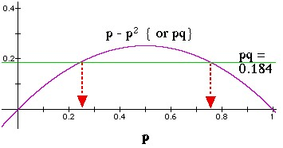
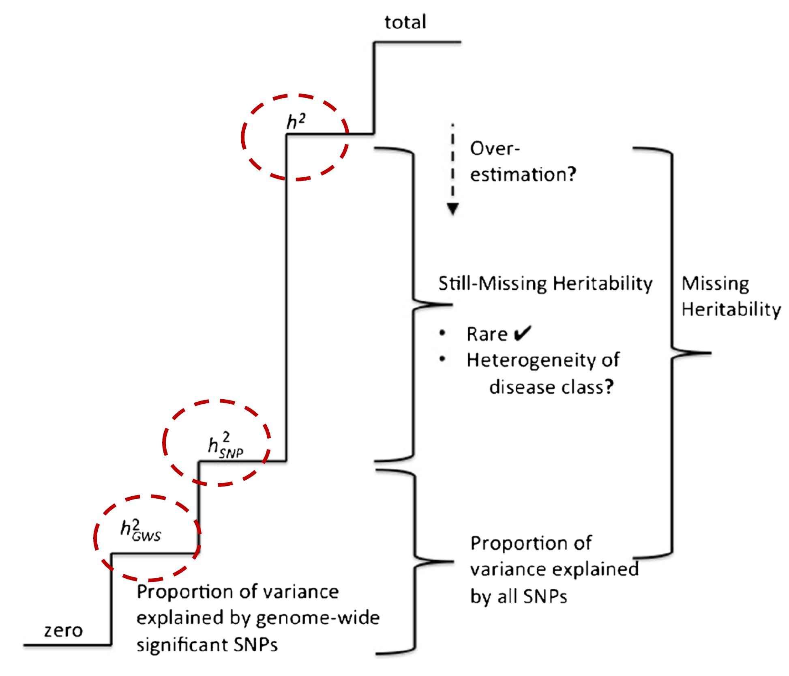

```{r setup, include=FALSE}
knitr::opts_chunk$set(echo = FALSE)
library(data.table)
setDTthreads(1)
library(ggplot2)
```

## Fragen

Gibt es Fragen zu

* Vorlesung?
* Übung?
* Seminar?

## Plan heute

* Präsenzaufgabe zu Populationsgenetik
* Gemeinsame Herleitung Fixationsindex (*inbreeding coefficients*)
* Blatt 4 - A1 (Populationsgenetik)
* Blatt 4 - A2 (Heritabilität)

# Präsenzaufgabe

## Präsenzaufgabe - 1

Nachdem  Sie  Ihr  Studium  abgeschlossen  haben,  bauen  Sie  mit  17  Ihrer  Freunde  ein  Floß, siedeln sich auf einer einsamen Insel an und begründen dort eine neue Population, die vom Rest der Welt isoliert ist. Dabei war Ihnen nicht bekannt, dass zwei Ihrer Freunde Träger für das rezessive Allel für cystische Fibrose sind. 
 
a) Angenommen,  dass  die  Allelfrequenz  sich  in  dieser Population nicht  verändert, wie hoch wird die Rate an Cystischer Fibrose sein? 

## Präsenzaufgabe - 1 Lösung

Nachdem  Sie  Ihr  Studium  abgeschlossen  haben,  bauen  Sie  mit  17  Ihrer  Freunde  ein  Floß, siedeln sich auf einer einsamen Insel an und begründen dort eine neue Population, die vom Rest der Welt isoliert ist. Dabei war Ihnen nicht bekannt, dass zwei Ihrer Freunde Träger für das rezessive Allel für cystische Fibrose sind. 
 
a) Angenommen,  dass  die  Allelfrequenz  sich  in  dieser Population nicht  verändert, wie hoch wird die Rate an Cystischer Fibrose sein? 
 
$\Longrightarrow$ Es gibt 36 Allele in dieser kleinen Population; zwei davon sind mutierte Allele: 

$q = 2/36 = 0.056$

$q^2 = 0.003136 = 0.314\% = aa$ 

## Präsenzaufgabe - 2

Nachdem  Sie  Ihr  Studium  abgeschlossen  haben,  bauen  Sie  mit  17  Ihrer  Freunde  ein  Floß, siedeln sich auf einer einsamen Insel an und begründen dort eine neue Population, die vom Rest der Welt isoliert ist. Dabei war Ihnen nicht bekannt, dass zwei Ihrer Freunde Träger für das rezessive Allel für cystische Fibrose sind. 

b) Die Frequenz von Cystischer Fibrose auf dem Festland ist 0.059 %. Wievielmal höher ist sie in Ihrer Insel-Kolonie? 

## Präsenzaufgabe - 2 Lösung

Nachdem  Sie  Ihr  Studium  abgeschlossen  haben,  bauen  Sie  mit  17  Ihrer  Freunde  ein  Floß, siedeln sich auf einer einsamen Insel an und begründen dort eine neue Population, die vom Rest der Welt isoliert ist. Dabei war Ihnen nicht bekannt, dass zwei Ihrer Freunde Träger für das rezessive Allel für cystische Fibrose sind. 

b) Die Frequenz von Cystischer Fibrose auf dem Festland ist 0.059 %. Wievielmal höher ist sie in Ihrer Insel-Kolonie? 

$\Longrightarrow \frac{0.314\%}{0.059\%} = 5.322$-mal häufiger als (so häufig wie) auf dem Festland 

## Präsenzaufgabe - 3

Nachdem  Sie  Ihr  Studium  abgeschlossen  haben,  bauen  Sie  mit  17  Ihrer  Freunde  ein  Floß, siedeln sich auf einer einsamen Insel an und begründen dort eine neue Population, die vom Rest der Welt isoliert ist. Dabei war Ihnen nicht bekannt, dass zwei Ihrer Freunde Träger für das rezessive Allel für cystische Fibrose sind. 

c) Wie wird dieses Phänomen in der Populationsgenetik bezeichnet? 

## Präsenzaufgabe - 3 Lösung

Nachdem  Sie  Ihr  Studium  abgeschlossen  haben,  bauen  Sie  mit  17  Ihrer  Freunde  ein  Floß, siedeln sich auf einer einsamen Insel an und begründen dort eine neue Population, die vom Rest der Welt isoliert ist. Dabei war Ihnen nicht bekannt, dass zwei Ihrer Freunde Träger für das rezessive Allel für cystische Fibrose sind. 

c) Wie wird dieses Phänomen in der Populationsgenetik bezeichnet? 

$\Longrightarrow$ Gründereffekt

## Präsenzaufgabe - Wdh. Veränderung der Allelfrequenz

Erklären Sie die drei evolutionäre Hauptprozesse, die bestimmen, was mit der genetischen Variation passiert, wenn sie einmal entsteht (und diese sind unabhängig von dem Prozess, der neue Variationen erzeugt, nämlich Mutationen): 

* genetische Drift (*genetic drift*)
* natürliche Selektion 
* Genfluss (*gene flow*)

## Präsenzaufgabe - Genetic drift

* zufälliger Stichprobenfehler
* stärkerer Effekt bei kleinen Populationsgrößen
* Gründereffekt: zufällige, nicht repräsentative Teilmenge der Population bewegt sich & gründet neue Population --> verschiedene Allelfrequenzen & weniger Variation!
* Genetischer Flaschenhals: Plötzlicher starker Rückgang der Populationsgröße mit zufälligem Überleben 

## Präsenzaufgabe - Gene flow

* Zufälliger Austausch genetischen Materials zwischen zwei Populationen einer Art 
* Beispielsweise zwischen Neandertalern und *Homo sapiens*
* Wird der Genfluss blockiert (z.B. durch geographische Isolation), können neue Spezies entstehen

## Präsenzaufgabe - Natürliche Selektion

* nicht zufällig
* steht im Zusammenhang mit heritablen Merkmalen, die das Überleben und die Fortpflanzung wahrscheinlicher machen ("Fitness" - hängt von der Umwelt ab!)
* stärkerer Effekt in großen Populationen 
* Directional selection: ein Extrema der Verteilung am fittesten
* Diversifying selection: beide Extrema der Verteilung fitter als das Mittel
* Stabilizing selection: das Mittel ist am fittesten

## Präsenzaufgabe - mögliche Level

* innerhalb einer Population
* innerhalb eines Organismus (Krebszellen)
* Virus, innerhalb eines Wirts (bessere Invasion, schnellere Replikation --> Virulenz)
* Virus, zwischen Wirten (kleiner Partikel, weitere Verbreitung --> Transmissibilität)

# Fixationsindex

## Herleitung des Fixationsindex (1/7)

Der Fixationsindex ($F_{ST}$) ist ein Maß für die Populationsdifferenzierung aufgrund der genetischen Struktur.

Modell für einen SNP mit 2 Allele (A und a): 

* $i = 1, ... n$ diskrete Subpopulationen mit $N = \sum_{i=1}^{n} N_i$ Individuen
* $p_i = \#A / N_i$: Allelfrequenz von A in Subpopulation $i$
* $w_i = N_i / N$: Gewicht der Sub- an Gesamtpopulation
* $\bar{p} = \sum_{i=1}^{n}{w_i \cdot p_i}$ Allelfrequenz von A in der Gesamtpopulation

## Herleitung des Fixationsindex (2/7)

Genotypfrequenzen in den Subpopulationen

* Freq(AA) = $p_i^2$
* Freq(aa) = $q_i^2$
* Freq(Aa) = $2p_iq_i$

Annahme: Keine genetische Trennung (alle Subpopulationen gleich) & zufällige Partnerwahl

Erwartete Genotypfrequenzen in der Gesamtpopulation:

* Freq(AA) = $\bar{p}^2$
* Freq(aa) = $\bar{q}^2$
* Freq(Aa) = $2\bar{p}\bar{q}$

## Herleitung des Fixationsindex (3/7)

Aber: Wenn genetische Trennung

Erwartete Genotypfrequenzen in der Gesamtpopulation:

* Freq(AA) = $\sum_{i=1}^{n} w_i p_i^2$
* Freq(aa) = $\sum_{i=1}^{n} w_i q_i^2$
* Freq(Aa) = $\sum_{i=1}^{n} 2 w_i p_i q_i$

## Herleitung des Fixationsindex (4/7)

Die Varianz der Allelfrequenz ist gegeben durch:

$$Var(p) = \sum_{i=1}^{n} w_i (p_i - \bar{p})^2 = \sum_{i=1}^{n} w_i p_i^2 - \bar{p}^2 = \sigma_p^2$$

Zur Herleitung: Bitte mit Aufgabe 1 von Blatt 3 vergleichen! 

$Var(p) = Var(q)$

{width=70%}

## Herleitung des Fixationsindex (5/7)

Varianz in die erwartete Genotypfrequenzen in der Gesamtpopulation einsetzen:

* Freq(AA) = $\sum_{i=1}^{n} w_i p_i^2 - \bar{p}^2 + \bar{p}^2 = \bar{p}^2 + \sigma_p^2$
* Freq(aa) = $\sum_{i=1}^{n} w_i q_i^2 - \bar{q}^2 + \bar{q}^2 = \bar{q}^2 + \sigma_p^2$
* Freq(Aa) = $\sum_{i=1}^{n} 2 w_i p_i q_i = 1-\bar{p}^2 - \bar{q}^2 - 2\sigma_p^2 = 2 \bar{p}\bar{q} - 2\sigma_p^2$

$\Longrightarrow$ Jede Varianz der Allelhäufigkeit von A reduziert die Häufigkeit der Heterozygoten!

$\Longrightarrow$ Dieser Einfluss der Varianz auf die erwartete Genotyphäufigkeit wird Wahlundeffekt genannt

$\Longrightarrow$ Alle Subpopulationen haben gleiche Allelfrequenzen --> $\sigma_p^2=0$ --> kein Wahlundeffekt

## Herleitung des Fixationsindex (6/7)

$\Longrightarrow F_{ST} = \sigma_p^2 / \bar{p} \bar{q}$ 

* Freq(AA) = $\bar{p}^2 + \sigma_p^2 = \bar{p}^2 + \bar{p} \bar{q} F_{ST}$
* Freq(aa) = $\bar{q}^2 + \sigma_p^2  = \bar{q}^2 + \bar{p} \bar{q} F_{ST}$
* Freq(Aa) = $2 \bar{p} \bar{q} - 2\sigma_p^2 =  2\bar{p} \bar{q} (1-F_{ST})$

$\Longrightarrow F_{ST}$: Abweichung vom HWE aufgrund AF-Abweichungen in den Subpopulationen

$\Longrightarrow F_{ST}$: standardisierte Varianz der Allelfrequenzen der Subpopulationen im Verhältnis zur Totalen Population. 

## Herleitung des Fixationsindex (7/7)

$F_{IT} = 1 - H_I / 2\bar{pq}$: Ratio der beobachteten gegen die im HWE erwarteten Heterozygotenfrequenzen. Zwischen -1 (completely  outbred - nur Aa) und +1 (completely inbred - keine Aa)

$F_{ST} = 1 - H_S / 2\bar{p}\bar{q}$: Varianz innerhalb der Subpopulationen relativ zu der erwarteten Varianz. Zwischen 0 (alle Subpopulationen haben gleiche AF) und 1 (Subpopulationen fix für unterschiedliche Allele - nur AA oder aa)

## Populationsgenetik - De Finetti Diagramm

{width=70%}

# Populationsgenetik

## Populationsgenetik - Aufgabe

a) Bestimmung von $p_i$ und $q_i$

b) Berechnung von Inzuchtskoeffizient $F_i$

c) Warum Varianz = Heterozygosität?

d) Bestimmung von $H_I$, $H_S$ und $H_T$ 

e) Berechnung des Fixationsindex $F_ST$

f) Interpretation 

Genotyp      | AA  | AB  | BB 
------------ | --- | --- | ---
Population 1 | 125 | 250 | 125
Population 2 |  50 |  30 |  20
Population 3 | 100 | 500 | 400

## Populationsgenetik - Lösung a)

$$ p=\begin{pmatrix} (2\text{AA}_1 + \text{AB}_1)/2n_1 \\ (2\text{AA}_2 + \text{AB}_2)/2n_2 \\ (2\text{AA}_3 + \text{AB}_3)/2n_3 \end{pmatrix} = \begin{pmatrix} 500/1000 \\ 130/200 \\ 700/2000 \end{pmatrix} = \begin{pmatrix} 0.5 \\ 0.65 \\ 0.35 \end{pmatrix}, q=1-p=\begin{pmatrix} 0.5 \\ 0.35 \\ 0.65 \end{pmatrix}$$

\begin{align}
\bar{p} &= \frac{2 \cdot (AA_1+AA_2+AA_3) + (AB_1+AB_2+AB_3)}{2\cdot (n_!+n_2+n_3)} \notag \\
&= \frac{2\cdot 275 + 780}{2\cdot 1600} = 0.416 \notag \\
\bar{q} &= 0.584 \notag
\end{align}

## Populationsgenetik - Lösung b)

Beobachtete Heterozygosität:

$$ p_{obs}(AB)=\begin{pmatrix} \text{AB}_1/n_1 \\ \text{AB}_2/n_2 \\ \text{AB}_3/n_3 \end{pmatrix} = \begin{pmatrix} 250/500 \\ 30/100 \\ 500/1000 \end{pmatrix} = \begin{pmatrix} 0.5 \\ 0.3 \\ 0.5 \end{pmatrix} $$

Erwartete Heterozygosität:

$$ p_{exp}(AB)= 2 \cdot p \cdot q =\begin{pmatrix} 2 \cdot 0.5 \cdot 0.5 \\ 2 \cdot 0.65 \cdot 0.35 \\ 2 \cdot 0.35 \cdot 0.65 \end{pmatrix} = \begin{pmatrix} 0.5 \\ 0.455 \\ 0.455 \end{pmatrix} $$

Inzuchtskoeffizient: 

$$F= \frac{p_{exp}(AB) - p_{obs}(AB)}{p_{exp}(AB)} = \begin{pmatrix} (0.5 - 0.5)/0.5 \\ (0.455 - 0.3)/0.455 \\  (0.455 - 0.5)/0.455 \end{pmatrix} = \begin{pmatrix} 0 \\ 0.34 \\ -0.10 \end{pmatrix}$$

## Populationsgenetik - Lösung c)

* Binomialverteilung $B(k|n,p)$: 
* Allel A zählt als Erfolg, Allel B als Misserfolg. 
* n=2, weil pro Genotyp zweimal gezogen 
* Erfolgswahrscheinlichkeit entspricht der Allelfrequenz ($p$). 
* Bei zwei Treffern ($k=2$) erhält man den Genotyp AA ($P(AA)=B(2|2,p)$)
* Die Varianz unter Bionomialverteilung ist immer $Var(X)=n \cdot p \cdot q =2pq=p_{exp}(AB)$ im HWE. 

## Populationsgenetik - Lösung d) & e)

\begin{align}
H_I &= \frac{p_{ops}^T \cdot n}{N_{total}} = \frac{250 + 30 + 500}{1600}= 0.4875 \notag \\
H_S &= \frac{p_{exp}^T \cdot n}{N_{total}} = \frac{0.5 \cdot 500 + 0.455 \cdot 100 + 0.455 \cdot 1000}{1600}=0.470 \notag \\
H_T &= 2 \cdot \bar{p} \cdot \bar{q} = 0.486 \notag \\
F_{ST} &= 1 - \frac{H_S}{H_T} = 0.034 \notag \\
F_{IT} &= 1 - \frac{H_I}{H_T} = -0.0031 \notag 
\end{align}

## Populationsgenetik - Lösung f)

Interpretation:

* Population 1 ist im HWE
* Population 2 hat weniger Heterozygote als erwartet --> Hinweis für *inbreeding* (Inzucht; Verletzung von HWE weil keine zufällige Partnerwahl, sondern eher Verwandte)
* Population 3 hat mehr Heterozygote als erwartet --> Hinweis für *outbreeding* (Auszucht; Verletzung von HWE weil keine zufällige Partnerwahl, sondern alle Verwandten ausgeschlossen)
* Subpopulationen sind für etwa 3.4% der gesamten genetischen Variation verantwortlich
* Die Geamtpopulation zeigt keine Anzeichen für Inzucht

# Heritabilität

## Heritabilität - Definition

**Heritabilität**: Anteil der Varianz eines Merkmals, der durch die Genetik erklärt wird. Beantwortet in wie fern Gene den Unterschied (Varianz) einer Eigenschaft erklären, **NICHT** welche Gene die Eigenschaft beeinflussen. 

$$ h^2 = \frac{Var(Genetik)}{Var(Merkmal)} = \frac{Var(Gen.)}{Var(Gen.) + Var(Umw.) + 2 \cdot Cov(Gen., Umw.)}$$

Einfachste Methode zur Bestimmung von $h^2$: Zwillingsstudie & Falconers Formel $h^2=2 \cdot (r(MZ) - r(DZ))$ (Vergleich der Merkmalskonkordanz zwischen monozygoten (MZ) und dizygoten (DZ) Zwilligen). 

Alternative: GCTA, LDHub

## Heritabilität - Missing heritability

{width=70%}

## Heritabilität - Aussage 1

a) Falls eine Person die Veranlagung einer Krankheit hat, die eine Heritabilität von 1 besitzt, wird diese Person auch die Krankheit erleiden. 

## Heritabilität - Aussage 1

a) Falls eine Person die Veranlagung einer Krankheit hat, die eine Heritabilität von 1 besitzt, wird diese Person auch die Krankheit erleiden. 

**Fast immer falsch**. Bsp. Phenylketonurie (PKU, angeborene Stoffwechselstörung, autosomal-rezessiv, >400 Mutationen im Gen Phenylalaninhydroxylase bekannt, Mutationen beeinflussen das Ausmaß der Aktivitätseinschränkung) – hat Heritabilität 1, aber bei geeigneter Diät bricht die Krankheit nicht aus. 

## Heritabilität - Aussage 2

b) Die Heritabilität Finger an jeder Hand zu haben ist 1 (oder fast 1). 

## Heritabilität - Aussage 2

b) Die Heritabilität Finger an jeder Hand zu haben ist 1 (oder fast 1). 

**Falsch**, sie liegt nahe bei 0. Ursache ist hier fast immer Fehlbildungen aufgrund Medikamente / andere Substanzen in der Embryonalphase („Teratogens“) oder Unfälle im Erwachsenenalter 

## Heritabilität - Aussage 3

c) Die Begriffe „Heritabilität“ und „ererbt“ bedeuten fast das Gegenteil. 

## Heritabilität - Aussage 3

c) Die Begriffe „Heritabilität“ und „ererbt“ bedeuten fast das Gegenteil. 

**Richtig**. Je mehr ein Merkmal ererbt wird, desto niedriger ist dessen Heritabilität. 

## Heritabilität - Aussage 4

d) In Amerika der 1950er Jahre war die Heritabilität für das Tragen von Ohrringen sehr hoch. 

## Heritabilität - Aussage 4

d) In Amerika der 1950er Jahre war die Heritabilität für das Tragen von Ohrringen sehr hoch. 

**Richtig**. Fast nur Frauen haben in dieser Zeit Ohrringe getragen --> stellt quasi die Heritabilität vom Geschlecht dar. 

## Heritabilität - Aussage 5

e) Die Heritabilität von eineiigen Zwillingen ist 1. 

## Heritabilität - Aussage 5

e) Die Heritabilität von eineiigen Zwillingen ist 1. 

**Falsch**, sie haben eine Heritabilität von 0. Jede Variation kommt durch die Umwelt zustande. 

## Heritabilität - Aussage 6

f) Je mehr sich die Umwelt für verschieden Populationen mit unterschiedlicher Heritabilität angleicht, desto höher wird die (Gesamt-)Heritabilität. 

## Heritabilität - Aussage 6

f) Je mehr sich die Umwelt für verschieden Populationen mit unterschiedlicher Heritabilität angleicht, desto höher wird die (Gesamt-)Heritabilität. 

**Richtig**. Je ähnlicher die Umwelt wird, desto niedriger wird deren Varianz und der Anteil der Genetik steigt. 