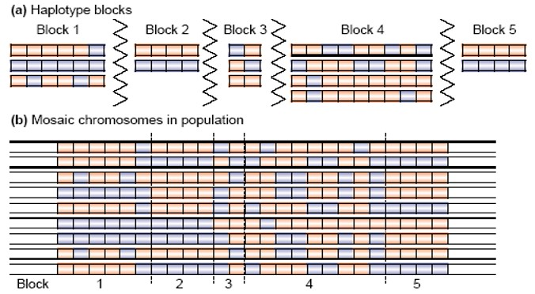
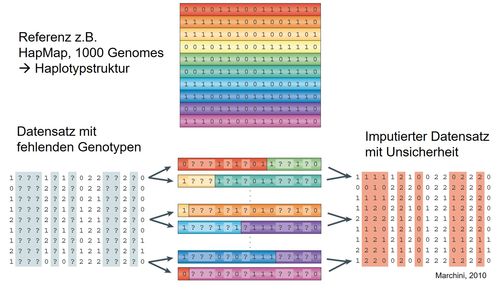
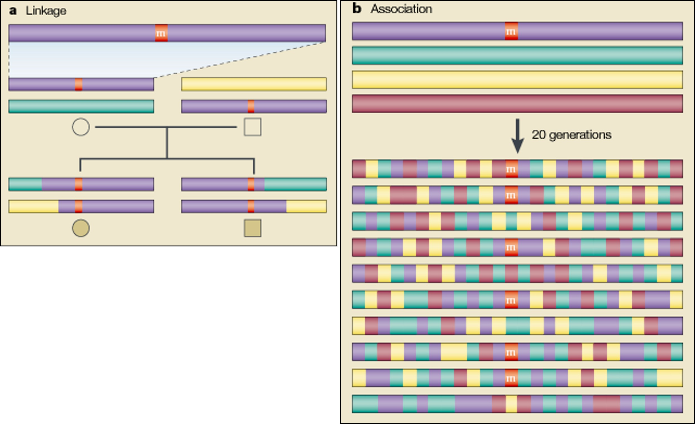
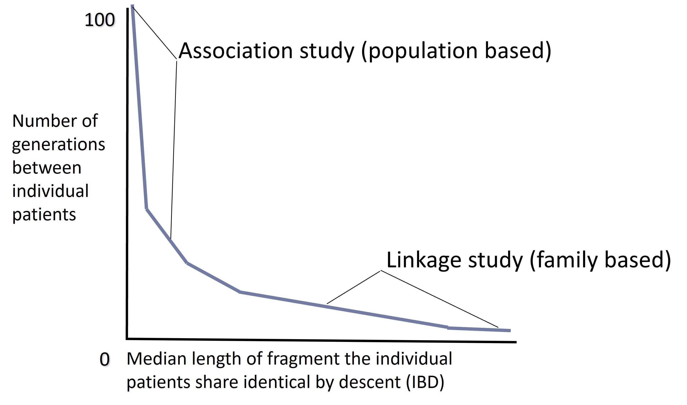
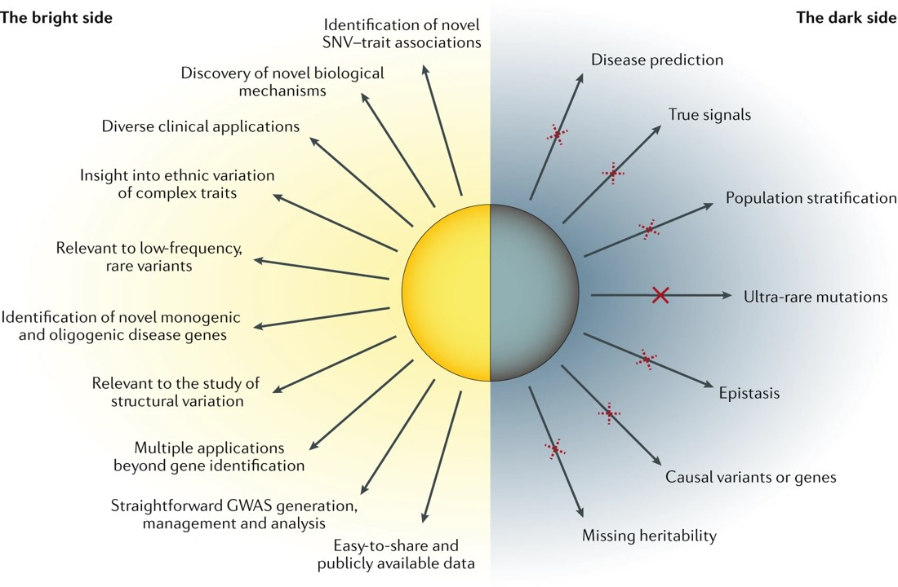
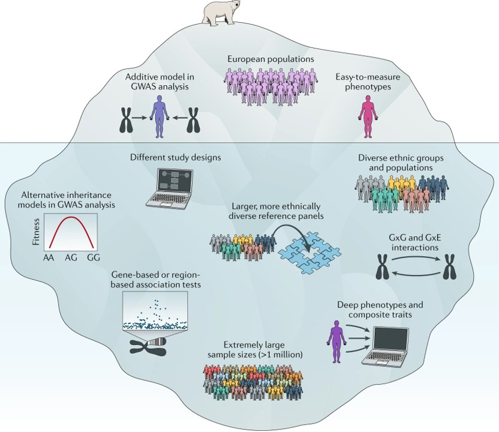
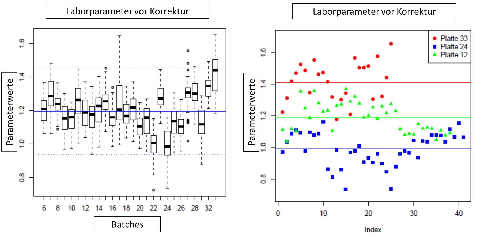
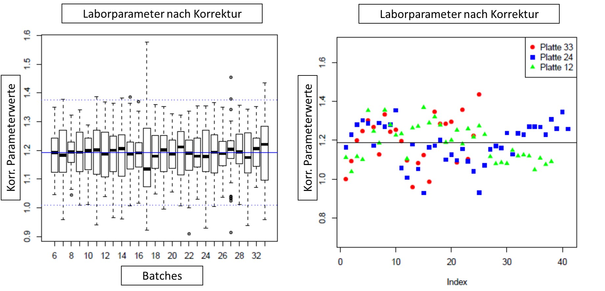
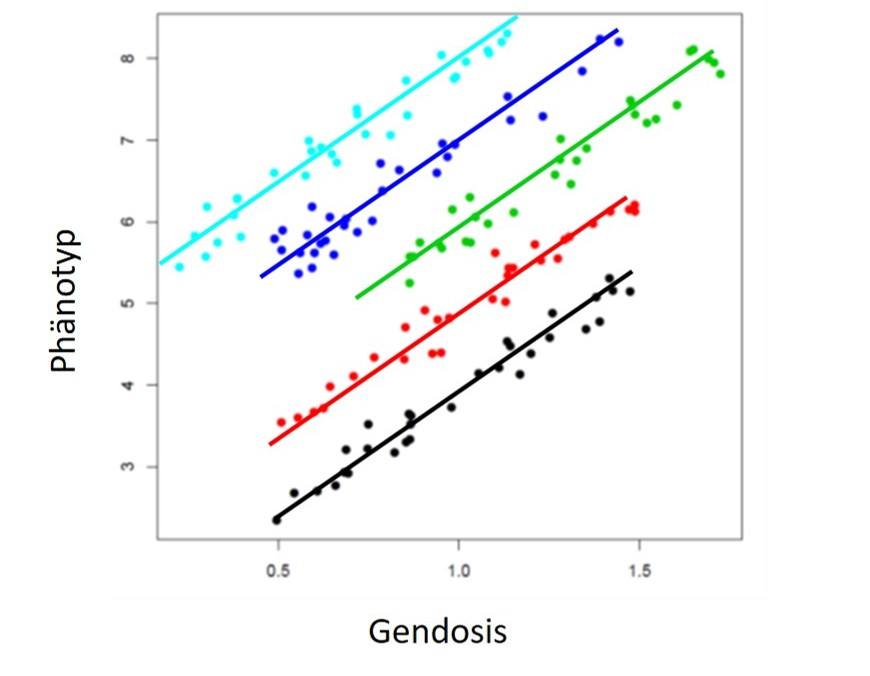
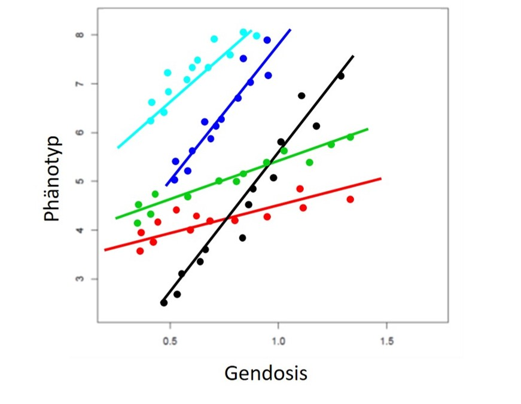

```{r setup, include=FALSE}
knitr::opts_chunk$set(echo = FALSE)
library(data.table)
setDTthreads(1)
library(ggplot2)
```

## Fragen

Gibt es Fragen zu

* Vorlesung?
* Übung?
* Seminar?

## Plan heute

* Blatt 5 - A1: Imputation
* Blatt 5 - A4: Studiendesign
* Blatt 5 - A3: (GW)AS
* Blatt 5 - A2: Gemischte Modelle

# Imputation

## Aufgabe 1: Imputation

a) Definieren Sie **Haplotyp** und **Haploblock**!

b) Drei Schritte der **SNP-Imputation**?

c) QC-Filter **vor** oder **nach** Imputation?

d) **Imputationsqualitätsmaße**? 

## Lösung 1 - a

* **Haplotype**: haploider Genotyp, individuelle Kombination von Allelen, die gemeinsam auf einem Chromosom vererbt werden (weil in hohem LD).
* **Haploblock**: Bereich der gemeinsam vererbt wird
* Mittlere Blockgröße: 16.3 kb (von <1 kb – 173 kb)
* Haplotypen Diversität: 4.2 Typen/Block (in Caucasian)
* Viele kleine und einige sehr große Blöcke

## Lösung 1 - Haploblockstruktur

{width=100%}

## Lösung 1 - b

1) $\text{\underline{Referenz-Abgleich}}$: Welche Array-SNPs sind in der Referenz, und sind sie gleich codiert (ID, Chromosom, Position, Strang, Allel A, Allel B)?

2) $\text{\underline{Phasierung}}$: Schätzung der Haplotypen. Genotyp AA == 00, Genotyp BB == 11, mittels Hidden-Markov (und ggf. Referenz) wird AB geschätzt (10 oder 01).

3) $\text{\underline{Imputation}}$: Schätzung der fehlenden Genotypen mittels MCMC unter Verwendung der Haplotypen.

## Lösung 1 - Übersicht Imputation

{width=100%}

## Lösung 1 - c

Dilemma: 

* Filtern --> Ausdünnung der Haplotypstruktur --> Schlechtere Imputationsqualität
* Kein Filtern --> Schlechte SNPs können Imputation verfäschen --> Schlechtere Imputationsqualität

Lösung: 

* Nur moderate Filterung vor Imputation
    + $MAF \geq 0.01$
    + $CR \geq 0.95$
    + $p(HWE) \geq 1 \cdot 10^{-6}$
* Überschreibung im Imputationsprozess erlauben 

## Lösung 1 - d

**Post-imputation information measures**

* Meistens zwischen 0 und 1 (vollständige bzw. keine Unsicherheit über die Genotypen)
* Interpretation: Informationsmaß *a* bei *N* Individuen zeigt an, dass die Datenmenge bei diesem SNP etwa einem Satz beobachteter Genotypen mit Fallzahl *aN* entspricht
* MACH $r^2$: Verhältnis der empirisch beobachteten Varianz der Alleldosis zur erwarteten binomialen Varianz im HWE 
* IMPUTE *info*: basiert auf der Messung der relativen statistischen Informationen über die Allelhäufigkeit der Population (Verhältnis der beobachteten und vollständigen Information)
* siehe auch [Marchini & Howie (2010)](https://static-content.springer.com/esm/art%3A10.1038%2Fnrg2796/MediaObjects/41576_2010_BFnrg2796_MOESM3_ESM.pdf)


## Aufgabe 4: Studiendesigns

In der Vorlesung wurde Ihnen die LIFE-Studie vorgestellt. Wie unterscheiden sich **LIFE-Adult** und **LIFE-Heart** im Studiendesign? Nennen Sie je eine Fragestellung, die sich mit der jeweiligen Studie besser beantworten lassen!

## Lösung 4

Merkmal | LIFE-Adult | LIFE-Heart
---------- | --------------------------------------- | ---------------------------------------
N | 10000 | 7000
Design | Kohortenstudie populationsbasiert | Kohortenstudie patientenbasiert
Frage (konkret) | Identifizierung von Faktoren für Volkskrankheiten (Diabetes, …) | Identifizierung von Modifikatoren der ASVDs 
Frage (generell) | Wie gesund/krank ist die Bevölkerung? | Was haben die Kranken gemeinsam?
Vorteile | Billig, einfach durchführbar | Erfassung der Inzidenz, zeitlichen Zusammenhang Exposition-Endpunkt
Nachteile |  Ursache – Wirkung schlecht abbildbar | Teuer, seltene Endpunkte können nicht erfasst werden, selection bias

## Aufgabe 3: (Genomweite) Assoziationsstudien

a) Vergleichen Sie **Linkage-** und **Assoziationsstudien**!

b) Neben genomweiten Assoziationsstudien (GWAS), welche Typen von Assoziationsstudien sind Ihnen bekannt? 

c) Geben Sie stichpunktartig den Ablauf einer GWAS an!

d) Welche Vor- und Nachteile gibt es bei einer GWAS?

## Lösung 3 - a

* **Linkage-Studie**: 
    + liefert breite Chromosomregionen, die viele Gene haben können (Kandidatengene)
    + Familienspezifisch (Rekombinationsereignisse in den untersuchten Familien)
    + gut: wenige Marker werden benötigt
    + schlecht: Auffinden von kausalen Varianten
* **Assoziationsstudien**: 
    + liefert einzelne genetischer Varianten
    + Populationsspezifisch (Rekombinationsereignisse der Vorfahren)
    + gut: Auffinden von kausalen Varianten
    + schlecht: viele Marker werden benötigt (& hohe Fallzahlen)

## Lösung 3 - Vergleich Linkage und Assoziation

{width=100%}

## Lösung 3 - Vergleich Linkage und Assoziation
    
{width=100%}

## Lösung 3 - Vergleich Linkage und Assoziation

Linkage | Association 
------- | -----------
Family-based | Unrelateds
Few markers for genome coverage (300-400 STRs) | Many markers required for genome coverage ($10^5 - 10^6$ SNPs)
low resolution | high resolution
matching/ethnicity genereally unimportant | matching/ethnicity crucial
powerful for rare variants | powerful for common variants; rare variants generally impossible

## Lösung 3 - b

* Candidate SNP: Untersuchung eines einzelnen SNPs, der im Verdacht steht eine Krankheit zu verursachen 
* Candidate gene: 5-50 SNPs innerhalb eines Gens, das im Verdacht steht eine Krankheit zu verursachen
* Fine mapping/Candidate region: SNPs innerhalb einer genetischen Region (mit mehreren Genen) 
* Genome-wide: alle SNPs des Genoms werden analysiert (Hypothesenfrei!)

## Lösung 3 - c

* Ausgangslage:
    + QC-geputzte SNP-Daten (HWE, CR, MAF, info, ...) 
    + Phänotypdaten 
    + ggf. Covariablen 
* Test: 
    + Modell: $Phänotyp \sim SNP + Covariablen + \epsilon$ für jeden SNP
    + Betrachtung der Enden der Verteilung der Teststatistiken (sig. Tests)
* Check false positives; mögliche Quellen:
    + Genotypisierungsfehler (Qualität der SNPs?)
    + Populationsstratifikation (QQ-Plot, $\lambda$)
        + Genomic Control
        + PCA
        + Verwandtschaft
    + Multiples Testen
        + Bonferroni: $p_gw = 5 \cdot 10^{-8}$
        + Permutationsanalyse
        + FDR
* LD-Pruning, Annotation, Auswertung/sek. Analysen

## Lösung 3 - Ist die Assoziation echt?

Starke Evidenz | Schwache Evidenz
-------------- | ----------------
Genotypisierungsfehler unwahrscheinlich | "Verdächtiger" SNP
Stratifikationsbias unwahrscheinlich | Stratifikationsbias möglich
Sehr niedriger p-Wert | Grenzwertiger p-Wert
starke Studie | schwache Studie 
hohe MAF | niedrige MAF
bekannte Assoziation | keine bekannte Assoziation

## Lösung 3 - d

Nachteile: 

* große Datenmenge
* Auswirkung seltener Varianten kaum nachweisbar
* sehr große Fallzahl notwendig
* sehr empfindlich für falsch positive Ergebnisse
* fast nur additives Modell

## Lösung 3 - d Vorteile

* Identifizierung neuer SNP-Phänotyp Assoziationen
* Entdeckung neuer biologischer Mechanismen
* Vielzahl an klinischen Anwendungsmöglichkeiten
* Einblick in ethnische Variation
* Summary data kann für weitere Anwendungen genutzt werden

## Lösung 3 - Übersicht 

{width=70%}

Taken from [Tam et al. (2019)](https://www.nature.com/articles/s41576-019-0127-1)

## Lösung 3 - Spitze des Eisbergs

{width=60%}

Taken from [Tam et al. (2019)](https://www.nature.com/articles/s41576-019-0127-1)

## Aufgabe 2: Gemischte Modelle

a) Generell, was „mischt“ man bei den gemischten Modellen?

b) Abbildung \ref{fig5_1}). Wie mit Hilfe eines Mixed Models adjustieren, sodass kein Batch-Effekt mehr auftritt?

c) Sie haben Fitness-Daten von sechs Probanden, die drei verschiedenen Ergometer je dreimal genutzt haben. Sie interessieren sich für den Effekt der Ergometer, wobei es Variationen zwischen den Probanden und innerhalb der Probanden gibt. Stellen Sie ein geeignetes Modell auf! (Hinweis: Sie wollen $y_{ijk}$ bestimmen, für den $i$-ten Proband, an dem $j$-ten Ergometer und der $k$-ten Wiederholung!) 

d) Was ist die graphische Bedeutung eines gemischten Modells?

e) Wie werden gemischte Modelle in genomweiten Analysen angewandt? Nennen und erläutern Sie zwei Beispiele, indem Sie die Modellgleichungen angeben. 

## Aufgabe 2: Gemischte Modelle



## Lösung 2 - a

**Mixed Model**: man mischt zufällige und fixe Effekte in einem Modell. Diese Modelle sind u.a. wichtig bei Messwiederholungen (longitudinale Studien!) und Metaanalysen (unabhängige Kohorten). 

## Lösung 2 - b

**Batch-Adjustierung**: 

* Idee: Betrachte die Batches als zufällige Effekte und definiere adjustierte Werte normiert auf den Mittelwert und korrigiert auf den Batch-spezifischen Effekt. 
* Model: Laborparameter ~ 1 + (1/Batchnummer) $\rightarrow$ pro Batch ein Schätzwert (entspricht Intercept des Models, in etwa Mittelwert des Batches)
* Normierung: $LabValue_{adj} = LabValue + mean(LabValue) - estimate_{batch}$, wobei sich der Mittelwert auf alle Batches bezieht. 

## Lösung 2 - b



## Lösung 2 - c

**Wiederholungen**:

Modell: $y_{ijk} = \mu + \beta_j + b_i +\epsilon_{ijk}$ mit

* Probanden $i = 1,...,6$
* Ergometer $j = 1,...,3$
* Wiederholungen $k=1,...,3$
* fixer Effekt des Ergometers $\beta_j$
* zufälliger Effekt des Probanden $b_i$ (Variation innerhalb des Probanden)

Jeder Proband hat seinen eigenen Intercept (random), aber alle haben die gleiche Steigung (fix). 

## Lösung 2 - d&e - FEM

{width=90%}

## Lösung 2 - d&e - FEM

* Random intercept – fix slope
* Modell: $y_{ij}= \mu + \beta_j + b_i + \epsilon_{ij}$ 
* $\beta_j$ = fixer Effekt der Genedose
* $b_i$ = random Effekt der Studie
* Im Plot: 5 Studien, x-Achse = Genedose, y-Achse = Phänotyp
* entspricht fixed effect model (FEM)


## Lösung 2 - d&e - REM

{width=90%}

## Lösung 2 - d&e - REM

* Random intercept – random slope
* Modell: $y_{ij}= \mu + b_{1,j} + b_{2,i} + \epsilon_{ij}$ 
* $b_{1,j}$ = random Effekt der Genedose
* $b_{2,i}$ = random Effekt der Studie
* Im Plot: 5 Studien, x-Achse = Genedose, y-Achse = Phänotyp
* Berücksichtigung der Heterogenität („between study varianze)
* entspricht random effect model (REM)

